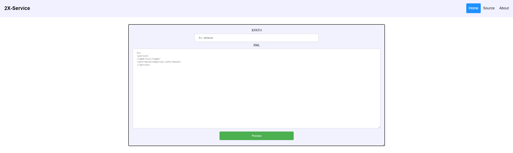
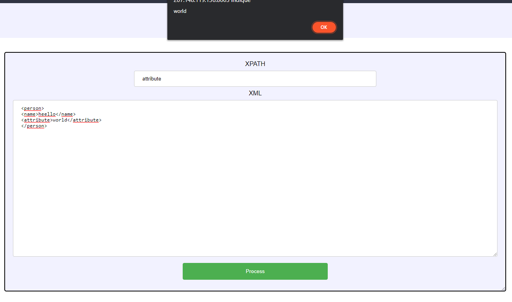
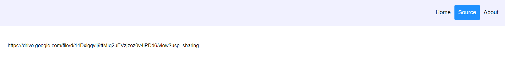
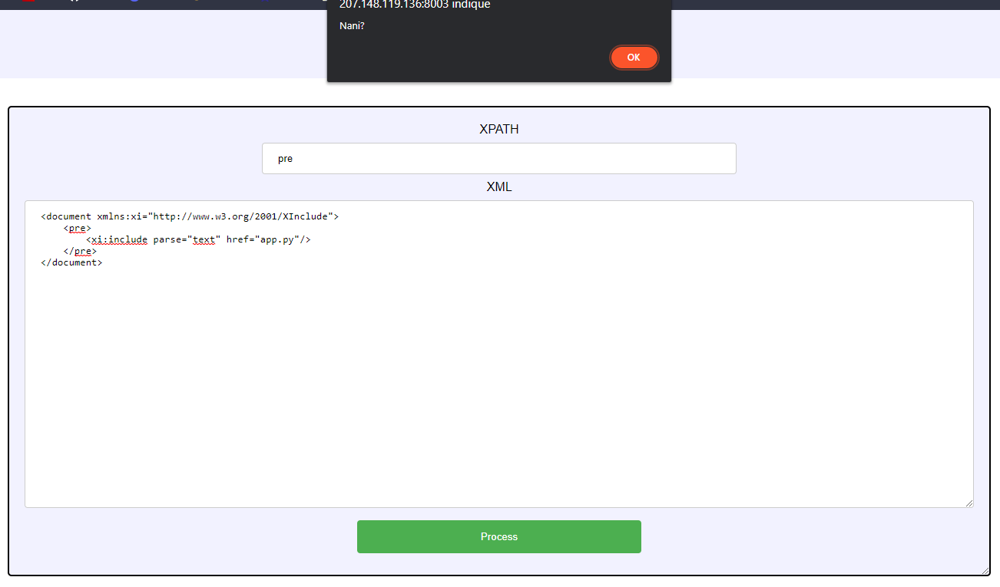
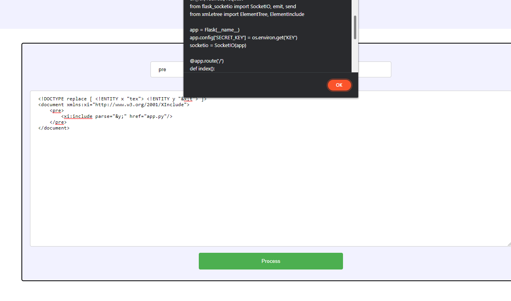
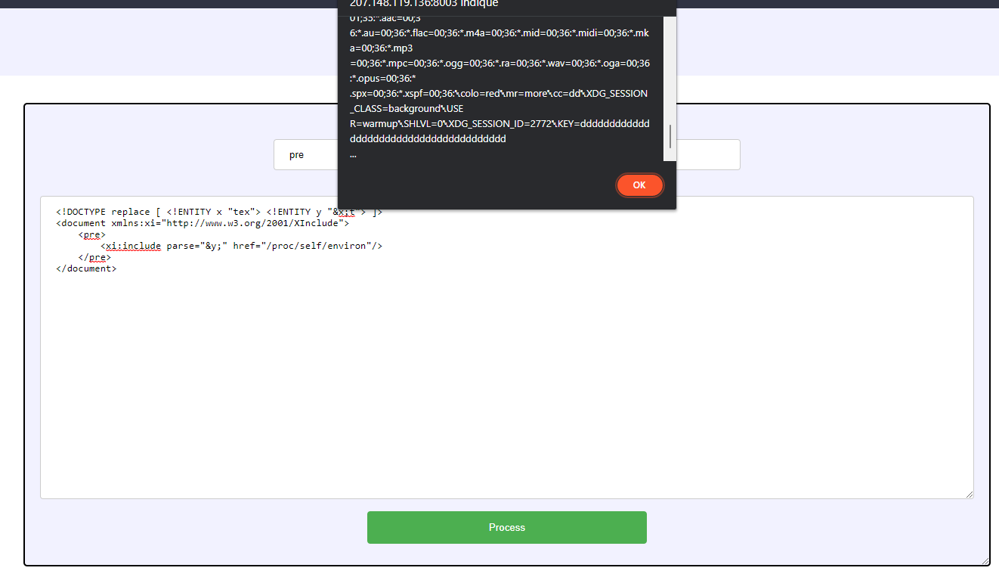
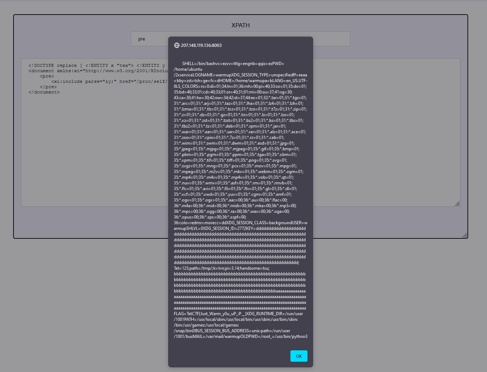

First web challenge at TetCTF 2022, 2X-Service seems to be an XPath XML parser.
The first thing we see on the home page is a form with two inputs :

- one for a [XPath](https://en.wikipedia.org/wiki/XPath)
- one for [XML](https://en.wikipedia.org/wiki/XML) data



This seems to use our provided XPath to give us the value located at that path in our XML data.



On the `Source` page, we can find a link to the source code of the Flask backend, hosted on Google Drive.



```python
import random
import os
from flask import Flask, render_template, render_template_string, url_for, redirect, request
from flask_socketio import SocketIO, emit, send
from xml.etree import ElementTree, ElementInclude

app = Flask(__name__)
app.config['SECRET_KEY'] = XXXXXXXSECREKTXXXXXXXX
socketio = SocketIO(app)

@app.route('/')
def index():
	return redirect(url_for('dashboard'))


@app.route('/dashboard')
def dashboard():
	return render_template('dashboard.html')

@app.route('/source')
def source():
	return render_template('source.html')

@app.route('/about')
def about():
	return render_template('about.html')

@socketio.on('message')
def handle_message(xpath, xml):
	if len(xpath) != 0 and len(xml) != 0 and "text" not in xml.lower():
		try:
			res = ''
			root = ElementTree.fromstring(xml.strip())
			ElementInclude.include(root)
			for elem in root.findall(xpath):
				if elem.text != "":
					res += elem.text + ", "
			emit('result', res[:-2])
		except Exception as e:
			emit('result', 'Nani?')
	else:
		emit('result', 'Nani?')


@socketio.on('my event')
def handle_my_custom_event(json):
	print('received json: ' + str(json))

if __name__ == '__main__':
	socketio.run(app, host='0.0.0.0', port=8003)
```

After reading the source code, I noted three very interesting things:

- the secret key stored in the `SECRET_KEY` attribute of the app's config
- the condition that prevents the XML input to contain the `text` word
- the call to `ElementInclude.include(root)`

At first, I didn't understand why they put this condition preventing the use of the `text` word, so I just ignored it for the moment and searched more informations about the second point, the include call.

In the Python documentation for the `xml` module, this function is explained in the section about [XInclude](https://docs.python.org/3/library/xml.etree.elementtree.html#xinclude-support). In short, this is just a way to include data in an XML document, which can be XML (the default) but also plain text.

So the idea is to include the `app.py` file as plain text in our XML document to leak the secret key. Let's try that.
```xml
<xi:include href="app.py" parse="text"/>
```



Now the `text` condition started making sense. It's a protection that tries to prevent us from using a text include.

The only two values allowed for the `parse` attribute in Python's XML module are `xml` and `text`, `xml` being the default if missing. There's no other way to include a text file.<br/>
I searched a lot how I could encode characters so that they are interpretered as the word `text` without being written as such in the XML, or how I could split the word in some kind of "variables" that I could concatenate.<br/>
But after a lot of research, I unfortunately didn't find anything to do one of these. I got stuck here and couldn't flag this challenge during the CTF.<br/>
These were actually pretty good ideas I had, because in the end, *both these methods* were possible to solve the challenge. Maybe I should have continue to make Google searches.

Here is the kind of "concatenated variables" solution. It uses internal entities.<br/>
We could actually use XML entities to act as variables and combine them to recreate the `text` word:

```xml
<!DOCTYPE replace [ <!ENTITY x "tex"> <!ENTITY y "&x;t"> ]>
<document xmlns:xi="http://www.w3.org/2001/XInclude">
    <pre>
        <xi:include parse="&y;" href="app.py"/>
    </pre>
</document>
```



And that's it, we get the content of the `app.py` file. But this isn't the end yet: as you can see, the key variable is actually taken from the process environment.<br/>
So we just have to use the same process to include the content of `/proc/self/environ`.<br/>



In Chromium based browsers, as the alert pop up with the result contains a *lot* of text, its content is truncated and you can't see much further. So I just started Firefox instead, where the alert pop up contains everything.



Just after the key which is a lot of `d`s, we can see a `FLAG` environment variable.

Flag : `TetCTF{Just_Warm_y0u_uP_:P__}`