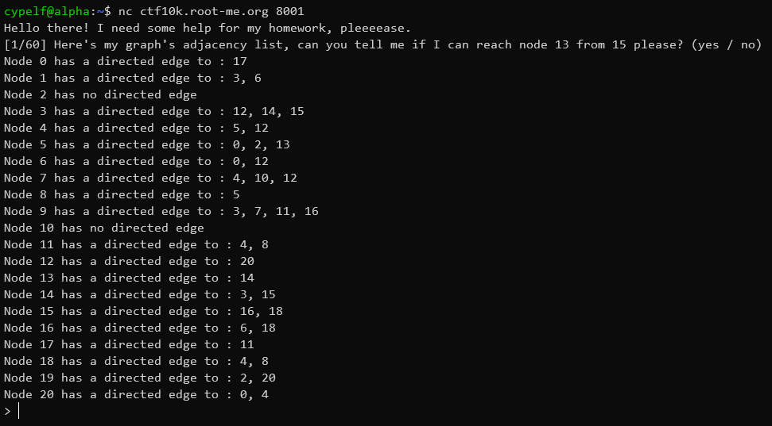
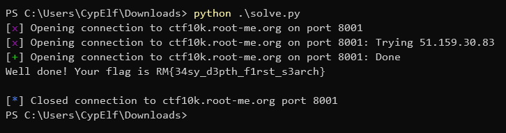

## Context

This is a write up for a challenge I created for the Root-Me CTF we organized to celebrate the 10k members on the Discord server. \
Please keep in mind I wasn't a participant but the creator of the challenge, hence the level of details and explainations I am able to provide. \
That was an amazing experience to help organizing this CTF, and I hope people learned a few things and enjoyed my challenges!

## Description

> I need your help for this task! I have a few graphs and I need to know if I can access a node from another for every one of them.

## Resolution

We start the challenge with a host and port, as usual. Let's connect to it to see how it works using netcat.



It's giving us the [adjacency list](https://en.wikipedia.org/wiki/Adjacency_list) of a graph and asking us if we can access some node Y from node X (though it's not in a usable form right now and we'll have to parse the information we want in that). \
This is a very common problem in graph theory to search for the accessibility of a node from another, and thus there are a few algorithms to do it, such as [Depth First Search](https://en.wikipedia.org/wiki/Depth-first_search) (DFS). \
This algorithm isn't very complicated. It will basically start at our start node, mark it as visited, visit every neightbor of it, and check if that neightbor it's our destination node. If it is, that's a success, otherwise, we'll mark this node as visited and use recursion to visit all of the neightbors of this node that are not marked as visited. This process only stops if we reach our destination node or if we visited all the accessible nodes from our start node and marked them all as visited without finding it.

Here's my script:

```python
from pwn import *

host = "ctf10k.root-me.org"
port = 8001

def reachable(graph, src, dst):
    visited = [False for _ in list(range(len(graph)))]
    return reachable_rec(graph, visited, src, dst)

def reachable_rec(graph, visited, src, dst):
    visited[src] = True
    if src == dst:
        return True
    for successor in filter(lambda succ: not visited[succ], graph[src]):
        result = reachable_rec(graph, visited, successor, dst)
        if result == True:
            return True
    return False

r = remote(host, port)

r.recvline()

for _ in range(60):
    question = r.recvuntil(b"(yes / no)\n").decode()
    src = int(question.split(" ")[17])
    dst = int(question.split(" ")[15])

    graph = dict()

    nodes_info = r.recvuntil(b"> ").decode().split("\n")[:-1]

    for line in nodes_info:
        node = int(line.split(" ")[1])

        if "no directed edge" in line:
            graph[node] = []
        else:
            successors = list(map(int, line.split(": ")[1].split(", ")))
            graph[node] = successors

    if reachable(graph, src, dst):
        r.sendline(b"yes")
    else:
        r.sendline(b"no")

    r.recvline()

print(r.clean(0.3).decode())
```



Flag: `RM{34sy_d3pth_f1rst_s3arch}`