> In this challenge, you'll need to grasp every single detail of what you're doing.
> No guesswork allowed.
> Dive deep, analyze thoroughly, and most importantly, enjoy the process ! 

## Discovering the challenge

We are provided with a `DoubleTrouble.sol` file with the following content:

```solidity
// Author : Neoreo
// Difficulty : Hard

// SPDX-License-Identifier: MIT
pragma solidity ^0.8.26;

contract DoubleTrouble {
    bool public isSolved = false;
    mapping(address => bool) public validContracts;

    function validate(address _contract) public  {
        uint256 size;
        assembly {
            size := extcodesize(_contract)
        }
        if (size == 0 || size > 5) {
            revert("Invalid contract");
        }
        validContracts[_contract] = true;
    }

    function flag(address _contract) public {
        require(validContracts[_contract], "Given contract has not been validated");

        uint256 size;
        assembly {
            size := extcodesize(_contract)
        }
        bytes memory code = new bytes(size);
        assembly {
            extcodecopy(_contract, add(code, 0x20), 0, size)
        }
        bytes memory keyBytecode = hex"1f1a99ed17babe0000f007b4110000ba5eba110000c0ffee";
        
        require(keccak256(code) == keccak256(keyBytecode),"Both bytecodes don't match");

        isSolved = true;
    }

}
```

We are also given a link to deploy the challenge. Once done, we get the following information:

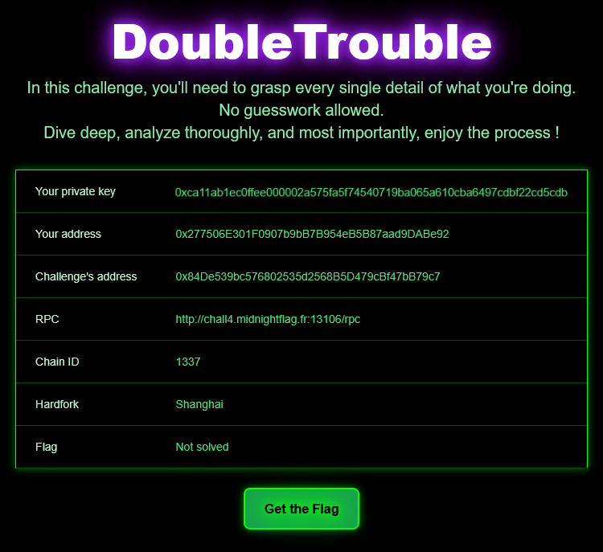

One important thing to note here is that we have a chain using the Shanghai hardfork. This is actually mandatory for the challenge to be feasible, because the Cancun hardfork changed the way `selfdestruct` behaves by not *really* deleting the contract anymore, and only halting the execution and tranfering its ETH to an address instead. \
We will need the previous behavior of selfdestruct in the process of solving this challenge.

Let's now look at the contract code. Fortunately, it isn't too long so it's pretty quick to wrap your mind around. \
The `validate` function is responsible for validating contracts by checking their code size. This code size must be between 1 and 5 included, otherwise they can't be validated. \
The `flag` function will look at a validated contract's code and compare it to `1f1a99ed17babe0000f007b4110000ba5eba110000c0ffee` (i.e.,"I flagged it babe football baseball coffee", lol). We solve the contract if we manage to do that!

There are two things we need to accomplish:

- find a way to bypass the code size verification
- hand write initialization bytecode to deploy the exact code needed

Let's do these steps in reverse, because I find it easier to take care of the bytecode step first.

## Writing initialization bytecode manually

### How a contract is created

We usually write our code in a dedicated programming language such as Solidity, and we don't have to think about what the output code will look like. Solidity actually abstracts initialization and runtime code through the use of the contract constructor, and same applies for the functions dispatcher mechanism implemented by Solidity when compiling the contract. \
Right now, we want to have full and complete control over the runtime code that will be registered for the contract. It means we can't rely on Solidity.

When creating a contract using the CREATE or CREATE2 opcodes, you specify the contract bytecode as arguments. This bytecode is made of two parts concatenated together: initialization code, and runtime code. The initialization code is the code that is run while the contract is being created. Its role is to take the runtime code, push it to memory, and return it. When the initialization code returns, it takes the returned data and place it as the permanent code of the contract. This is how the permanent code of a contract is set up! \
The initialization code will almost always *at least* copy the runtime code from the right offset in the calldata, place it in memory and return it to set it up. It can also do other things, such as initialize storage variables, or do whatever you might want: that's the code you would place in the contract constructor.

### Writing the code

We know we have to specify a runtime code that is exactly `1f1a99ed17babe0000f007b4110000ba5eba110000c0ffee`, in order to pass the check of the `flag` function. We need the initialization bytecode to setup a contract with that code. \
We will be using a table of the [EVM opcodes](https://www.evm.codes/?fork=shanghai) as a reference.

We have to take the runtime code from the calldata and push it to memory, then return its location and length. \
We will leverage the opcodes `CODECOPY` and `RETURN` for that.

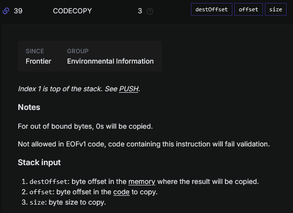

For this one, we need to push 3 parameters to the stack for this opcode: the offset in memory where to place the runtime code at, the offset where the runtime code is located in the calldata, and and the size to copy.

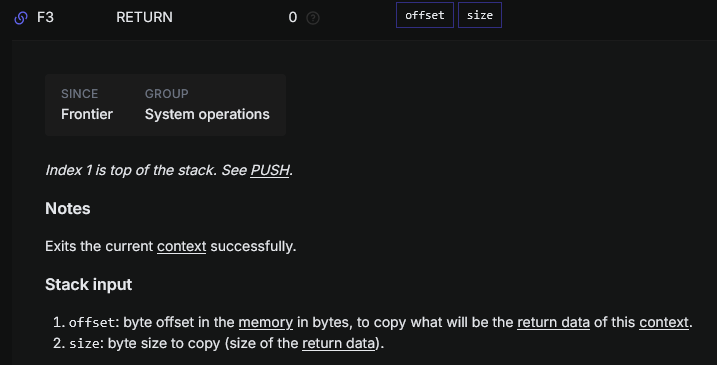

For return, we simply need to push the offset in memory where the runtime was placed, and the size of it. \
Put together, we get something like this:

```
6018    # PUSH1 0x18 (0x18 is 24, the size in bytes of our runtime code)
600c    # PUSH1 0x0c (0x0c is 12, which is the offset of the runtime code in the calldata, because this init code we're writing right now will be exactly 12 bytes)
6000    # PUSH1 0 (this is the destination offset in memory, 0 is chosen arbitrarily)
39      # CODEDOPY
6018    # PUSH1 0x18 (again, the size of the runtime code)
6000    # PUSH1 0 (the offset in memory where we copied the runtime code)
f3      # RETURN
```

If we put this as a linear sequence of hex characters and concatenate the runtime code to it, we get the following: `0x6018600c60003960186000f31f1a99ed17babe0000f007b4110000ba5eba110000c0ffee`. \
It's not ready to be deployed, cool! But first, we need to bypass the code size verification.

## Bypass the code size verification

### Approaching the issue

After seeing the `extcodesize` call, we immediately recall a well known bypass about it: this opcode is often used (wrongly) to determine if an address is a contract or not, by checking if its code size is > 0. However, this is easily bypassed by running code directly in the constructor of a contract, because as we described earlier in this post, the permanent code section is only created after the initialization code completes. Therefore, this opcode performed on a contract running initialization code will return 0 even though it is a contract.

However, we can't exploit this behavior here, because the check is `size == 0 || size > 5`. The contract *has* to already contain some code, but no more than 5 bytes. For it to contain code, it must have completed initialization.

The other thing we notice is that the contract does not store the size of the contract code and deliberately fetches it again in the `flag` function. The only way we have to solve this problem is to find a way to change the code of the contract after its creation, to put only a few bytes inside it, validate it and then change it to the sequence it is compared to.

You may wonder how we can do that, and it might seem impossible at first glance. After all, the code of a contract is immutable, and cannot be changed in any way after the contract was created.

However, a trick allowing us to workaround that exists, and it uses the behavior of the `CREATE2` opcode!

### Creating metamorphic contracts with CREATE2

Contrary to the `CREATE` opcode, where the address of the created contract is computed using the creating contract address and a nonce, making it impossible to reuse the same address multiple times, `CREATE2` allows to create a contract at a deterministic address. \
With `CREATE2`, the address is computed with the following [formula](https://www.evm.codes/?fork=shanghai#f5):

```
address = keccak256(0xff + sender_address + salt + keccak256(initialization_code))[12:]
```

If the account creating the contract with `CREATE2` is the same every time, if the salt is the same and if the initialization_code is the same, then the resulting address will always be the same as well. \
If we execute a `SELFDESTRUCT` on a contract deployed with `CREATE2` to destroy it and we use the same parameters with `CREATE2`, a new contract will be placed at the exact same address!

You may think "well yes, but if the initialization code has to be the same every time, it's always going to be the same contract, no?". And that would be a very pertinent question. \
The trick is, only the initialization code has to be the same, not the resulting runtime code that will be stored for that contract! And because we can arbitrarily choose what we want to put in the initialization code, we can just call a function on a fixed contract, get bytecode from it, and copy that as the runtime code for the contract. It has to include a way to execute `SELFDESTRUCT` in order to be deleted and replaced with another `CREATE2` call later. And that's it!

That's why the chain for this challenge is running on the Shanghai hardfork. Post Cancun, we can't delete a contract with selfdestruct anymore, so we can't use this technique to redeploy a new contract to this same address anymore, because the address is definitively used after creation.

Many implementations already exist online to do what I just explained. I copied and reused the Factory contract in this [blog post](https://ethereum-blockchain-developer.com/110-upgrade-smart-contracts/12-metamorphosis-create2/) because it's simple and straightforward.

Its content is the following:

```solidity
// SPDX-License-Identifier: MIT
pragma solidity ^0.8.19;

contract Factory {
    mapping (address => address) _implementations;

    event Deployed(address _addr);

    function deploy(uint salt, bytes calldata bytecode) public {

        bytes memory implInitCode = bytecode;

          // assign the initialization code for the metamorphic contract.
        bytes memory metamorphicCode  = (
          hex"5860208158601c335a63aaf10f428752fa158151803b80938091923cf3"
        );

         // determine the address of the metamorphic contract.
        address metamorphicContractAddress = _getMetamorphicContractAddress(salt, metamorphicCode);

        // declare a variable for the address of the implementation contract.
        address implementationContract;

        // load implementation init code and length, then deploy via CREATE.
        /* solhint-disable no-inline-assembly */
        assembly {
          let encoded_data := add(0x20, implInitCode) // load initialization code.
          let encoded_size := mload(implInitCode)     // load init code's length.
          implementationContract := create(       // call CREATE with 3 arguments.
            0,                                    // do not forward any endowment.
            encoded_data,                         // pass in initialization code.
            encoded_size                          // pass in init code's length.
          )
        } /* solhint-enable no-inline-assembly */

        //first we deploy the code we want to deploy on a separate address
        // store the implementation to be retrieved by the metamorphic contract.
        _implementations[metamorphicContractAddress] = implementationContract;

        address addr;
        assembly {
            let encoded_data := add(0x20, metamorphicCode) // load initialization code.
            let encoded_size := mload(metamorphicCode)     // load init code's length.
            addr := create2(0, encoded_data, encoded_size, salt)
        }

         require(
          addr == metamorphicContractAddress,
          "Failed to deploy the new metamorphic contract."
        );
        emit Deployed(addr);
    }

    /**
    * @dev Internal view function for calculating a metamorphic contract address
    * given a particular salt.
    */
    function _getMetamorphicContractAddress(
        uint256 salt,
        bytes memory metamorphicCode
        ) internal view returns (address) {

        // determine the address of the metamorphic contract.
        return address(
          uint160(                      // downcast to match the address type.
            uint256(                    // convert to uint to truncate upper digits.
              keccak256(                // compute the CREATE2 hash using 4 inputs.
                abi.encodePacked(       // pack all inputs to the hash together.
                  hex"ff",              // start with 0xff to distinguish from RLP.
                  address(this),        // this contract will be the caller.
                  salt,                 // pass in the supplied salt value.
                  keccak256(
                      abi.encodePacked(
                        metamorphicCode
                      )
                    )     // the init code hash.
                )
              )
            )
          )
        );
    }

    //those two functions are getting called by the metamorphic Contract
    function getImplementation() external view returns (address implementation) {
        return _implementations[msg.sender];
    }

}
```

**Note** : I had to make sure to compile this contract with a solc version <= 0.8.19, because after version 0.8.20, a `PUSH0` opcode was added to the EVM, and it wasn't supported in the Shanghai hardfork. It seems that the last solc versions are using it somewhere for this contract when compiled, because I got `opcode not supported` errors.

### Writing a 2 bytes self destructing contract

We already explained in detail the technique to manually create a contract, so I won't detail as much now. We will basically redo the exact same thing we previously did, but this time we have to write the runtime code manually as well! \
We will use the `CALLER` and `SELFDESTRUCT` opcodes.

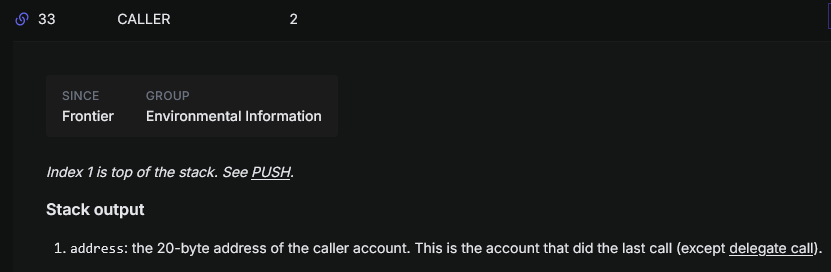

This opcode is pretty straightforward, it will push the sender's address to the stack.

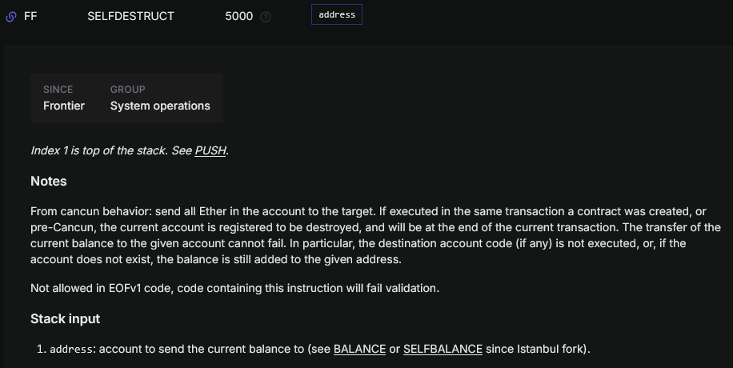

Selfdestruct will destroy the contract and send all the remaining ETH to the address on the stack. In ours case, that will be the sender.

The bytecode sequence for our runtime code is therefore as simple as `0x33ff`. No more than 2 bytes were needed, I guess 5 bytes were given to allow some other options using other opcodes to push an address... Or maybe just in case(?)

We will reuse the same initialization bytecode we wrote before, and change only the runtime code size:

```
6002    # PUSH1 2 (the runtime code size is 2, this time)
600c
6000
39
6002    # PUSH1 2 (same)
6000
f3
```

We get our final bytecode sequence: `0x6002600c60003960026000f333ff`. \
We will also need to call the code of this contract so that is execute this selfdestruct sequence. I wrote this contract for that:

```solidity
// SPDX-License-Identifier: MIT
pragma solidity ^0.8.29;

contract Placeholder {
    function goodbye() public {}
}

contract Destroyer {
    constructor(address metamorph) {
        Placeholder(metamorph).goodbye();
    }
}
```

The function we call on the contract doesn't matter, because it doesn't have any way to dispatch the call to the right function anyway: it will always execute the `CALLER` / `SELFDESTRUCT` sequence no matter what.

## Putting it all together

We now have everything we need, so let's solve the challenge! I will be using Remix IDE and a Metamask wallet connected to the custom network with the provided account.

Let's first add the existing `DoubleTrouble` contract to our deployed contracts, and deploy a new `Factory` contract.

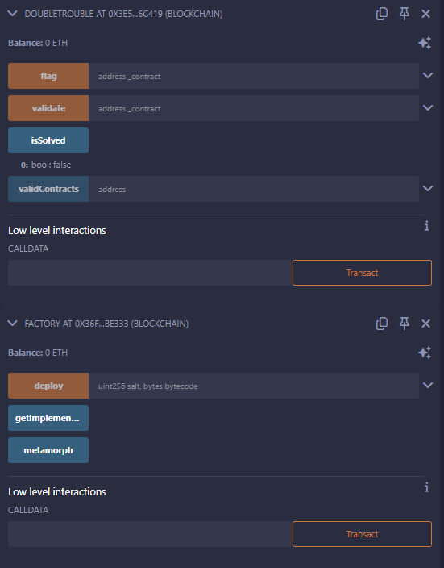

I added a `metamorph` public variable to the Factory contract in order to retrieve more easily the address of the contract after deploying it with the `deploy` call.

Let's now deploy our self destructing contract of 2 bytes. I use 0 as the salt arbitrarily here, we can use whatever value but we have to use the exact same one to redeploy to the same address later!

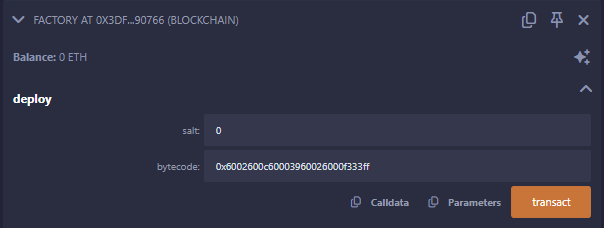

After that, if I check the metamorph variable I added, I can see the address of the created contract.

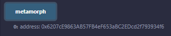

Let's validate it and check that validContracts is set to true for our contract.

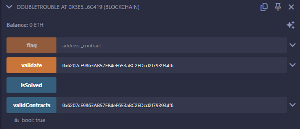

Okay, time to destroy this contract so that we can put another one at this address! We deploy the Destroyer contract with the contract to destroy as an argument.

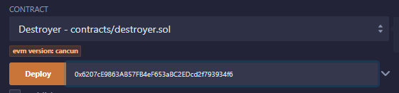

Now, let's mutate the contract with the bytecode containing the expected runtime code checked by the `flag` function!

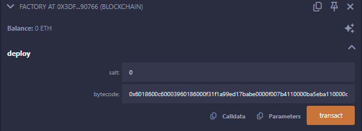

And the last thing to do now is to call the `flag` function with the address of the metamorph contract.

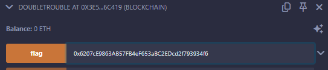

The challenge is now solved, and we can get the flag from the interface!

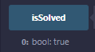
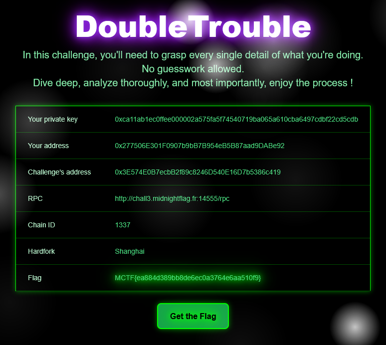

Very interesting, technical and cool challenge to discover the insides of the EVM. Shout out to the author Neoreo for his amazing work!

Flag: `MCTF{ea884d389bb8de6ec0a3764e6aa510f9}`