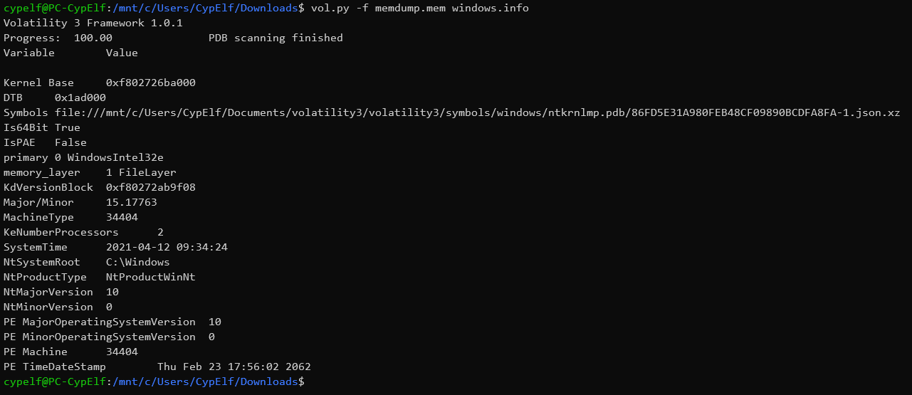
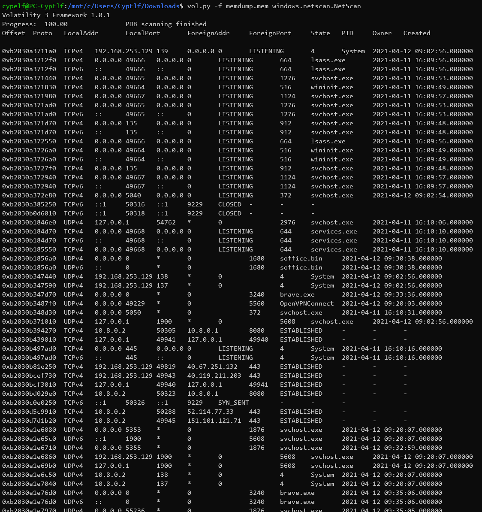

For this challenge, we have a big `memdump.mem` file, of almost 5 Go. We know someone was connected to it with a VPN when the dump was made, and we now have to retrieve the IP and port of this connection.

To analyse this memory dump, we will use the [Volatility framework](https://github.com/volatilityfoundation/volatility3). Please note that there are a lot of differences between the version 2.6 and the version 3, which is still in development. We will use the version 3.

We can get some informations about this image with the command `vol.py -f memdump.mem windows.info`

This is a dump of a machine running Windows 10.
Now, let's analyze the current connections with `vol.py -f memdump.mem windows.netscan.NetScan`:

That's quite a lot. Now we just have to test the few possibilities where the state column is `ESTABLISHED`.
After some tests, we successfully validate the flag with the following couple IP / port : `CTFIUT{151.101.121.71:443}`