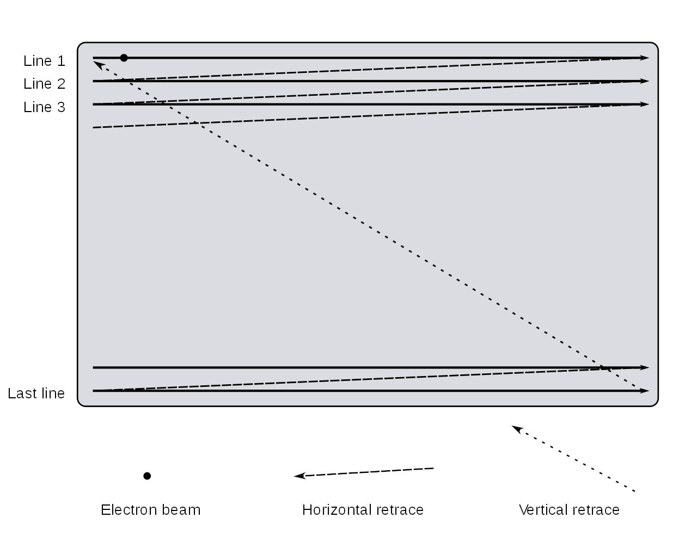
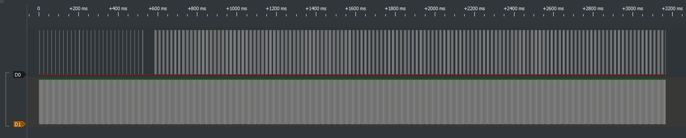
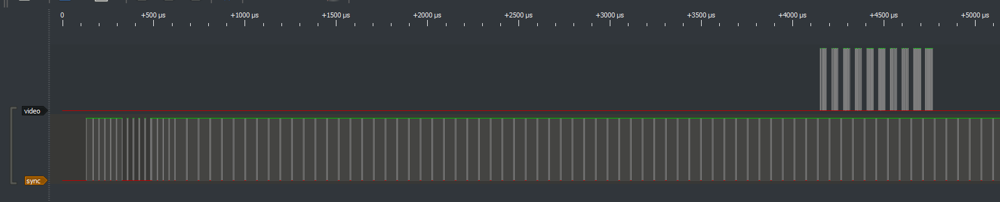
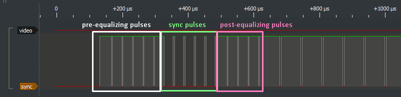
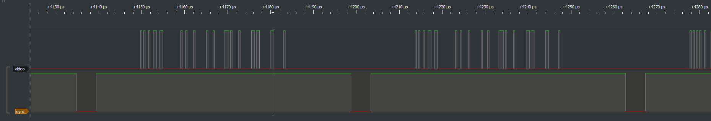
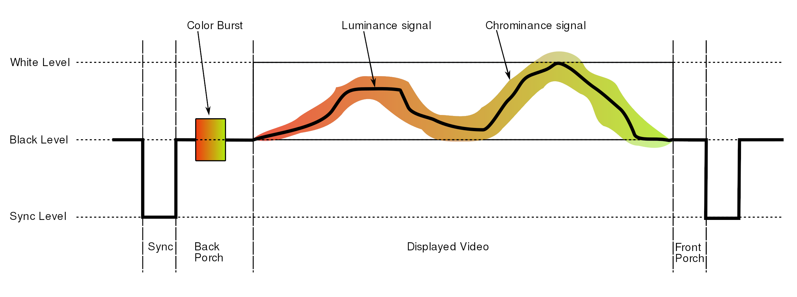
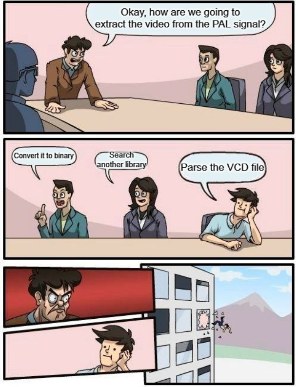
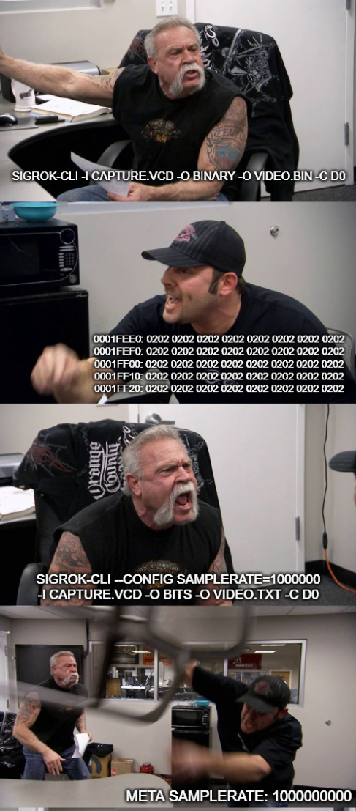
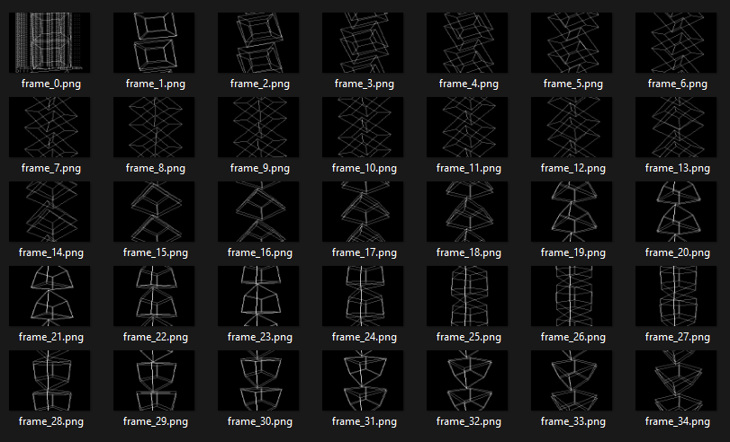
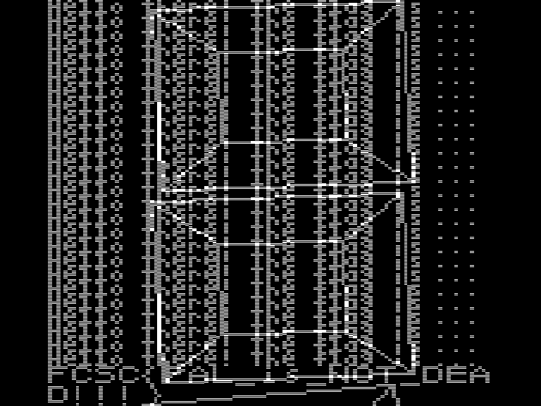

Estimated difficulty: ⭐⭐⭐ \
Quantity of solves: 14/1964

## The scenario

The challenge description tells us the following (translated from French) :

> In order to hide his communications, a criminal decided to use a radio broadcast of particular PAL videos to chat with his partners. He hopes that in the age of digital broadcasting, he will remain unseen.
> 
> You have intercepted with your SDR a sensitive communication, but you don't really have the equipment to decode the PAL signal! You know nevertheless that the criminal uses a PAL receiver with a **black and white** TV (thus without additional luminance nor chrominance) with a resolution of **768 pixels per line and 576i** (classic for PAL), and that the signal contains only the video (no audio).
> 
> You have successfully digitized the analog signals in `capture.vcd`, isolating the sync signal and the payload signal. You are confident that you can decode this PAL signal to find the secret message!
> 
> SHA256(`capture.vcd`) = `e4b198e8ff6f38a32c469ede8503f55df0c254f60696cc0094f4d70bfd819378`.

The concept of the challenge is simple: recover the video from a [signal capture](./capture.vcd). In a nutshell, the steps to solve it is first to understand what is inside this signal and how it is encoded exactly, and then find a way to decode it.

## Understanding analog TV

Because I'm born in 2003, I only saw analog televisions for a few years of my childhood before they disappeared with the digital era. \
The only mention of PAL and NTSC that I remember is for the regions of Wii games back then. \
I obviously didn't know anything about analog TV, so I took a few hours to read a lot about the topic and to understand how everything is working.

The wikipedia page for [analog TV](https://en.wikipedia.org/wiki/Analog_television) is great and detail a lot the processes, just like the [PAL](https://en.wikipedia.org/wiki/PAL) page.

We can safely ignore all the signal encoding steps implying amplitude, frequency and phase, because in our case the signal is already decoded and digitized in a capture file. \
Also, because it specifies that the attacker TV is only black and white, we don't have to worry about extracting any color. This is very good news, because extracting color is very complicated. For PAL, it converts the RGB colors in [YUV](https://en.wikipedia.org/wiki/YUV) format and transmits the U and V composants using a QAM modulation of a subcarrier... Glad I don't have to mind that!

### The raster scan

First things first, how does an analog TV work? An analog TV uses a [cathode-ray-tube](https://en.wikipedia.org/wiki/Cathode-ray_tube), or CRT, to send electrons on the TV surface. It scans every **scan line** from top to bottom, where a scan line (shortened just "line" for the rest of this write up) is literally just an horizontal line of pixels on the screen that is scanned from left to right. This kind of scan is also known as a [raster scan](https://en.wikipedia.org/wiki/Raster_scan). The analog signal received is used to vary the [luminance](https://en.wikipedia.org/wiki/Luminance) of the screen by changing the intensity of the electrons beam.



Similar to a [UART](https://en.wikipedia.org/wiki/Universal_asynchronous_receiver-transmitter) communication, the communication here is asynchronous because the TV and the analog signal emitter do not share a clock. Therefore, to know where a line begins and when the CRT should be put back at the top left corner of the TV, it uses what is called horizontal and vertical synchronisation signals. \
The horizontal sync is used to tell the TV that it's starting a new line, whereas the vertical sync tells the TV that all the lines of the TV were written and that for the next it should go back to the start. More on that later.

### Interlaced video

Another important notion I have to mention here is [interlaced video](https://en.wikipedia.org/wiki/Interlaced_video). \
The description says the signal is using [576i](https://en.wikipedia.org/wiki/576i), which is a definition video mode. The 576 part of the name means that the signal is composed of 576 vertical lines, but where I want to draw your attention is the `i` after that. This stands for interlaced, and it's a technique used to double the frame rate perceived.

The concept is that instead of how we would do naturally by displaying a frame line after line, it displays only every even line first, and then every odd line. \
This means that every frame is cut in two. These two parts of a frame, containing only the even or odd lines, are called **fields**.


## The video signal

That's a lot of theory, but we didn't even open the signal file! I use [PulseView](https://sigrok.org/wiki/PulseView) for that purpose.



The signals last for a bit more than 3 seconds in total. Just as the challenge description said, there are two isolated signals: the video data signal and the sync signal. \
The sync signal is probably D1 due to how it repeats a pattern in loop, while D0 therefore contains the video. I renamed the signals in PulseView for readability.

### The vertical sync

Let's zoom on the beginning of the signal and analyse it.



Do you see the fast back and forth at the beginning of the sync signal? This is the vertical synchronisation signal we talked about earlier. It's composed of 3 phases called the pre-equalizing pulses, the sync pulses, and finally the post-equalizing pulses. As we said earlier, it's used to put the CRT back to the upper left corner of the screen to draw a new field to the screen.



After these vertical sync, there's always no data transmitted during some time. This is called the [vertical blanking interval](https://en.wikipedia.org/wiki/Vertical_blanking_interval) and it's here to let the CRT move its way back to the start position without writing the retrace line on the screen.

### The horizontal sync

This first part being done, let's zoom somewhere where we see data in the video signal and see what's going on.



Do you see the spike at 0 in the sync signal? Each period where the sync is at 1 contains the [horizontal blanking interval](https://en.wikipedia.org/wiki/Horizontal_blanking_interval) and the actual line video data.

The horizontal blanking interval consists of 3 phases:

- the front porch
- the sync pulse
- the back porch

The **front porch** is placed between the end of the video data and the sync pulse for the next line. Its purpose is to let older TVs time to stabilize their voltage to avoid interferences between lines.

The **sync pulse** is the actual spike at 0 in the sync signal. It's here, like for the vertical sync, to synchronize the signal data with the TV and to let the TV getting ready for the line.

The **back porch** is placed after the sync pulse and before the video data to restore the black level of the video.

The length of all of these phases depends of the encoding used. As we're using PAL, we know exactly [the duration](https://en.wikipedia.org/wiki/PAL#PAL_signal_details) of each phase.

The following schema from Wikipedia recapitulates all of that. Note that we don't have the color burst nor the chrominance signal in our case, because we're working in black and white only, which is why I didn't mention them.



**Note** : in the original analog signal, as shown in this schema, the sync signal and the video signal are actually one single signal. For PAL signals, because they are analog, the logical 1 is represented using 100% of the amplitude, the logical 0 using 30% of the amplitude, and the sync level using 0%. Because the challenge is a digitized version of this signal, the challenge creator separated the sync from the video, which is why we have two different signals.

Okay, we now understand what are the different components of this signal. \
Because we know the duration of every horizontal sync phase, we can compute the exact interval in which the real video data is transmitted. And because we know the video is 768 pixels per line from the challenge description, we can just divide this interval in 768 samples, and we'll have the line pixels recovered! \
We identified the lines and the fields inside the signal. It's time to extract the video!

## The VCD format

Obviously, because of the size of the capture and the huge number of lines and fields, you can guess that we won't be manually analyzing every pixel in PulseView... We need to script the extraction. Let's search for a Python library to parse and give us the values out of a VCD file.

I found the library [PyVCD](https://github.com/westerndigitalcorporation/pyvcd) that does exactly this. \
I thought that I could find a library that will abstract the VCD format away from me and just give me the binary values I want. Unfortunately, I didn't find such a library, and to use PyVCD, I had to first dig into how the VCD format is represented.

So, VCD stands for [Value Change Dump](https://en.wikipedia.org/wiki/Value_change_dump), and it's a common format for storing signals. It actually stores information in an ASCII based format: we can open the file to see what the content looks like.

```
$ head capture.vcd -n 30
$timescale 1ns $end
$scope module logic $end
$var wire 1 ! D0 $end
$var wire 1 " D1 $end
$upscope $end
$enddefinitions $end
#0
0!
#0
0"
#130750
1"
#166750
0"
#169062
1"
#198750
0"
#201062
1"
#230750
0"
#233062
1"
#262750
0"
#265062
1"
#294750
0"
```

The VCD format basically uses keywords, i.e. words prefixed by a `$`, to do a lot of things. Each of these must be closed with a matching `$end`. \
The beginning of the file defines some importants things, including the timescale used for the signal data and our two signals D0 and D1. They are given respectively the letters `!` and `"` as identifiers.

After that, we can see a pattern that is repeated again and again, a `#` followed by a number: this is used to change the current timestamp. Then, we see each time a 0 or 1 followed by `!` or `"`: this effectively changes the value for one of the two signals using the right identifier.

Now we know why this is called Value **Change** Dump: the format actually contains only the timestamps where the value of the signal changes, which is the reason why the file is so light even though it contains a few seconds of data sampled at a very fast rate.

I started using PyVCD to loop through the tokens of the VCD file and writing some code to detect when we're exactly in the video part of the signal... Just to realize that it was extremely painful to do. \
The issue is that we jump from a change of the signal value to the next one immediately. We can't just iterate through the signal when it doesn't change. And it is a big issue for us, because in the signal video part, we want to take a few samples at regular intervals no matter if the signal value changed or not. Also, it's difficult to get the value of a signal at one precise moment in time.

After a bit of time trying to develop the logic for that anyway, trying to find workarounds for these issues, I gave up the idea because it was really unfeasable.



## Get rid of the VCD format

I didn't find any library for VCD parsing that can give me a sequence of values at a defined sampling rate ~~(and I understand why, seeing how painful that is)~~. Another workaround I could try was to convert the VCD to another format, directly binary if possible.

I didn't find much tool for that, except [sigrok-cli](https://sigrok.org/wiki/Downloads), from the same family as PulseView. It can convert the VCD file to various formats that can be listed with `-L`.

```
$ sigrok-cli -L
...
Supported output formats:
  analog               ASCII analog data values and units
  ascii                ASCII art logic data
  binary               Raw binary logic data
  bits                 0/1 digits logic data
  chronovu-la8         ChronoVu LA8 native file format data
  csv                  Comma-separated values
  hex                  Hexadecimal digits logic data
  null                 Null output (discards all data)
  ols                  OpenBench Logic Sniffer data
  srzip                srzip session file format data
  vcd                  Value Change Dump data
  wav                  Microsoft WAV file format data
  wavedrom             WaveDrom.com file format
...
```

It supports output as binary, which is nice. Well, it would be if the output was correct... 🙃

```
$ sigrok-cli -i capture.vcd -O binary -o video.bin -C D0
$ sigrok-cli -i capture.vcd -O binary -o sync.bin -C D1
```

As always, I check the files quickly with `xxd` to be sure the content is what I expected. I always do this after a conversion of some kind to avoid using wrong data for hours and don't understand why nothing works. Here is what I saw after scrolling a bit in the sync signal file:

```
0001fe60: 0000 0000 0000 0000 0000 0000 0000 0000  ................
0001fe70: 0000 0000 0000 0000 0000 0000 0000 0000  ................
0001fe80: 0000 0000 0000 0000 0000 0000 0000 0000  ................
0001fe90: 0000 0000 0000 0000 0000 0000 0000 0000  ................
0001fea0: 0000 0000 0000 0000 0000 0000 0000 0000  ................
0001feb0: 0000 0000 0000 0000 0000 0000 0000 0000  ................
0001fec0: 0000 0000 0000 0000 0000 0000 0000 0000  ................
0001fed0: 0000 0000 0000 0000 0000 0202 0202 0202  ................
0001fee0: 0202 0202 0202 0202 0202 0202 0202 0202  ................
0001fef0: 0202 0202 0202 0202 0202 0202 0202 0202  ................
0001ff00: 0202 0202 0202 0202 0202 0202 0202 0202  ................
0001ff10: 0202 0202 0202 0202 0202 0202 0202 0202  ................
0001ff20: 0202 0202 0202 0202 0202 0202 0202 0202  ................
0001ff30: 0202 0202 0202 0202 0202 0202 0202 0202  ................
0001ff40: 0202 0202 0202 0202 0202 0202 0202 0202  ................
0001ff50: 0202 0202 0202 0202 0202 0202 0202 0202  ................
0001ff60: 0202 0202 0202 0202 0202 0202 0202 0202  ................
0001ff70: 0202 0202 0202 0202 0202 0202 0202 0202  ................
0001ff80: 0202 0202 0202 0202 0202 0202 0202 0202  ................
0001ff90: 0202 0202 0202 0202 0202 0202 0202 0202  ................
```

I have no idea why, but when the signal is at a logical 1 level, the binary that sigrok-cli exported has 0x02 instead of 0xFF for every byte. Nice, thanks sigrok.

It's a bit dirty, but as a workaround, I exported the signal using the `bits` option instead. Because the output file will be huge in size due to every bit in the output being converted to one full ASCII byte, I added a command line argument to reduce the sample rate. The original sample rate of 1000000000 is way more than necessary, taking one sample every 1 ns, so I reduced it to one every 1 µs.

```
$ sigrok-cli --config samplerate=1000000 -i capture.vcd -O bits -o video.txt -C D0
$ sigrok-cli --config samplerate=1000000 -i capture.vcd -O bits -o sync.txt -C D1
```

The result is two files of 3.45 Go. It's still a lot, especially after reducing the sample rate that much... \
Something cool about sigrok, it that the output file has a header with some metadata information. Here's how it looks like.

```
$ head -5 sync.txt
META samplerate: 1000000000
libsigrok 0.5.2
Acquisition with 1/2 channels at 1 GHz
D1:00000000 00000000 00000000 00000000 00000000 00000000 00000000 00000000
D1:00000000 00000000 00000000 00000000 00000000 00000000 00000000 00000000
```

Can you guess what's wrong here... ? \
The sample rate written here is still 1000000000: it literally ignored our provided sample rate! I double checked the man of sigrok-cli, and there's no indication on conditions about when it's applied or not. \
My assumption is that it works when the input is a real board of some kind, but it's ignored when the input is a signal capture file that already has a sample rate. Anyway, we can't change it with sigrok.



Anyway, because the output of sigrok is not composed of only the ASCII bits, we first have to remove the metadata header, the VCD signal name at the beginning of each row and the spaces between bytes. I wrote a script for that.

```py
video = open("video.txt", "r").read()
sync = open("sync.txt", "r").read()

prefix = """META samplerate: 1000000000
libsigrok 0.5.2
Acquisition with 1/2 channels at 1 GHz"""

video = video.replace(prefix, "", 1)
video = video.replace("\nD0:", "")
video = video.replace(" ", "")

sync = sync.replace(prefix, "", 1)
sync = sync.replace("\nD1:", "")
sync = sync.replace(" ", "")

with open("video_fixed.txt", "w") as f:
    f.write(video)

with open("sync_fixed.txt", "w") as f:
    f.write(sync)
```

It takes a few minutes to run, but it works well.

Now at least we have the signals as text bits, even if it's still the original sample rate. \
I tried writing a Python script to resample the two files, but it was taking way too much time. Because it's only a matter of 20 lines of code, I rewrote it in Rust just in case it would be faster to process.

```rs
use std::fs;

fn main() {
    let file_path = "./video_fixed.txt";
    let reduced_file_path = "./video_fixed_reduced.txt";
    println!("Reading file...");
    let content = fs::read_to_string(file_path).unwrap();
    println!("File read.");

    let mut reduced_content = String::new();

    let smaller_len = (content.len() / 1000) as i32;

    for i in 0..smaller_len {
        let index = i * 100;
        let c = content.chars().nth(index as usize).unwrap();
        reduced_content.push(c);
    }

    println!("Writing to file...");
    fs::write(reduced_file_path, reduced_content).unwrap();
}
```

Unfortunately, even this Rust code takes way too much time to run. What's slow isn't the loop itself, because if I start an empty loop of the same size, it ends in a few seconds. I suspects the string allocations with the heap and the copy of a lot of stuff to be what's slowing down the program that much.

At this point I just gave up the idea of resampling the signal: I have another idea that will be much simpler.

## Writing the solve script

Now that we have the two signals as bits sampled at a known rate, we can finally start writing the solve script. First things first, let's define some variables we will need later.

```py
# process the signals at a lower sample rate for faster processing, otherwise it would take too long for it to complete
samp_rate_reduction = 100
samp_rate = 1000000000 / samp_rate_reduction

pixels_per_lines = 768 # 768px
lines_per_frame = 576 # 576i
lines_per_field = lines_per_frame // 2

# see https://en.wikipedia.org/wiki/PAL#PAL_signal_details
# everything is in µs
hsync_pulse = 4.7
back_porch = 5.7
active_video = 51.95
front_porch = 1.65

video_symbol_duration = active_video / pixels_per_lines
```

The `samp_rate_reduction` is my idea to solve the sample rate struggle. Instead of resampling the signal files, let's just loop through them with a step of 100 elements at a time. If we do it like that, we still loop only through a reduced amount of samples, but we don't have to do the heavy allocations stuff that is taking too much to do.

I don't define the vertical sync timing, because we won't need it. Seeing how the first thing in the signal is a vertical sync, we can guess that the signal begins at the start of a new frame, so we can just keep track of the number of lines we processed in the script. No need to code anything to parse the vertical sync.

Then, let's open and read the signal files. We also define and initialize some more variables for the main loop.

```py
log.info("Reading video signal...")
video_file = open("video_fixed.txt", "r")
video = video_file.read()[::samp_rate_reduction]
video_file.close()

log.info("Reading sync signal...")
sync_file = open("sync_fixed.txt", "r")
sync = sync_file.read()[::samp_rate_reduction]
sync_file.close()

log.info("Computing the frames...")

field_even = []
field_odd = []

field_line = 0

# initializes the fields with all 0
for i in range(lines_per_field):
    field_even.append([])
    field_odd.append([])
    for _ in range(pixels_per_lines):
        field_even[i].append(0)
        field_odd[i].append(0)

# keep track of the field parity being processed
currently_even = True
frames_processed = 0
last_sync_high_time = 0
```

The last variable defined, `last_sync_high_time`, will be very important. We will store in this variable the time where the sync signal was last seen at a logical 1. Because of that, when we see the sync signal at logical 1, we can check if the `current_time - last_sync_high_time == hsync_pulse`. \
If this difference between the last time the sync was at logical 1 and now is equal to the horizontal sync pulse timing, it means that we currently just exited this sync pulse. It means that the next thing from where we are right now is the back porch, and then there's a line of video signal!

Okay, but the signal is not perfectly respecting the specifications of the timings. There will always be some error offset from the specification. This maximum error offset is also specified in the PAL specifications. Let's write a function to check if a delay for any of the signals is within its tolerated error range. \
In fact, for this whole script, the only pattern we need to be able to recognize is the horizontal sync one, the others are not relevant. But I wrote this function at the beginning and didn't know which one I was going to need yet.

```py
def is_match(pattern, duration):
    reference = 0
    tolerated_above = 0
    tolerated_below = 0

    # see https://en.wikipedia.org/wiki/PAL#PAL_signal_details for the tolerated error ranges for each pattern
    if pattern == "front" or pattern == "video":
        tolerated_above = 0.4
        tolerated_below = 0.1
        if pattern == "front":
            reference = front_porch
        if pattern == "video":
            reference = active_video
    else:
        tolerated_above = 0.2
        tolerated_below = 0.2
        if pattern == "back":
            reference = back_porch
        if pattern == "hsync":
            reference = hsync_pulse

    return duration > reference - tolerated_below and duration < reference + tolerated_above
```

Before going further, let's define some more functions to help use later. As we loop through the samples, and because all the hardcoded delays we wrote are in microseconds, a function to convert the sample index into its time in microseconds will be needed.

```py
def i_to_us(i):
    return (i / samp_rate) * 1e6
```

Also, when we reach the moment where we detected the end of the horizontal sync, we can extract the upcoming line pixels, but for that we need a function that gives us the bit value at a specific time in microseconds. Let's write that too.

```py
def value_at_time(signal, time):
    # time in µs
    time_in_secs = time * 1e-6
    return signal[int(time_in_secs * samp_rate)]
```

A convenient function we can add as well, because we will work with two fields due to the interlaced video, is one to combine two fields and return the associated frame.

```py
def fields_to_frame(field_even, field_odd):
    frame = []
    for row_even, row_odd in zip(field_even, field_odd):
        frame.append(row_even)
        frame.append(row_odd)
        
    return frame
```

Let's also add a function that saves the frame to disk. It will use another function to convert the frame pixels from 0 and 1 to 0 and 255 to represent them with the RGB black and white.

```py
def array_bin_to_rgb(array):
    for i in range(len(array)):
        for j in range(len(array[0])):
            if array[i][j] == 1:
                array[i][j] = 255

def save_frame(frame, frame_number):
    array_bin_to_rgb(frame)
    filename = f"frame_{frame_number}.png"
    log.success(f"Writing to disk frame {frame_number}")
    cv2.imwrite(path.join("frames", filename), np.array(frame))
```

To reset the fields after we gathered both of them and wrote the frame to disk, we can add one last function.

```py
def reset_field(field):
    for i in range(len(field)):
        for j in range(len(field[0])):
            field[i][j] = 0
```

That's a lot of code and functions, but [splitting a very big and complicated problem into smaller independant problems](https://en.wikipedia.org/wiki/Divide-and-conquer_algorithm), is a very convenient way to make the whole problem much simpler to solve. \
Now that we have all these small functions for various tasks, the main code will be easier to understand and shorter in size. Let's jump right into it.

The main loop code does the following:

- if the sync bit is 1, check if we just passed a horizontal sync
- if we did, get the start and the end of the line using the known duration of the back porch and video
- get all the pixels of the line
- if the line is full of 0, ignore it because it is in a vertical blank interval (obviously not true in general, but from what I saw in PulseView of the signal, it seems like there's not a single entirely pure black line in a single of the fields, so let's use that to our advantage to simplify the extraction)
- otherwise, we continue and we write this line's content to the current field being processed
- when we reach the end of the even field, we switch to the odd field
- when we reach the end of the odd field, we have a full frame and we can save it to disk, reset the fields and continue with the next frame

Knowing that, the code should be pretty easy to read.

```py
for i, (video_bit, sync_bit) in enumerate(zip(video, sync)):
    time_us = i_to_us(i)

    if sync_bit == "1":
        duration_since_last_high = time_us - last_sync_high_time
        if is_match("hsync", duration_since_last_high):
            active_video_start = time_us + back_porch
            active_video_end = active_video_start + active_video

            line = []

            # added to avoid reading past the end of the signal and raising an error
            if i + pixels_per_lines >= len(video):
                break

            for j in range(pixels_per_lines):
                # take the value in the middle of the duration for this pixel to be sure to get its value
                pixel_time = active_video_start + (j * video_symbol_duration) + (video_symbol_duration / 2)
                pixel_value = value_at_time(video, pixel_time)

                line.append(pixel_value)

            if "1" in line:
                for j, bit in enumerate(line):
                    if currently_even:
                        field_even[field_line][j] = 0 if bit == "0" else 1
                    else:
                        field_odd[field_line][j] = 0 if bit == "0" else 1

                if field_line == lines_per_field - 1:
                    if not currently_even:
                        # if the field is odd and just finished, we can save the frame because we have both fields set
                        frame = fields_to_frame(field_even, field_odd)
                        save_frame(frame, frames_processed)
                        
                        reset_field(field_even)
                        reset_field(field_odd)
                        currently_even = True
                        frames_processed += 1
                    else:
                        currently_even = False

                    field_line = 0
                else:
                    field_line += 1

    if sync_bit == "1":
        last_sync_high_time = time_us

log.success("Finished processing the video signal")
```

The full script with all of the previous pieces of code as well as the imports can be found [here](./extract.py).

## The results

If I execute the script, I get the following output:

```
$ python3 extract.py
[*] Reading video signal...
[*] Reading sync signal...
[*] Computing the frames...
[+] Writing to disk frame 0
[+] Writing to disk frame 1
[+] Writing to disk frame 2
[+] Writing to disk frame 3
[+] Writing to disk frame 4
[+] Writing to disk frame 5
[+] Writing to disk frame 6
[+] Writing to disk frame 7
[+] Writing to disk frame 8
[+] Writing to disk frame 9
[+] Writing to disk frame 10
[+] Writing to disk frame 11
[+] Writing to disk frame 12
[+] Writing to disk frame 13
[+] Writing to disk frame 14
[+] Writing to disk frame 15
[+] Writing to disk frame 16
[+] Writing to disk frame 17
[+] Writing to disk frame 18
[+] Writing to disk frame 19
[+] Writing to disk frame 20
[+] Writing to disk frame 21
[+] Writing to disk frame 22
[+] Writing to disk frame 23
[+] Writing to disk frame 24
[+] Writing to disk frame 25
[+] Writing to disk frame 26
[+] Writing to disk frame 27
[+] Writing to disk frame 28
[+] Writing to disk frame 29
[+] Writing to disk frame 30
[+] Writing to disk frame 31
[+] Writing to disk frame 32
[+] Writing to disk frame 33
[+] Writing to disk frame 34
[+] Finished processing the video signal
```

If I look at the `frames` folder on my disk, I can see that the frames were indeed successfully extracted!



The first one looks different. If we look at it...



We can read `Hello there! The flag is...` repeated multiple times, and then the flag is written!

This challenge was a journey through analog TV and signal processing. I really loved it because I learned about a lot of things I never studied, from how the CRT works to the VCD file format through the sync mechanisms. \
I had to apply these new notions very quickly to decode the signal, which was difficult but super entertaining. \
Thank you, FCSC 2023. ❤️

Flag: `FCSC{PAL_is_NOT_DEAD!!!}`