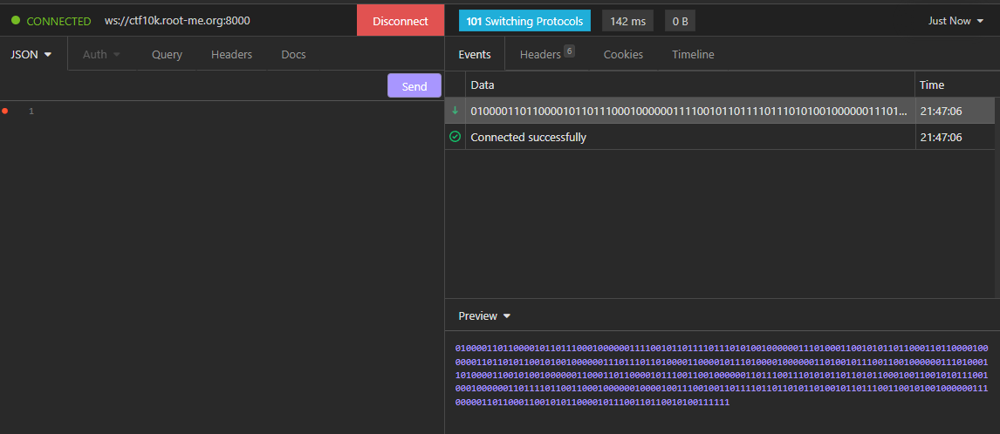
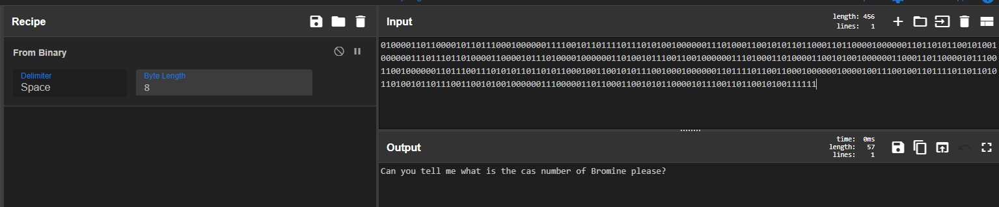
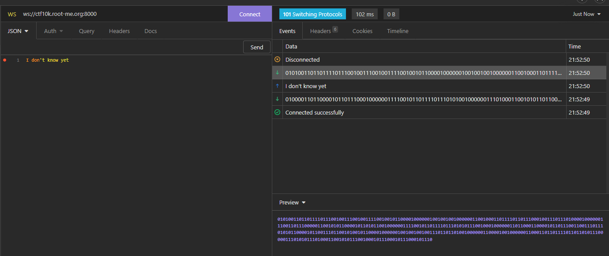
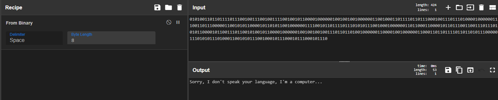
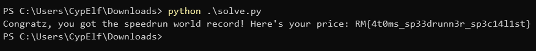

## Context

This is a write up for a challenge I created for the Root-Me CTF we organized to celebrate the 10k members on the Discord server. \
Please keep in mind I wasn't a participant but the creator of the challenge, hence the level of details and explainations I am able to provide. \
That was an amazing experience to help organizing this CTF, and I hope people learned a few things and enjoyed my challenges!

## Description

> You found a super cool ranked quizz online about physics. It rewards anybody that can complete it faster than all of the predecessors.
>
> **Note** : the atomic weight must be rounded to one decimal number.

## Resolution

We start with the link `ws://ctf10k.root-me.org:8000`. This is a websocket! We can use [Insomnia](https://insomnia.rest/) to connect to this websocket to see what's going on. This is an amazing tool to play with a REST API, a GraphQL API, gRPC calls or websocket connections.



The websocket returned a binary string. Let's decode it.



It's asking about the CAS number of Bromine. Let's answer something random to see what happens.



The websocket answered with a binary string once more.



The websocket says it doesn't speak our language. It means we have to speak in its language: binary. \
If we retry once more, we can see that the websocket has 3 types of questions:

- the CAS number of an atom
- the number of electrons of an atom
- the atomic weight of the atom

In addition to that, the websocket has 2 different ways of asking us:

- Can you tell me what is the `<question>` of `<element>` please?`
- Yo, please tell me what is the value of the `<question>` for the `<element>`

Okay, we know what we have to do now: let's write a program to answer these questions automatically! \
For that, I'm going to use a Python script with the help of the libraries `websockets` for the websockets part and `mendeleev` for the physics part. \
We'll also need to convert from and to binary the communication, so let's add functions for that.

And here is my script:

```py
import asyncio
import websockets
from mendeleev import element

uri = "ws://ctf10k.root-me.org:8000"

def from_bin(string):
    return "".join([chr(int(string[i:i+8], 2)) for i in range(0, len(string), 8)])

def to_bin(string):
    return "".join(["0" * (8 - len(format(ord(x), "b")) % 8) + format(ord(x), "b") for x in string])

async def main():
    async with websockets.connect(uri) as ws:
        for _ in range(50):
            message = from_bin(await ws.recv())

            if message.endswith("please?"):
                elem_name = message.split(" ")[-2]
            else:
                elem_name = message.split(" ")[-1]

            if message.startswith("Yo"):
                question = message[44:].split("for")[0].strip()
            else:
                question = " ".join(message[28:].split(" ")[:-3])
            
            elem = element(elem_name)

            if question == "number of electrons":
                answer = elem.electrons
            elif question == "cas number":
                answer = elem.cas
            elif question == "atomic weight":
                answer = round(elem.atomic_weight, 1)

            await ws.send(to_bin(str(answer)))
            
            resp = from_bin(await ws.recv())
            if not resp.startswith("Thank you so much!"):
                # for debug purpose in case of a crash
                print("I made an error")
                print("Response is:", resp)
                print("Question was:", question)
                print("Answer tried was:", answer)
                exit(0)

        print(from_bin(await ws.recv()))

if __name__ == "__main__":
    asyncio.run(main())
```



Flag: `RM{4t0ms_sp33drunn3r_sp3c14l1st}`