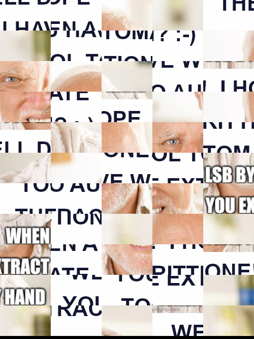

In the news channel of the CTF discord server, one week before the CTF starts, an admin announces that the inscriptions are now open, and ends his message with the following :

> There is a prechall 🦕 to find on the website while waiting for the official opening. You are already 14 to have solved it, congratulations to you! 🔥

**Note** : all the quotes, code blocks, screenshots, etc... from the challenge in this write up are originally in French. I translated them for accessibility.

## Find the challenge

If we look at the HTML source code of the website's main page, we can see the following comment:

```
<!-- While waiting for the opening, a flag is to be found on this website. See on /teasing 🔥 -->
```

The `/teasing` endpoint contains the following page.


The challenge only gives only 1 symbolic point and a flame after the user pseudo... But this flame is something uniq you can't have otherwise!


## Solving the puzzle

The starting point is this image.


It seems like the original image has been shuffled into a puzzle. \
Because I'm lazy and I don't want to spend hours solving the puzzle in GIMP (which is really annoying), I decided to just recover the text written on the image visually. After a few minutes, I got it: `FCSC 2023 CHALLENGE DESIGNERS SPEAKING OF LSB STEGANO`.

But I just made a huge mistake. :-) \
Up to this point, I was thinking that it was useless to edit the image in GIMP or whatever to solve the puzzle anyway, because it would obviously change everything in the pixels order and create a new, different image. \
As you'll see, it cost me some days of struggling.

### Failed attempts

As the text talks about LSB steganography, something I know well because it's very common, the first thing I tried is to apply steganography tools on the original image. \
I tried a lot of different tools, such as [zsteg](https://github.com/zed-0xff/zsteg), [steglsb](https://github.com/Aqcurate/lsb-steganography), [stegsolve](https://wiki.bi0s.in/steganography/stegsolve/)... But everything was just giving me garbage data. \
Using stegsolve, I tried using 2 bits of precision instead of 1, or using only two color channels at a time instead of all three... But nothing was working. \
However, I noticed something very interesting in [aperisolve](https://www.aperisolve.com/).


The bit plane 0 of the image is definitely where everything is happening. Some puzzle pieces have all their LSB at 0, while other pieces contain data.

My assumption, when I saw that, was that the LSB data was actually built using only these puzzle pieces. I then spent some time writing a Python script to extract the LSB **only** in the coordinates of one of the puzzle pieces with data, ignoring all the zones with only 0 LSB. \
Unfortunately, it ended up giving me garbage once again.

At this point, I was thinking that something was definitely suspicious with the fact that it is a puzzle, and I started to do some research about puzzle steganography.

After some googling about puzzle based steganography, I found out that something exists! [This paper](https://www.techscience.com/cmc/v67n2/41370/pdf) explains a steganography technique based on jigsaw puzzle. And if we search that on google...


We see images of dinosaurs!! 

**Note** : to explain the context, the dinos are a kind of joke in the FCSC, because of last year's pre challenge using a dinosaurs font to hide text. Since then, dinos are used a lot as a reference. For instance, you can see a dino emoji in the quote at the very beginning of this write-up, and you can also identify that the puzzle image actually contains dinosaurs.

I thought that if it was the right technique to use, the challenge authors were definitely very funny... But after reading the technique paper, I found out that the technique is using the tabs and blanks of puzzle pieces to hide the information, hence it's not usable in our case.


Such a coincidence was very funny and made me laugh, but I was still on the wrong path. :-)

### The real solution

After some brainstorming, I clicked and came back to one of the first things I thought of... Shuffling back the puzzle pieces together! If the LSB data is only on some random pieces in the puzzle... Maybe once the puzzle is solved, the pieces with the data are next to each other! \
My original assumption that editing the image would break it was actually exactly what needed to be done for the hidden data to make sense!

I took some time to solve the puzzle in GIMP, making sure every puzzle piece is exactly in the right spot, at exactly the right pixel. It gave me the following image. \
I could have only placed correctly the puzzle pieces at the top of the image, which are those holding the data in their LSB. But at this point I wanted to have the full original picture for my own pride.


This time, extracting the LSB with any of the exiting tools finally works! We extract the hidden data, and run `file` on it. It's an image.

```
$ file extracted.png
extracted.png: PNG image data, 500 x 666, 8-bit/color RGB, non-interlaced
```

If we look at it...



Me:


## Solving the second puzzle

Let's check this image with aperisolve.


Fortunately for us, it seems to be exactly the same as the first image. This time, I'm way too lazy to solve the whole puzzle, so I took only the puzzle pieces with LSB data and assembled them together. \
I didn't even try to see what the text in the image is saying. It's probably just trolling though.


If we extract the LSB data and run `file` on it once again, we see a stripped [ELF executable](binary).

```
$ file binary
binary: ELF 64-bit LSB pie executable, x86-64, version 1 (SYSV), dynamically linked, interpreter /lib64/ld-linux-x86-64.so.2, BuildID[sha1]=8633214f4900c48d504eb171c5013837f19a7d85, for GNU/Linux 3.2.0, stripped
```

## Reversing the binary

If we try to execute the binary, it waits for user input, then nothing is printed before exiting. \
Let's open it in IDA and decompile the main function. I already renamed the variables for readability.


The `hardcoded_data` variable is just a global array of integers stored in the `.data` section.


This code does some random computations with this hardcoded array integers, and then stores the results in a very big array of 0x1120 either a `#` or a space, depending on each result.

After that, it uses `scanf` to ask for user input and stores it in a string up to a length of 188. \
The code then loops over the string characters and increment or decrement what seems to be coordinates if the character is one among `L`, `R`, `U` or `D`. Now this starts to make sense, the array processed before was some kind of maze with free space to travel and walls, represented with the space and `#`. \
Each time we change one of the coordinates, we need to make sure that these coordinates aren't in a wall, and that we don't go out of the maze, i.e. prevent our coordinates from being < 0 or > 62.

If we respect these conditions and reach the coordinates (62, 62), a message is displayed, giving us the flag. \
If we summarize, we basically have a maze, where we start at coordinates (0, 0) and we need to reach the exit that is at (62, 62)!

### Automatic solve

I'm currently learning to use BINSEC, and I wondered if it was capable of solving this scenario by itself. [BINSEC](https://github.com/binsec/binsec) is a binary analysis platform, with a symbolic static execution (SSE) module very useful for reverse engineering challenges.

I wrote the following script. It replaces the user input returned from `scanf` by a symbolic variable, which is assumed to be composed of `L`, `R`, `U`, or `D` characters only. We want it to reach the instruction where it displays the flag.

```
starting from core

goal<64> := 0x5555555553A3
failure_one<64> := 0x55555555533F
failure_two<64> := 0x55555555534C
failure_three<64> := 0x555555555359
failure_four<64> := 0x555555555366
failure_five<64> := 0x555555555373
main_end<64> := 0x5555555553C9

rsp := 0x7fffffffd8e0

replace <puts>, <printf> by
    caller<64> := @[rsp, 8]
    rsp := rsp + 8
    jump at caller
end

replace <__isoc99_scanf> by
    caller<64> := @[rsp, 8]
    assert @[rdi, 6] = "%188s"z
    len<64> := nondet
    assume len = 188
    all_directions<1> := true
    for i<64> in 0 to len - 1 do
        @[rsi + i] := nondet as key
        all_directions := all_directions && (key = "L" || key = "R" || key = "U" || key = "D")
    end
    @[rsi + i] := "\x00"
    assume all_directions
    rsp := rsp + 8
    jump at caller
end

reach goal then print model

cut at goal
cut at failure_one
cut at failure_two
cut at failure_three
cut at failure_four
cut at failure_five

halt at main_end
```

Unfortunately, I let BINSEC run for more than 40 minutes without getting a result. The number of possibilities to try is probably way too much.

**Note** : after I solved the challenge, I asked another participant that solved it too who works at BINSEC. It is indeed possible to solve this maze with BINSEC, but for it to be optimized enough, one need to add constraints to avoid testing sequences with the impossible combinations that are `LR`, `RL`, `UD` and `DU`. The `strlen` function should also be stubbed too in order to make it always run for the 188 iterations, making it constant-time, to avoid forking the execution in BINSEC's engine for every possible length that would leave the function at a different moment. With all these conditions added, BINSEC is able to find the right path in approximately 10 minutes.

### Manual solve

As BINSEC didn't work, let's just solve it manually as usual. We just have to apply a simple maze solving algorithm to get the right path to the exit. I also added a plot of the maze to visualize how it looks like for fun.

Here's my script to do so.

```py
from matplotlib import pyplot as plt
from copy import deepcopy

def path_to(x, y, maze, goal_x, goal_y):
    if x < 0 or y < 0 or x >= len(maze) or y >= len(maze[0]) or maze[x][y] == 0:
        return None

    if x == goal_x and y == goal_y:
        return []

    maze[x][y] = 0

    for (dx, dy) in [(0, -1), (1, 0), (0, 1), (-1, 0)]:
        result = path_to(x + dx, y + dy, maze, goal_x, goal_y)
        if result != None:
            if dy == -1:
                result.insert(0, "U")
            elif dy == 1:
                result.insert(0, "D")
            elif dx == -1:
                result.insert(0, "L")
            elif dx == 1:
                result.insert(0, "R")
            return result
    return None

numbers = [0x7FFFFFFFFFFFFFFC, 0x4004504400511151, 0x7DD5DD5575D77D5D, 0x4554455115500451, 0x5F5D5DDD7557F5DD, 0x4105101144455045, 0x5DF77FDF77DD57F5, 0x5445104144450001, 0x75F57DFFDDD5FDFD, 0x4450400511141011, 0x775777F5DDF7DFF7, 0x4415144001104011, 0x55F55DDD577DFF57, 0x5451441555041151, 0x75D7FF57F555DDD7, 0x5454045045550401, 0x55D5FFD7DDF7DFD5, 0x4004000450015415, 0x57F7D7FF5D7775FD, 0x5545140401100115, 0x5D7DFD7FDD5DF5D5, 0x4000050145441415, 0x57DFFDFD5F777755, 0x5541441441541451, 0x55755FD57F5DFDFD, 0x5414044511444101, 0x7F7F7775F5DD5FD5, 0x4111441414155415, 0x775DF5FF57F5D7D7, 0x4441100045105015, 0x75DDD77FDDDF7F7D, 0x4045150040051005, 0x5FD555FF755D7775, 0x4114500115404141, 0x5FFDD7DF5DFDFFDD, 0x4415410545515151, 0x55F757FDFF5F5D77, 0x5151150041040451, 0x775755F555DD5D5F, 0x4415501515114515, 0x55F5F7FDF7DD5DD5, 0x5001004110054501, 0x57FDF7FFD7D7F5D7, 0x5101114041511111, 0x77FD7F5FDF5DDD77, 0x4040141045100141, 0x5FF7775F757775F5, 0x4041414414511515, 0x7DF7DF7DF757F77D, 0x5014101104411441, 0x5DFDDF57D7F77DFD, 0x5415014450411101, 0x57D5DDF77DFD77FD, 0x5001054114051105, 0x5DDF7D5557F55577, 0x4104411444444511, 0x5FFF5577DD575DFD, 0x4500541541155411, 0x755DDD7557DD7775, 0x5445111551111405, 0x577DFFD57DD7D7D7, 0x410005100405011, 0x3FFFFFFFFFFFFFFF]

maze = []

for i in range(0x1120):
    maze.append(0)

for i in range(63):
    for j in range(64):
        if (numbers[i] >> j) & 1 != 0:
            maze[i * 64 + j - 4128] = '#'
        else:
            maze[i * 64 + j - 4128] = ' '

def is_okay(x, y):
    if x > 62 or x < 0 or y > 62 or y < 0 or maze[y * 64 + x - 4128] == '#':
        return False
    else:
        return True

paths = []

for i in range(63):
    paths.append([])
    for j in range(63):
        paths[i].append(1 if is_okay(i, j) else 0)

path = path_to(0, 0, deepcopy(paths), 62, 62)

if path is not None:
    assert len(path) <= 188

    print(f"Solution found in {len(path)} steps!")
    print("".join(path))

    x, y = 0, 0
    paths[x][y] = 2

    for step in path:
        if step == "U":
            y -= 1
        elif step == "D":
            y += 1
        elif step == "L":
            x -= 1
        elif step == "R":
            x += 1

        paths[x][y] = 2

    plt.imshow(paths)
    plt.show()
else:
    print("No solution found!")
```

Result:

```
$ python .\solve.py
Solution found in 188 steps!
RDDDDDDDDDRRDDDDDDRRDDRRRRDDRRRRRRRRDDLLDDRRDDDDDDLLDDDDRRRRRRUURRRRRRRRUUUURRDDRRRRRRRRRRRRDDDDDDRRUUUURRDDRRUUUURRRRUURRDDRRDDRRRRDDDDLLDDDDDDDDDDRRDDLLLLDDDDLLLLDDRRRRDDRRRRDDLLDDDDRRRD
```


The only thing left to do is to copy paste this sequence in the binary and get the flag. :-)

```
$ ./binary
RDDDDDDDDDRRDDDDDDRRDDRRRRDDRRRRRRRRDDLLDDRRDDDDDDLLDDDDRRRRRRUURRRRRRRRUUUURRDDRRRRRRRRRRRRDDDDDDRRUUUURRDDRRUUUURRRRUURRDDRRDDRRRRDDDDLLDDDDDDDDDDRRDDLLLLDDDDLLLLDDRRRRDDRRRRDDLLDDDDRRRD
Congrats!! You can use the flag given by this command to validate the challenge:
echo -n RDDDDDDDDDRRDDDDDDRRDDRRRRDDRRRRRRRRDDLLDDRRDDDDDDLLDDDDRRRRRRUURRRRRRRRUUUURRDDRRRRRRRRRRRRDDDDDDRRUUUURRDDRRUUUURRRRUURRDDRRDDRRRRDDDDLLDDDDDDDDDDRRDDLLLLDDDDLLLLDDRRRRDDRRRRDDLLDDDDRRRD | sha256sum | awk '{ print "FCSC{" $1 "}" }'
$ echo -n RDDDDDDDDDRRDDDDDDRRDDRRRRDDRRRRRRRRDDLLDDRRDDDDDDLLDDDDRRRRRRUURRRRRRRRUUUURRDDRRRRRRRRRRRRDDDDDDRRUUUURRDDRRUUUURRRRUURRDDRRDDRRRRDDDDLLDDDDDDDDDDRRDDLLLLDDDDLLLLDDRRRRDDRRRRDDLLDDDDRRRD | sha256sum | awk '{ print "FCSC{" $1 "}" }'
FCSC{5cf9940286533f76743984b95c8edede9dbfde6226de012b8fe84e15f2d35e83}
```

Flag: `FCSC{5cf9940286533f76743984b95c8edede9dbfde6226de012b8fe84e15f2d35e83}`