## Preface

Hello there, welcome to my blog! I'm Cyprien Molinet, a security engineer passionate about computer science, development, offensive security and low level stuff.

This article follows the talk I gave at [Le Hack 2026](https://lehack.org/2026/), the biggest French technical cybersecurity conference, where I presented the Sighax vulnerability on the main stage, found on the Nintendo 3ds. I presented this talk as a staff and representative of [2600](https://www.2600.eu/), a cybersecurity focused higher education school.

The time limit for the presentation was 20 minutes, which forced me to remove approximately half of my slides the day before, when I realized that the content I created and planned for this talk would last more than 35 minutes...

You can [download here](./slides.pdf) the full version of the **slides**, with the missing part.

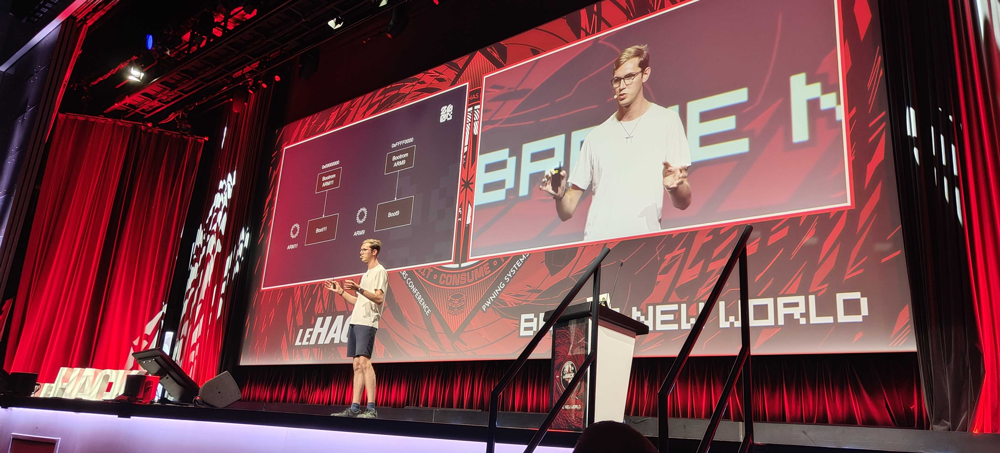

This article will contain roughly the same content as the talk did, but we will dig into the details much more than the talk did, and include the full missing part.

⚠️ One thing to note: these information and research were made by many different people back in the days, 10 years ago. I did not discover all of this myself: all the credit for finding it goes to the original researchers. Back in the days all of that was discovered, I was too busy going to middle school to bother about vulnerability research... 😎

## The 3ds architecture

This tour of the 3ds components is not meant to be exhaustive, as it will cover only the components that are important to understand and know for the rest of this article. If you want to read more about the 3ds architecture in detail, I recommend reading [Copetti's amazing blog article](https://www.copetti.org/writings/consoles/nintendo-3ds) on the topic.

### The board

Upon opening an old 3ds, you will find a board like this.

💡 In this article (and in the 3ds hacking scene in general), the initial 3ds models published by Nintendo are going to be referred to as "**old 3ds**". This includes the 3ds, the 3ds XL, and the 2ds. On the other hand, all the "new" models that came up later with upgraded hardware and capabilities, which include the new 3ds, new 3ds XL and new 2ds XL models, are going to be referred to as "**new 3ds**".

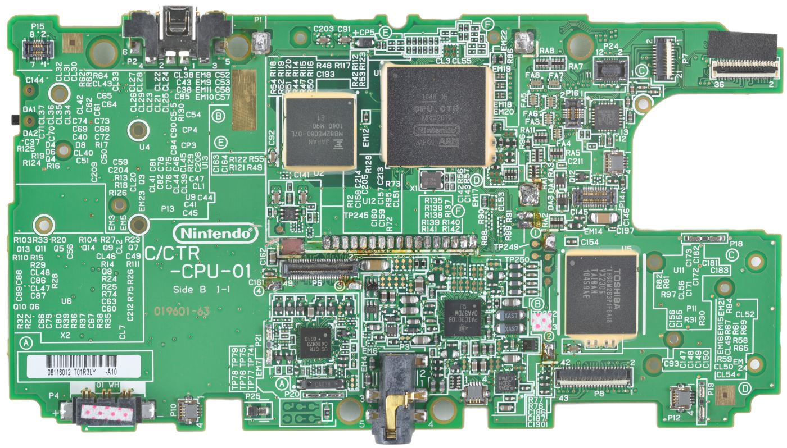

The biggest black square, the one at the top and on the center right, is the **SoC** of the console. \
Its name is **CPU CTR**, with CTR being the general code name for the Nintendo 3ds.

Just at the left of it is located another squared black chip: the Fact Cycle DRAM, referred to as **FCRAM**. It contains 128 MB of RAM on the old 3ds and 256 MB on the new 3ds. \
This is the primary RAM meant to be used by **running games**.

The last squared black chip visible here on the board, at the bottom right, is an **eMMC** chip. It is basically the storage and internal memory of the console, and is where the console firmwares are located. As this eMMC is composed of NAND memory, it is also very commonly referred to as the **NAND**.

The NAND memory starts with a Nintendo specific container format called [NCSD](https://www.3dbrew.org/wiki/NCSD). All of its content is also encrypted using AES in CTR mode.

Among the different partitions it contains, are two called **firm0** and **firm1**. This is where the firmware on the console is stored (more on that later). Both have the exact same content, and firm1 is just here as a backup in case firm0 would get corrupted or altered in any way.

### Inside CPU CTR

The SoC of the console contains a ton of different things, including what we're most interested in: the 3 CPUs of the console.

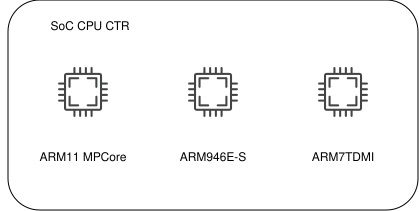

As a simplification, we usually call them ARM11, ARM9 and ARM7.

The ARM7 CPU is merely used in DSi and GBA retrocompatibility modes. When the console is used for its 3ds capabilities, which is most of the time, this CPU is not even turned on, and the ARM11 and ARM9 are the only being used.

Therefore, for the rest of this article, we'll just ignore this CPU.


**ARM11** is a core cluster that contains 2 ARM11 cores on the old 3ds and 4 on the new 3ds. It's the most powerful CPU among the 3, and is where the games are running.

In addition to the FCRAM used by games, the ARM11 processor has access to another chunk of 512 KB "work" SRAM through ARM's [AXI](https://developer.arm.com/documentation/102202/0300/AXI-protocol-overview) protocol, called **AXI WRAM**. It's the RAM used by ARM11's kernel, but more on that later.

**ARM9** is a CPU used for **security**. It controls NAND access and I/O operations. Games don't even know this CPU exists! When ARM11 wants to do any operation that requires some level of permissions, it has to ask ARM9, which will perform checks, perform the operation, and return the result.

Just like ARM11 has AXI WRAM to store kernel memory, ARM9 also has a dedicated block of 1 MB of SRAM for the old 3ds and 1.5 MB for the new 3ds. This is often simply referred to as "ARM9 memory".

ARM11 and ARM9 are connected through an [IPC](https://en.wikipedia.org/wiki/Inter-process_communication) mechanism, called "PXI". This is a FIFO unit that contains two separate 64 bytes queues, one for each direction (from ARM11 to ARM9, and the opposite). This is how ARM11 and ARM9 can communicate and exchange information.

This divide is **extremely important** for the 3ds security model. The ARM11 processor, where games are running, is going to be the entrypoint for most attacks, so it's considered untrusted. Even if it's entirely compromised up to the kernel, it has very limited access to the hardware, because it has to rely on ARM9 for all the sensitive operations.

### The FIRM file format

When talking about the 3ds, the firmwares we refer to are using a proprietary format created by Nintendo for the occasion. The file format is called **FIRM**.

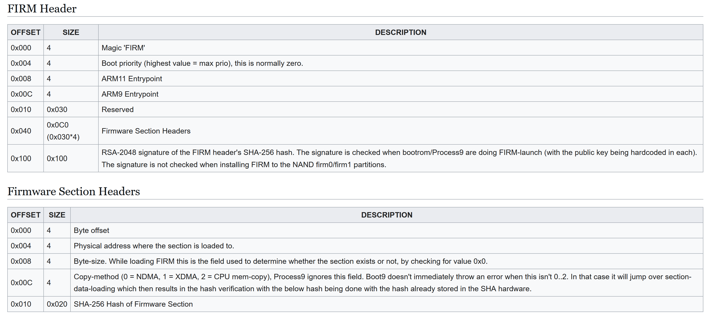

A FIRM file contains different **sections**, and for each of them, a physical address where they should be copied.

The main firmware of the console, the one used to operate in 3ds mode, located in firm0 and firm1, is called **NATIVE_FIRM**.

In NATIVE_FIRM, one section contains the kernel code for ARM11, called **kernel11**, and another section contains the kernel code for ARM9, this time called **kernel9**. The address where they are copied are respectively located in the AXI WRAM and in ARM9 memory, as we discussed earlier.

Every FIRM must also provide a RSA 2048 **signature** of the SHA256 hash of the FIRM header, with a private key owned by Nintendo.

### Hardware crypto engines

The 3ds features hardware AES, RSA and SHA engines. \
The AES and RSA engines are particularly interesting: they contain **key slots**, that can be written to but **not read from**.

The idea is the following: once keys are loaded in these key slots, they are disposed of, so that they can't be accessed. It then becomes only possible to ask the engine to encrypt or decrypt using the key in the key slot, but the key itself is kept private all along.

Different keys are placed in the different slots of these engines, for all the different purposes that the console has.

⚠️ Because the AES related crypto is not necessary to understand the rest of this article regarding Sighax, we will ignore it from now on, however don't forget that it is present and in particular that the NAND content is encrypted.

## The 3ds boot process

### Step by step

The final, entire boot process looks like this.


The first thing happening when the console turns on, is that both CPU start at a fixed address in their memory space. For ARM11, this is 0x00000000, and for ARM9, this is 0xFFFF0000.

Below if their physical memory layout.

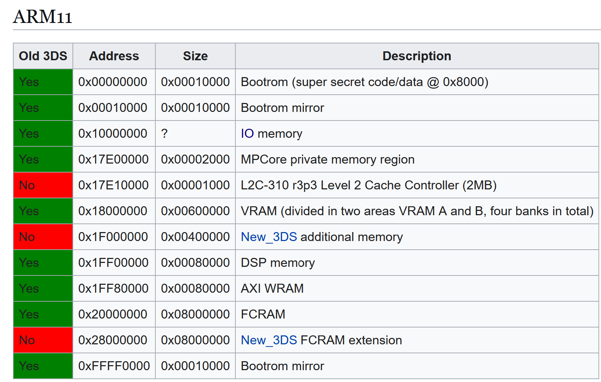

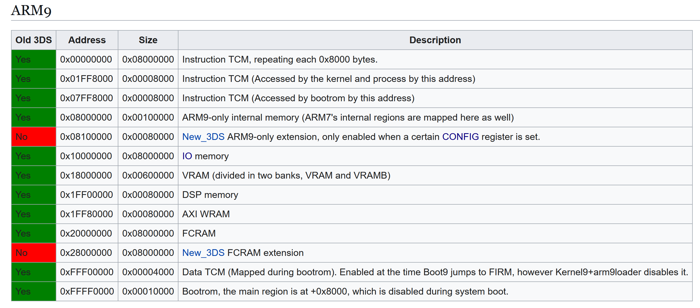

As we can see, these addresses point to the beginning of both **bootroms**. \
The bootroms are tiny memory regions located near the CPUs and burned in a definitive, read-only memory at factory. It can't be changed after that.

The bootrom of ARM11 contains a code that we will call **boot11**, and in a similar way, we will call the content of the ARM9 bootrom **boot9**.

Boot9 starts first. It puts hardcoded AES keys and RSA public keys in their respective key slots, and then tries to load NATIVE_FIRM from the firm0 partition on the NAND. If it fails, it then tries the one in the firm1 partition. \
The **signature** of NATIVE_FIRM is checked and the process continues only if it matches.

Once this is finished, boot9 basically tells boot11 that everything is ready. \
The last step is that boot9 will write to specific config registers, `CFG_SYSPROT9` and `CFG_SYSPROT11`, in order to **disable read access** to the **upper half** of the bootroms of ARM9 and ARM11. This upper half is where all the important code lies, which is now not accessible anymore. This measure is meant to prevent dumping the bootroms and reverse engineering them. \
Writing to these registers also enables **access to FCRAM**, which is necessary for the console to work properly.

Finally, each CPU will jump to the entrypoint that was specified by the FIRM header, and start executing **kernel11** and **kernel9**.

Kernel11 will start many system modules, including the **Process Manager** (PM), which in turn will start the **Nintendo Shell** (NS), which will finally start the home menu, that infamous menu of the 3ds that welcomes us when the console boots!

Kernel9, however, will only start a single process, called **process9**. \
It is worth noting that the ARM9 kernel exposes to process9 a syscall allowing to execute basically anything with kernel level permissions, which makes the privilege split between these two basically useless.

Kernel11's system module PXI will be the one taking care of communication with process9 through the PXI mechanism.

### Context and goal

We will assume that ARM11 and ARM9 and fully compromised. Back in the days, many other exploits existed already, allowing to privesc from ARM11 userland to kernel11, and even to kernel9. \
These other exploits are way beyond the scope of this article.

The main issue is the following: with an update, Nintendo could patch vulnerabilities over time, removing the access that was gained.

A first way to persist on the console already existed in the name of **A9LH**, but it had its own drawbacks and difficulties.

Sighax gives us a much better way to do this. Let's see how.

## Sighax

The signature of the FIRM header is not just RSA over the raw bytes of the SHA256 hash. The hash itself it put in an ASN.1 structure first.

### ASN.1 101

[ASN.1](https://en.wikipedia.org/wiki/ASN.1) is a generic way of describing data, mostly used for telecommunications and cryptography. To store our hash, the structure that it contains looks like this:

```asn1
DigestInfo ::= SEQUENCE {
    digestAlgorithm     DigestAlgorithmIdentifier,
    digest              Digest
}

DigestAlgorithmIdentifier ::= SEQUENCE {
    algorithm           OBJECT IDENTIFIER,
    parameters          ANY DEFINED BY algorithm OPTIONAL
}

Digest ::= OCTET STRING
```

A sequence is just a container of two other fields. We have an outer sequence, that contains an inner sequence, which describes the algorithm used. Then, after that inner sequence, we have the hash data itself.

The actual values we have for SHA256 are the following:

```
SEQUENCE (2 elem)
  SEQUENCE (2 elem)
    OBJECT IDENTIFIER 2.16.840.1.101.3.4.2.1 (sha-256)
    NULL
  OCTET STRING (32 byte) [SHA256 hash value]
```

The inner sequence contains an object identifier, or **OID**, that uniquely described SHA256 in the ASN.1 standard. There are no parameters to this algorithm, hence the NULL for this parameter.

### DER 101

In order to actually store this as concrete bytes, we need a way to encode this ASN.1 data into bytes. Multiple encodings exist, but the one used by Nintendo in this case is [DER](https://en.wikipedia.org/wiki/X.690).

It's a **Type Length Value** (TLV) encoding. It encodes the **type** of the data with one byte, then the **length** of it using one or more bytes, and finally the **content** of it.

The length is encoded using 7 bits out of the 8 bits in the byte, because the most significant bit (MSB) is used to determine if the length continues on the next byte or not. This allows multi bytes lengths. On a single byte, the maximum length is therefore 2<sup>7</sup>, or 127. Including 0, it makes up 128 different possible values.

Consider the following ASN.1 example:

```
example ::= INTEGER
```

If we want to store the number 1 as this ASN.1 example value, and encode it with DER, we would get the following:

```
02 01 01
```

Where `02` is the ASN.1 type for INTEGER, `01` is the byte length of the data that follows, and `01` is the number we wanted to store.

Now, for SHA256, remember the ASN.1 structure we saw previously? Here is what the DER encoding of it looks like:

```
30 31 30 0d 06 09 60 86 48 01 65 03 04 02 01 05 00 04 20 [SHA256 hash value]
```

We can unpack it as follows:

- `30 31` = **SEQUENCE** of length 0x31
- `30 0d` = **SEQUENCE** of length 0x0d
- `06 09` = **OID** of length 9
- `60 86 48 01 65 03 04 02 01` = OID value for **SHA256**
- `05 00` = **NULL type** of length 0
- `04 20` = **OCTET STRING** of length 0x20 (32 bytes)

This is the final data that is signed with RSA!

### PKCS#1 v1.5 101

Before we can sign this data with RSA, we need to add **padding** to our data. As we are using **RSA 2048**, we need to pad the data so that it is contains this size.

Today, a more robust padding named [OAEP](https://en.wikipedia.org/wiki/Optimal_asymmetric_encryption_padding), or PKCS#1 v2, exists. It was actually already available when the 3ds was being created and Nintendo chose to implement PKCS#1 v1.5 instead.

They probably evaluated that the problems of PKCS#1 v1.5 were not a concern in the context where it was going to be used with the 3ds, and it has the advantage of being very easy to implement, contrary to OAEP, that requires some complex maths. For an embedded console where they re implemented most of the crypto, this is important.

The way PKCS#1 v1.5 padding works is very easy to understand.

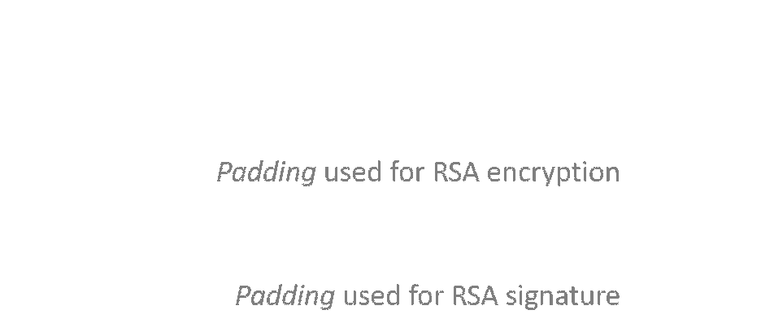

It starts with a null byte, then is followed by a byte that dictates the type of padding that this is. If we are padding for encryption, this value is 2, and if we are padding for a signature, this value is 1.

Next, it depends on the type of padding. If we are padding for encryption, we add random non null bytes, and then we end with a null byte to indicate where the padded data starts. \
In the case of a signature, the random non null bytes are replaced by `0xFF` bytes everywhere.

### Code reuse

We don't have access to any of the bootroms' content, so we can't just reverse engineer them to search for vulnerabilities. However, we do know that it has to parse ASN.1 and check the RSA signature.

These are also things that **NATIVE_FIRM does** in a few places. If you reverse engineer the **factory firmware**, the NATIVE_FIRM version that came out at first even before version 1.0.0-0 was released in 2011, you can notice **two huge flaws**.

They were patched very early by Nintendo in NATIVE_FIRM, but they reused almost the same code in the bootroms, which can't be updated or changed. They actually contain the **same flaws**.

### PKCS#1 v1.5 mistake

Nintendo allows **type 2** padding on **signatures**. This is a **HUGE** issue, because if we want to bruteforce a valid signature, it's normally unfeasible due to all these `0xFF` bytes in the padding that we have to get. Now, any value that is not zero will be accepted. This reduces by a ton any effort of bruteforce.


### ASN.1 parser mistake

Now, look at this code. This is decompiled code from the vulnerable ASN.1 parser from NATIVE_FIRM before the fix.

```c
int extract_asn1_from_rsa(uint8_t* signature, uint8_t** hash) {
    int result, length_field;
    uint8_t type_field;
    uint8_t* sig_ptr;

    sig_ptr = signature;
    if (signature
        && parse_asn1_field(&sig_ptr, &type_field, &length_field) && type_field == 0x30
        && parse_asn1_field(&sig_ptr, &type_field, &length_field) && type_field == 0x30)
    {
        sig_ptr += length_field;
        parse_asn1_field(&sig_ptr, &type_field, &length_field);
        if (hash)
            *hash = sig_ptr;
        result = 1;
    }
    else
        result = 0;
    
    return result;
}
```

Every time `parse_asn1_field` is called, the `sig_ptr` pointer is moved just **after the DER header** (that is, the type and length fields) to point towards the data itself.

The first thing it expects is a sequence (type `0x30`), but it **does not check its size**. It's not even used. \
Next, it checks if there's a second, inner sequence. Here, the same happens: the type field is the only field that is verified.

It then **adds the length field** of this inner sequence to point just passed it, where the hash is supposed to be stored with its DER header. \
And finally, it parses the field and gets the data in it, **without even checking** the type or the length of it.

Besides the fact that this parser is awful because it ignores basically half of the fields values, it contains a **critical issue**. When it adds the length field of the inner sequence, it does not check if this length is actually within the ASN.1 data.

If we are able to change this length field to increase it a lot, we can make the ASN.1 parser look **beyond the DER data** on the stack, and return whatever data is there instead of the hash embedded in the signature...

The thing is, the computed hash from the FIRM header, that is checked against the hash in the signature, is **already on the stack** below. By choosing the right length, we can make the ASN.1 parser return the **computed hash** so that it compares against itself!

### Combining everything together

Our goal is to find a valid signature that contains an inner sequence length field pointing after the ASN.1 structure end.

We don't know if the hash is located just after the ASN.1 structure, or if it's further away on the stack. Therefore, finding such signatures for every possible location is necessary. They will be tested manually. Because a length field on a single byte can only go up to 128, we can only try these 128 locations.

There is a big chance that the computed hash is in this range, as it is very unlikely that more than 128 values were placed onto the stack between computing the hash of the FIRM and verifying the signature.

The type of signature we are looking for is the following:

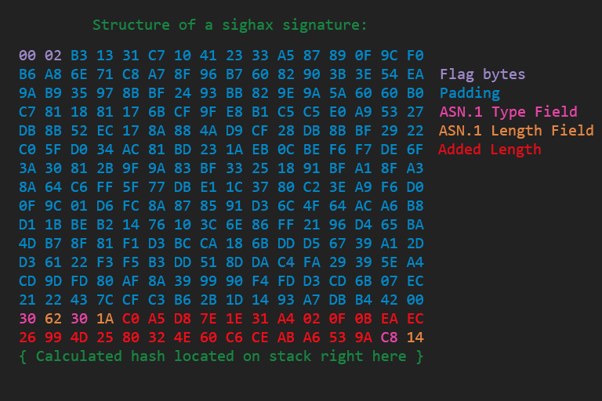

What's important in this signature?

The first two bytes must be `00 02` (in hex) to match a PKCS#1 v1.5 header type encryption.

All the bytes in blue must be **non null** but can be **anything**, except the last one who has to be zero to indicate the end of the padding. The size of this padding can vary and doesn't have to be this exact size, because the RSA parser also doesn't enforce the padding length. That's another issue in it adding a lot of flexibility to the allowed layouts.

The `30` that follows is required, because it is parsed as the outer sequence of the ASN.1. The type, `62`, can be anything because it's ignored by the parser. Then, the `30` just after is important too, because it's parsed as the inner sequence. The value `1A` here is probably the most important thing: it's supposed to be the length of the data, the one that's not enforced. Here, we want to have the exact offset of the memory location where we suspect the computed hash to be on the stack, beyond the ASN.1 structure end. We take this and **subtract 2** from it, because the parser then parses the two bytes at this offset as the type and length before the data (even if the actual values are ignored).

In summary, we have exactly **6** bytes that must hold very specific values, and a whole bunch in the padding that can be anything except zero.

This is easy enough to be bruteforced! 🎉

### Results

Signatures like these were called **perfect** signatures, because what the content of the FIRM is doesn't matter, this signature exploits the RSA padding and ASN.1 parser flaws we saw to make them return true when the signature is checked in all cases.

In practice, with some computation optimization, perfect signatures were bruteforced in a bit more than a week, using AWS machines (p2.8xlarge) and a few GTX 1080 Ti.

The computation step itself is very interesting but goes beyond the scope of this article.  You can read [the slides from the original authors](https://sciresm.github.io/33-and-a-half-c3/math.html) if you're interested.

This vulnerability is what was named **Sighax**. \
With it, we can now put any FIRM file in the firm0 partition and make it boot through boot9.

Also, this **can't be patched**, because all of this happens directly in boot9, so it can't be updated by Nintendo.


💡 Note: 6 signatures had to be bruteforced instead of a single one, because there is not a single RSA key but actually 6 used in different contexts beyond the scope of this article.

## Dumping boot9

This is already a huge win and a big impact. But even if we can load any FIRM, by the time each CPU starts executing the code we've chosen, the bootroms are already locked out by boot9, by writing to the `CFG_SYSPROT9` and `CFG_SYSPROT11` registers, as we discussed in the 3ds architecture section. Until the console resets, it becomes impossible to access their content.

It would be great to be able to dump their content to reverse engineer it and look for other vulnerabilities.

### Arbitrary copy with NDMA

Remember how a FIRM file works, and how it consists of copying a section to any physical address?


Now that we can sign any FIRM, we can not only write our own sections of code that will be executed on ARM11 and ARM9, but we can also **write our payload to any address in memory**.

Or at least, *almost* any. The code that loads a FIRM in boot9 contains a blacklist that is checked against the section being copied. However, only the **boot9 data** regions are blocked.


The **I/O registers**, are not concerned by this blacklist. The thing is, there is a DMA engine called "new" DMA or **NDMA** accessible in this area.

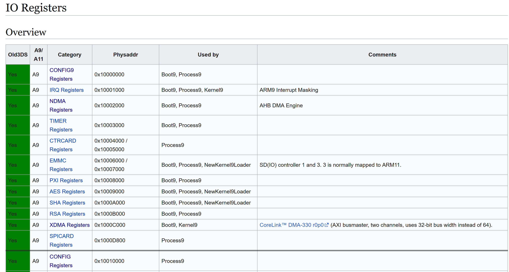

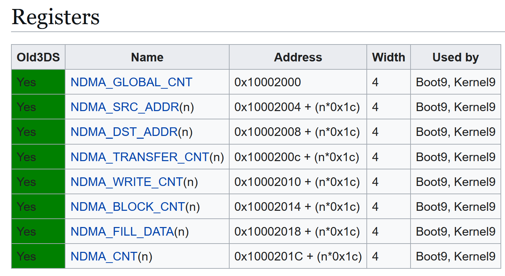

By writing to these registers with specifically chosen values, it is possible to trigger a copy data from any source to any destination, including from the boot9 data addresses.

This allows to **bypass** the blacklist!

### Using NDMA to copy boot9

It is possible to leverage this arbitrary copy to dump boot9! \
We have to create a section that will be copied over **NDMA** (address `0x10002000`), so that it triggers a copy from the protected half of boot9, located at `0xFFFF8000`, to any unused address in ARM9 memory of our choice, for a size of 32 KB.

Then, when boot9 copies our section in memory over NDMA, the copy gets triggered, and all of this happens while the FIRM is still being loaded in memory, which means **before** the bootroms get locked!

When the console boots afterwards, we can then get the copy of the bootrom that is waiting for us in ARM9 memory!

### Dumping boot11?

We can't use the same trick to dump boot11 right away, simply because boot11 can only be accessed from ARM11 and is not mapped in ARM9's memory layout.

If we want to dump boot11, we need to get a way to execute something from boot11 before the bootroms get locked. In order to get arbitrary code execution under ARM11, we will need to start by getting it in boot9 first.

## Getting bootroms code execution

With our NDMA enabled arbitrary copy, as we saw previously, we can write anywhere accessible from there, including the **ARM9 memory** used by boot9 during its execution and supposed to be protected by the blacklist.

What can be overwritten to get code execution?

### Boot9's exception vectors

As we discussed earlier, the first half of the bootrom is not protected, and it contains different things including the **ARM9 exception vectors**, hardcoded there.

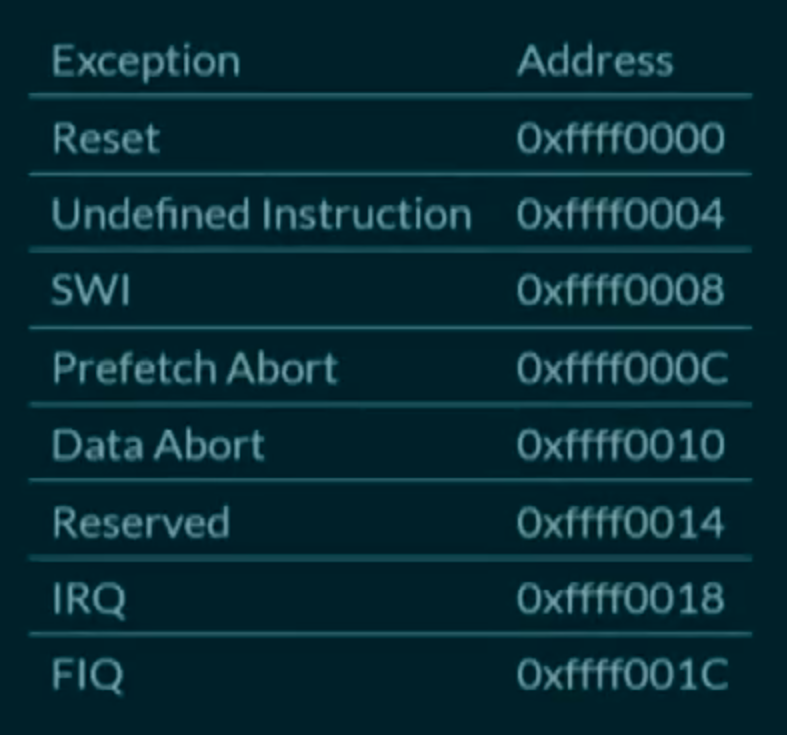

The addresses they contain point to another jump table in ARM9 memory, which in turn contain vectors pointing to the *actual* handlers.

### Abusing ARM9 vector handlers

So, first, we use a section of our FIRM to put an ARM9 payload of our choice somewhere in ARM9 memory, containing ARM9 code to execute later and the address where this code is going to be placed. \
Then, we use another section to trigger NDMA and replace the exception vectors in ARM memory with the address of the previous ARM9 code, that we also copied in memory.

Finally, we place a section that we ask to place to physical address 0, in order to force a data abort exception to be triggered.

The data abort vector is triggered, the corrupted handler is invoked, and we get **boot9 code execution**!

### Getting boot11 code execution and dump

From there, it is pretty trivial to get ARM11 bootrom code execution as well. ARM9 has access to AXI WRAM in its memory layout, where boot11 puts its data. Among these data are some function pointers, that can be overwritten before they're called by boot11 in order to hijack its execution flow.

For that, we just need to place a section in our FIRM that puts an ARM11 payload in AXI WRAM. Then, from boot9, we replace boot11's function pointers in AXI WRAM at the right moment, and just a moment later, we get ARM11 code execution.

Once we have boot11 code execution, boot11 can be **dumped** because the bootroms are still accessible!

💡 Note: the description above is a simplification of the actual process. In reality, the ARM9 exception handler corrupts two function pointers from ARM9 itself and then lets the boot process resume, then the function pointers are called by boot9 later to do first the boot11 hijacking and then the code execution of a stage 2 payload. For more information, check the [research paper from SciresM](https://arxiv.org/pdf/1802.00359).

## From sighax to boot9strap

By leveraging Sighax, we saw that it is possible to get code execution in boot9 and boot11, dump their bootroms, and finally load any eventual stage 2 payload, often a custom firmware (CFW) like Luma3ds.

The implementation of this as a FIRM file, that gets code execution during boot9 and boot11, is called [Boot9Strap](https://github.com/SciresM/boot9strap) and is, since then, the reference to install on any 3ds to persist in a definitive, safe and clean way on the console. It tries to load a FIRM file named `boot.firm` from the SD card or from the NAND.

## Conclusion

It is very impressive to see how a community of passionate and professionals were able to put such efforts together to dig very deep in the architecture, hardware and software of the console, and exploit all the mistakes that were made.

We have to admit that the architecture that Nintendo tried to put into place was, on paper, really good. The problem lies in the implementation of the different defensive measures and securities, with repeated and obvious mistakes on some of the most critical pieces of software of the console.

As a side note, after all of that happened, upon reverse engineering of boot9, another huge flaw allowing to execute anything on the console from a DS cartridge was found (**ntrboothax**), by holding a few keys together and using a magnet. This also gave a cheap, permanent entrypoint to the console that also can't be patched. Oopsie!

Nintendo learned a lot from their mistakes, and the Nintendo Switch that came years later was MUCH more secure and fine tuned for security than all its predecessors. Though the Switch suffered from a critical bootrom flaw just like the 3ds in the name of [fusée gelée](https://youtu.be/MjclaVr1NeM), this time wasn't the fault of Nintendo but of Nvidia. Nowadays, the Switch 2 reused most of the Switch architecture that was already proved secure, and is a big success from a security point of view.

## Sources and resources

Here are all the sources I used for this article. There is a lot more to the 3ds than what I talked about here, so if you want to dig more and learn about many other things related to the console hardware and architecture, I recommend checking these out!

- https://www.3dbrew.org
- https://youtu.be/8C5cn_Qj0G8
- https://arxiv.org/pdf/1802.00359
- https://sciresm.github.io/33-and-a-half-c3/
- https://www.copetti.org/writings/consoles/nintendo-3ds

I hope you found this article interesting and learned new things! \
Bye!

\- Elf