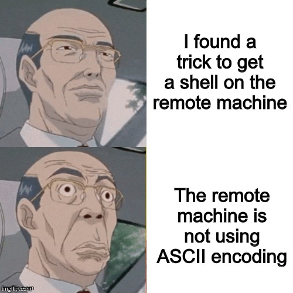
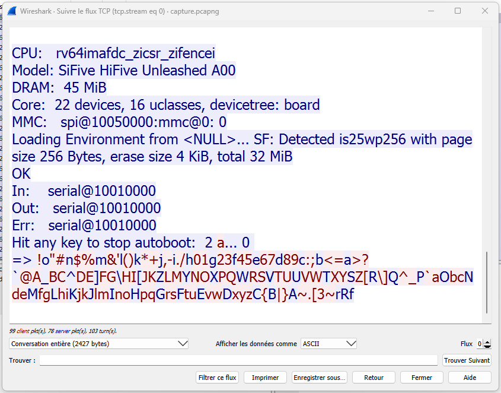

Estimated difficulty: ⭐⭐ \
Quantity of solves: 6/1964

**Note** : "Sous marin" means "submarine" in French.

## The scenario

The challenge description is pretty long. It tells us the following (translated from French) :

> You are invited by a colleague to come and test his new miniature submarine model. This model is equipped with a "first person view" camera and an adequate system to broadcast this video stream.
> 
> To lure you in, your colleague specifies that its board is based on **a RISC-V core**. You immediately accept. That evening, you spend several minutes exploring the ocean floor of the campus pool. Nevertheless, after half an hour, the supervision system panics and you lose communication. You jump into the pool to retrieve the model. Your colleague sees students running off in the distance with radio equipment in hand. But what happened? Could these students have compromised the remote submarine system? You offer to help your colleague extract the content of his Flash memory and analyze it.
> 
> The next day, after a shower and a short night's rest, your colleague drops the submersible's electronic board on your desk. He confirms to you that he implemented [a serial port in 8-N-1 mode](https://en.wikipedia.org/wiki/8-N-1), but he says that he potentially made **an implementation error in the logic of the synthesized serial port**, but he doesn't remember much about it.
> 
> Because the submarine is not underwater, its electronics are not properly cooled. You can't keep it on for more than a few minutes before it shuts down for safety.
> 
> You take a serial to USB adapter to connect to the system and start investigating...
> 
> **To interface with the serial port remotely, you will need Telnet.**
> 
> `HOST:PORT : challenges.france-cybersecurity-challenge.fr:2303`
> 
> Your colleague has managed to find a backup of the `bootloader.bin` and tells you that you can emulate the boot sequence with the command `qemu-system-riscv64 -M sifive_u -m 45M -kernel bootloader.bin` (serial port available in `View > Serial 0`). This allows you to prototype ideas before you risk damaging the submarine.
> 
> SHA256(`bootloader.bin`) = `e06c7b272736c0d34617e9f62fd4e4c1a8d56d6df6e4f1ee83492999c4a65e6c`.

### Summary

That's a lot of information. If we recap, we have the following elements:

- a remote access to the original submarine serial port, through the [Telnet](https://en.wikipedia.org/wiki/Telnet) protocol
- a [backup of the bootloader](./bootloader.bin) used in the submarine

The command to start the bootloader locally with [QEMU](https://www.qemu.org/) is also provided. It features a [RISC-V](https://en.wikipedia.org/wiki/RISC-V) core. \
Last but not least, the serial port of the submarine seems to suffer from an implementation error. We don't really know what exactly, for now.

### Getting more information on the context

Before looking at anything regarding the challenge, let's do some research about the topic to get a better understanding of what we're talking about here. I already knew about RISC-V, but never used QEMU with that architecture before. So, I made a quick search and found some nice [documentation about QEMU and RISC-V](https://qemu.readthedocs.io/en/latest/system/target-riscv.html). \
It explains the specifics for that architecture within QEMU, especially the fact that you must specify the board model you want to use (with `-M` or `--machine`). As it is explained in these docs, this is because the different RISC-V systems differ a lot from one another, at a point where OS and firmwares intended for one machine won't work on any other one.

The board used here is a [SiFive HiFive Unleashed](https://qemu.readthedocs.io/en/latest/system/riscv/sifive_u.html), a well documented development board created with the intention to increase exposure and adoption of the RISC-V architecture. \
For those who don't know it, RISC-V is an instruction set architecture ([ISA](https://en.wikipedia.org/wiki/Instruction_set_architecture)), just like x86, ARM, etc. It's very popular because of a lot of its design properties and the fact that it's an open standard.

## The bootloader backup

Let's now run `qemu-system-riscv64 -M sifive_u -m 45M -kernel bootloader.bin` and see what happens. In the QEMU window that opens, we can go to `View > Serial 0` as said in the challenge description to connect to the board's serial port.

```
OpenSBI v0.9
   ____                    _____ ____ _____
  / __ \                  / ____|  _ \_   _|
 | |  | |_ __   ___ _ __ | (___ | |_) || |
 | |  | | '_ \ / _ \ '_ \ \___ \|  _ < | |
 | |__| | |_) |  __/ | | |____) | |_) || |_
  \____/| .__/ \___|_| |_|_____/|____/_____|
        | |
        |_|

Platform Name             : SiFive HiFive Unleashed A00
Platform Features         : timer,mfdeleg
Platform HART Count       : 2
Firmware Base             : 0x80000000
Firmware Size             : 108 KB
Runtime SBI Version       : 0.2

Domain0 Name              : root
Domain0 Boot HART         : 1
Domain0 HARTs             : 0*,1*
Domain0 Region00          : 0x0000000080000000-0x000000008001ffff ()
Domain0 Region01          : 0x0000000000000000-0xffffffffffffffff (R,W,X)
Domain0 Next Address      : 0x0000000080200000
Domain0 Next Arg1         : 0x0000000082000000
Domain0 Next Mode         : S-mode
Domain0 SysReset          : yes

Boot HART ID              : 1
Boot HART Domain          : root
Boot HART ISA             : rv64imafdcsu
Boot HART Features        : scounteren,mcounteren
Boot HART PMP Count       : 16
Boot HART PMP Granularity : 4
Boot HART PMP Address Bits: 54
Boot HART MHPM Count      : 0
Boot HART MHPM Count      : 0
Boot HART MIDELEG         : 0x0000000000000222
Boot HART MEDELEG         : 0x000000000000b109


U-Boot 2022.10 (Oct 03 2022 - 19:25:32 +0000)

CPU:   rv64imafdcsu
Model: SiFive HiFive Unleashed A00
DRAM:  45 MiB
Core:  22 devices, 16 uclasses, devicetree: board
MMC:   spi@10050000:mmc@0: 0
Loading Environment from <NULL>... SF: Detected is25wp256 with page size 256 Bytes, erase size 4 KiB, total 32 MiB
OK
In:    serial@10010000
Out:   serial@10010000
Err:   serial@10010000
Hit any key to stop autoboot:  0 
SF: Detected is25wp256 with page size 256 Bytes, erase size 4 KiB, total 32 MiB
[+] Copying kernel from flash, please wait...
device 0 offset 0x0, size 0x9bc8b
SF: 638091 bytes @ 0x0 Read: OK
[+] Decompressing and booting kernel...
Bad Linux RISCV Image magic!
=> 
```

The bootloader used here is [u-boot](https://en.wikipedia.org/wiki/Das_U-Boot), a popular bootloader used a lot in embedded systems. I know what it is by name, but as I never really had to deal with embedded devices bootloaders, I don't know more than that about it. \
The challenge name seems to come from here, as the logo of u-boot is a submarine and the name itself is a reference to the german submarine [U-boat](https://en.wikipedia.org/wiki/U-boat).

There are some interesting things in this output. First, it says `Hit any key to stop autoboot`, leaving us 2 seconds to press a key before booting automatically. Second, it tries to load the kernel from the flash, except... there's no flash and no kernel in our case, because we only booted QEMU with the bootloader and nothing more, so obviously, it won't be able to boot the kernel and fails saying that the [magic number](https://en.wikipedia.org/wiki/File_format#Magic_number) of the kernel is wrong.

After that, it opens a kind of shell prompt. If we type `help`, we get a nice list of commands.

```
=> help
?         - alias for 'help'
base      - print or set address offset
bdinfo    - print Board Info structure
booti     - boot Linux kernel 'Image' format from memory
bootm     - boot application image from memory
cmp       - memory compare
coninfo   - print console devices and information
cp        - memory copy
crc32     - checksum calculation
echo      - echo args to console
env       - environment handling commands
erase     - erase FLASH memory
exit      - exit script
false     - do nothing, unsuccessfully
fdt       - flattened device tree utility commands
flinfo    - print FLASH memory information
fstype    - Look up a filesystem type
fstypes   - List supported filesystem types
help      - print command description/usage
ln        - Create a symbolic link
load      - load binary file from a filesystem
loop      - infinite loop on address range
ls        - list files in a directory (default /)
md        - memory display
mm        - memory modify (auto-incrementing address)
mmc       - MMC sub system
mmcinfo   - display MMC info
mw        - memory write (fill)
nm        - memory modify (constant address)
panic     - Panic with optional message
part      - disk partition related commands
printenv  - print environment variables
protect   - enable or disable FLASH write protection
random    - fill memory with random pattern
reset     - Perform RESET of the CPU
save      - save file to a filesystem
setenv    - set environment variables
setexpr   - set environment variable as the result of eval expression
sf        - SPI flash sub-system
showvar   - print local hushshell variables
size      - determine a file's size
sysboot   - command to get and boot from syslinux files
test      - minimal test like /bin/sh
true      - do nothing, successfully
unlz4     - lz4 uncompress a memory region
version   - print monitor, compiler and linker version
```

It seems we can do a lot of things with that. Before searching some docs about these commands and what we can possibly do with them, let's also see what we have remotely.

## The remote submarine

Let's connect to the remote serial port using Telnet and see what we get.

```
$ telnet challenges.france-cybersecurity-challenge.fr 2303
Trying 176.31.162.35...
Connected to challenges.france-cybersecurity-challenge.fr.
Escape character is '^]'.
= Proof of Work protection =
To launch this challenge, you need to solve a proof-of-work.
More details can be found on <https://france-cybersecurity-challenge.fr/pow>.
Please provide an ASCII printable string S such that SHA256(NvG1EIUBL9tr2aDz || S) starts with 22 bits equal to 0 (the string concatenation is denoted ||):
```

Before seeing anything with the chllenge, it's protected by a PoW mecanism. I guess it is used here because loading a bootloader and a kernel, probably in an emulator such as QEMU just like we did locally, takes a lot of resources, so the PoW is a way to prevent anyone from being able to overload the server by starting a lot of connections very fast. \
This is not relevant for the purpose of the challenge. A Python solve script for it is provided in the linked page with all the details about this protection, so we don't have to care much about it. I just moved the code that computes and sends the PoW in another file, so I could just import it as one function in my own script and don't get distracted by all of its code. \
I chose to not put the source code of this file here for readability purposes, because it's not related to the challenge.

Anyway, if we solve the PoW, the actual boot sequence is started. Here is the output we get from the serial port.

```
$ telnet challenges.france-cybersecurity-challenge.fr 2303
Trying 176.31.162.35...
Connected to challenges.france-cybersecurity-challenge.fr.
Escape character is '^]'.
= Proof of Work protection =
To launch this challenge, you need to solve a proof-of-work.
More details can be found on <https://france-cybersecurity-challenge.fr/pow>.
Please provide an ASCII printable string S such that SHA256(LYsKWX6IPJkJtC1q || S) starts with 22 bits equal to 0 (the string concatenation is denoted ||): 00000000000000000000000008577462
Thank you for solving our proof-of-work, we hope you had a great time! Launching challenge...


OpenSBI v1.0
   ____                    _____ ____ _____
  / __ \                  / ____|  _ \_   _|
 | |  | |_ __   ___ _ __ | (___ | |_) || |
 | |  | | '_ \ / _ \ '_ \ \___ \|  _ < | |
 | |__| | |_) |  __/ | | |____) | |_) || |_
  \____/| .__/ \___|_| |_|_____/|____/_____|
        | |
        |_|

Platform Name             : SiFive HiFive Unleashed A00
Platform Features         : medeleg
Platform HART Count       : 2
Platform IPI Device       : aclint-mswi
Platform Timer Device     : aclint-mtimer @ 1000000Hz
Platform Console Device   : sifive_uart
Platform HSM Device       : ---
Platform Reboot Device    : gpio-restart
Platform Shutdown Device  : ---
Firmware Base             : 0x80000000
Firmware Size             : 260 KB
Runtime SBI Version       : 0.3

Domain0 Name              : root
Domain0 Boot HART         : 1
Domain0 HARTs             : 0*,1*
Domain0 Region00          : 0x0000000002000000-0x000000000200ffff (I)
Domain0 Region01          : 0x0000000080000000-0x000000008007ffff ()
Domain0 Region02          : 0x0000000000000000-0xffffffffffffffff (R,W,X)
Domain0 Next Address      : 0x0000000080200000
Domain0 Next Arg1         : 0x0000000082c00000
Domain0 Next Mode         : S-mode
Domain0 SysReset          : yes

Boot HART ID              : 1
Boot HART Domain          : root
Boot HART ISA             : rv64imafdcsu
Boot HART Features        : scounteren,mcounteren
Boot HART PMP Count       : 16
Boot HART PMP Granularity : 4
Boot HART PMP Address Bits: 54
Boot HART MHPM Count      : 0
Boot HART MIDELEG         : 0x0000000000000222
Boot HART MEDELEG         : 0x000000000000b109


U-Boot 2022.10 (Oct 03 2022 - 19:25:32 +0000)

CPU:   rv64imafdc_zicsr_zifencei
Model: SiFive HiFive Unleashed A00
DRAM:  45 MiB
Core:  22 devices, 16 uclasses, devicetree: board
MMC:   spi@10050000:mmc@0: 0
Loading Environment from <NULL>... SF: Detected is25wp256 with page size 256 Bytes, erase size 4 KiB, total 32 MiB
OK
In:    serial@10010000
Out:   serial@10010000
Err:   serial@10010000
Hit any key to stop autoboot:  0
SF: Detected is25wp256 with page size 256 Bytes, erase size 4 KiB, total 32 MiB
[+] Copying kernel from flash, please wait...
device 0 offset 0x0, size 0x9bc8b
SF: 638091 bytes @ 0x0 Read: OK
[+] Decompressing and booting kernel...
   Uncompressing Kernel Image
Moving Image from 0x80d00000 to 0x80200000, end=80cb7548
## Flattened Device Tree blob at 824907b0
   Booting using the fdt blob at 0x824907b0
   Using Device Tree in place at 00000000824907b0, end 0000000082494e0e

Starting kernel ...

[    0.000000] Linux version 5.15.90 (fcsc@fcsc) (riscv64-unknown-linux-gnu-gcc (GCC) 11.3.0, GNU ld (GNU Binutils) 2.39) #1 Wed Feb 1 11:36:50 CET 2023
[    0.000000] OF: fdt: Ignoring memory range 0x80000000 - 0x80200000
[    0.000000] Machine model: SiFive HiFive Unleashed A00
[    0.000000] Forcing kernel command line to:
[    0.000000] Zone ranges:
[    0.000000]   DMA32    [mem 0x0000000080200000-0x0000000082cfffff]
[    0.000000]   Normal   empty
[    0.000000] Movable zone start for each node
[    0.000000] Early memory node ranges
[    0.000000]   node   0: [mem 0x0000000080200000-0x0000000082cfffff]
[    0.000000] Initmem setup node 0 [mem 0x0000000080200000-0x0000000082cfffff]
[    0.000000] SBI specification v0.3 detected
[    0.000000] SBI implementation ID=0x1 Version=0x10000
[    0.000000] SBI TIME extension detected
[    0.000000] SBI IPI extension detected
[    0.000000] SBI RFENCE extension detected
[    0.000000] riscv: ISA extensions acdefimnrs
[    0.000000] riscv: ELF capabilities acdfim
[    0.000000] Built 1 zonelists, mobility grouping on.  Total pages: 10857
[    0.000000] Kernel command line:
[    0.000000] Dentry cache hash table entries: 8192 (order: 4, 65536 bytes, linear)
[    0.000000] Inode-cache hash table entries: 4096 (order: 3, 32768 bytes, linear)
[    0.000000] mem auto-init: stack:off, heap alloc:off, heap free:off
[    0.000000] Memory: 30824K/44032K available (688K kernel code, 4565K rwdata, 2048K rodata, 2112K init, 197K bss, 13208K reserved, 0K cma-reserved)
[    0.000000] NR_IRQS: 64, nr_irqs: 64, preallocated irqs: 0
[    0.000000] riscv-intc: unable to find hart id for /reserved-memory/mmode_resv0@80000000/interrupt-controller
[    0.000000] riscv-intc: 64 local interrupts mapped
[    0.000000] plic: interrupt-controller@c000000: mapped 53 interrupts with 1 handlers for 3 contexts.
[    0.000000] riscv_timer_init_dt: Registering clocksource cpuid [0] hartid [1]
[    0.000000] clocksource: riscv_clocksource: mask: 0xffffffffffffffff max_cycles: 0x1d854df40, max_idle_ns: 3526361616960 ns
[    0.000229] sched_clock: 64 bits at 1000kHz, resolution 1000ns, wraps every 2199023255500ns
[    0.013597] Calibrating delay loop (skipped), value calculated using timer frequency.. 2.00 BogoMIPS (lpj=4000)
[    0.013767] pid_max: default: 4096 minimum: 301
[    0.014645] Mount-cache hash table entries: 512 (order: 0, 4096 bytes, linear)
[    0.014711] Mountpoint-cache hash table entries: 512 (order: 0, 4096 bytes, linear)
[    0.294500] ASID allocator using 16 bits (65536 entries)
[    0.302421] clocksource: jiffies: mask: 0xffffffff max_cycles: 0xffffffff, max_idle_ns: 7645041785100000 ns
[    0.510297] clocksource: Switched to clocksource riscv_clocksource
[    0.695205] workingset: timestamp_bits=62 max_order=13 bucket_order=0
[    0.797372] 10010000.serial: ttySIF0 at MMIO 0x10010000 (irq = 1, base_baud = 4166666) is a SiFive UART v0
[    1.302085] printk: console [ttySIF0] enabled
[    1.307412] 10011000.serial: ttySIF1 at MMIO 0x10011000 (irq = 2, base_baud = 4166666) is a SiFive UART v0
[    1.601631] Freeing unused kernel image (initmem) memory: 2112K
[    1.603601] Run /init as init process
Muahahaha, you won't get my flag!
[    1.896306] reboot: System halted
```

It's the same as what we saw locally, except that a kernel is successfully loaded and booted, because it's the original submarine and its full board, including the flash. \
The kernel started is a Linux kernel. But instead of booting as usual, as soon as the init process is started, it prints `Muahahaha, you won't get my flag!` and then immediately reboot. \
The [init](https://en.wikipedia.org/wiki/Init) process is the first process that is started in the Linux boot process. It is responsible, as the name implies, for various initializations, such as the `/proc` and `/dev` paths, just to name a few. I hightly suspect they replaced it with a very simple binary that just prints this deny message and reboots.

During the boot sequence, if we press a key while the `Hit any key to stop autoboot` countdown is still running, we can get a u-boot shell here as well. It's the same bootloader, so we have access to exactly all the same commands.

## First idea: changing the `bootargs` environment variable

Because I'm not a u-boot expert, I took some time to read its documentation to get a better understanding of how it works and then search for information about the security tricks and other issues it can have. I ended up finding a lot of good resources, such as a [HackTricks page](https://book.hacktricks.xyz/hardware-physical-access/firmware-analysis/bootloader-testing) about bootloader testing, an article about [how to force a shell in the OS](https://drmnsamoliu.github.io/shell.html) and a very nice [article from a colleague](https://www.synacktiv.com/publications/i-hack-u-boot.html) at Synacktiv.

The u-boot shell can be used to do a lot of things, including copying data from flash to memory, starting the boot process at some address, changing the environment and configuration of u-boot... \
U-boot actually uses environment variables to configure a lot of its settings. We can use the [`printenv`](https://u-boot.readthedocs.io/en/latest/usage/cmd/printenv.html) command (shortcut for [`env print`](https://u-boot.readthedocs.io/en/latest/usage/cmd/env.html)) to list all of them. Let's try that locally and see how what it contains in our case.

```
=> printenv
arch=riscv
baudrate=115200
board=unleashed
board_name=unleashed
bootargs=console=ttyS0 autoplay=https://youtu.be/m2uTFF_3MaA
bootcmd=sf probe; echo [+] Copying kernel from flash, please wait...; sf read $kernel_addr_r 0 9bc8b; echo [+] Decompressing and booting kernel...; booti $kernel_addr_r - $fdtcontroladdr
bootdelay=2
cpu=fu540
ethaddr=70:b3:d5:92:f0:01
fdt_addr=824907b0
fdt_addr_r=0x8c000000
fdt_high=0xffffffffffffffff
fdtaddr=824907b0
fdtcontroladdr=824907b0
fdtfile=sifive/hifive-unleashed-a00.dtb
initrd_high=0xffffffffffffffff
kernel_addr_r=0x80d00000
kernel_comp_addr_r=0x81800000
kernel_comp_size=0xb00000
loadaddr=0x80200000
preboot=setenv fdt_addr ${fdtcontroladdr};fdt addr ${fdtcontroladdr};
serial#=00000001
stderr=serial@10010000
stdin=serial@10010000
stdout=serial@10010000
vendor=sifive

Environment size: 811/131068 bytes
```

Before going further, something catches our attention immediately: there is a youtube link in the `bootargs` variable. Should we check it... ?


I took the risk, because if by any chance it's useful for any reason, I have no choice but to check it.

I copy paste the link into my browser, and...

<iframe width="560" height="315" src="https://www.youtube.com/embed/m2uTFF_3MaA" title="YouTube video player" frameborder="0" allow="accelerometer; autoplay; clipboard-write; encrypted-media; gyroscope; picture-in-picture; web-share" allowfullscreen></iframe>

They're definitely trolling us, but at least I didn't get rickrolled, and now I have a nice song to listen to while doing the rest of the challenge.

Besides that, let's take a look at these environment variables real quick. In our case, we're not really interested in the ones that specifies the board's architecture, settings such as baud rate, etc. However, the following deserves some explaination:

- `kernel_addr_r`
- `bootcmd`
- `bootdelay`
- `bootargs`

The first one, `kernel_addr_r`, is used in the `bootcmd` variable, and from its name, we can guess it's the address of the kernel image located on the flash.

`bootcmd` is a special environment variable that contains the commands to execute when autoboot is enabled. These are the commands that are run when we don't press any key to enter the u-boot shell in time.

`bootdelay` is the variable that specifies the delay we have to press a key and enter the u-boot shell before autoboot happens and the `bootcmd` content is executed. If set to `0`, autoboot happens with no delay, but **you can still stop it** by pressing a key and get a u-boot shell. The values `-1` and `-2` can be used to respectively disable autoboot and autoboot with no delay **and prevent access to the u-boot shell**. \
In our case, this variable is set to `2`, which is why we have a 2 seconds delay for entering the u-boot shell.

The most important for our goal is probably `bootargs`. This one contains arguments passed to the kernel. I didn't even know the Linux kernel had command line arguments, but in the end it's just a very big and complex ELF executable, so why not?

The Linux [kernel documentation](https://docs.kernel.org/admin-guide/kernel-parameters.html) lists all of the command line arguments supported. It contains thousands of different ones, but one in particular will be very useful for us:

```
init=           [KNL]
                Format: <full_path>
                Run specified binary instead of /sbin/init as init process.
```

By setting the `init` argument, we can replace the original init process with something else! \
Therefore, we can do something like that:

```
=> setenv bootargs "console=ttyS0 init=/bin/sh"
```

And when it will boot, hopefully, we will get a shell. I kept the `console` argument because I wasn't exactly sure what it would do if I removed it. The `autoplay`, on the other hand, literally does not exist, so we don't care if it's removed.

Okay, the theory seems perfect! Let's try that on the remote machine. \
I stop the boot process by pressing one key, and I start to write the command... And as I'm typing, here's what I see in my terminal:

```
=> FMMHHOLF
```



## The implementation error

Do you remember the challenge description? It mentionned an implementation error in the logic of the serial port. I think we just found it. \
The characters we type are not the characters the server recognizes. But it's actually not really an issue at all. We know it is only an **implementation error**, so it's not just random characters replacing our input. There must be some relation between how we encode data as ASCII and how the server sees it, caused by a mistake in an algorithm.

In order to find how the server interpretation relates to ASCII, I immediately thought of the following plan: let's type in a lot of characters that are next to each other in the ASCII table, for example the lowercase alphabet, and see what the server is seeing. The goal here is to look for patterns, to identify a kind of logic in the way the server is interpreting these characters. \
To make it easier for me, and thanks to Telnet not being encrypted communications, I started [Wireshark](https://www.wireshark.org/) to be able to follow the TCP stream and see clearly my input followed by the server interpretation.



As I guessed, we can easily identify a pattern here! Two things can be noticed:

- half the characters are completely ignored by the server
- when typing the uppercase letters, the server answers with the uppercase alphabet in reverse order

With these information, I deduced that the server has its own weird ASCII table version that is the inverse of the normal ASCII table and that has a step of 2 between every characters, making it a 256 bits table instead of 128. This encoding still uses a single byte for each character, since the original non extended ASCII table only uses 7 bits.

Okay, time to write a function to make the conversion automatically from our ASCII characters to the server's encoding!

```py
ascii_table = []

for i in range(128):
    ascii_table.append(chr(i))

remote_encoding = []

for i in range(0, 255):
    if i % 2 == 0:
        ascii_table_char = ascii_table[i // 2]
        remote_encoding.insert(0, ascii_table_char)
    else:
        remote_encoding.insert(0, None)

def ascii_to_remote(text):
    encoded_bytes = b""
    for char in text:
        # I added a + 1 because I had an offset of 1 between the remote_encoding array here and the observed remote encoding
        # It was simpler to fix like that
        encoded_bytes += (remote_encoding.index(char) + 1).to_bytes(1, "big")
    return encoded_bytes
```

Let's use this function in a separate script to send the commands we want to the server.

```py
from telnetlib import Telnet
from remote_encoding import ascii_to_remote
from proof_of_work import solve_pow

host = "challenges.france-cybersecurity-challenge.fr"
port = 2303

if __name__ == "__main__":
    io = Telnet(host, port)
    solve_pow(io)

    io.write(b"A") # press any key to stop the autoboot and access the u-boot shell

    io.write(ascii_to_remote('echo "HELLO WORLD!!"\n'))

    while True:
        read = io.read_until(b"\n").strip().decode()
        print(read)
```

If we run it, in the output of the script, after all the bootloader information...

```
...
Hit any key to stop autoboot:  0
=> echo "HELLO WORLD!!"
HELLO WORLD!!
```

It works!!

## The deception

The encoding script working properly, I immediately used it to run the commands to update the `bootargs` environment variable to replace init with a shell. I print the environment to check if the modification was applied and just boot the kernel using the same command sequence that is inside the `bootcmd` variable. Replacing only the echo command part of the previous script:

```py
io.write(ascii_to_remote("setenv bootargs console=ttyS0 init=/bin/sh autoplay=/bin/sh\n"))
io.write(ascii_to_remote("printenv\n"))
io.write(ascii_to_remote("sf probe; sf read $kernel_addr_r 0 9bc8b; booti $kernel_addr_r - $fdtcontroladdr\n"))
```

I run it, I cross my fingers...

```
...
=> setenv bootargs console=ttyS0 init=/bin/sh
=> printenv
arch=riscv
baudrate=115200
board=unleashed
board_name=unleashed
bootargs=console=ttyS0 init=/bin/sh
bootcmd=sf probe; echo [+] Copying kernel from flash, please wait...; sf read $kernel_addr_r 0 9bc8b; echo [+] Decompressing and booting kernel...; booti $kernel_addr_r - $fdtcontroladdr
bootdelay=2
cpu=fu540
ethaddr=70:b3:d5:92:f0:01
fdt_addr=824907b0
fdt_addr_r=0x8c000000
fdt_high=0xffffffffffffffff
fdtaddr=824907b0
fdtcontroladdr=824907b0
fdtfile=sifive/hifive-unleashed-a00.dtb
initrd_high=0xffffffffffffffff
kernel_addr_r=0x80d00000
kernel_comp_addr_r=0x81800000
kernel_comp_size=0xb00000
loadaddr=0x80200000
preboot=setenv fdt_addr ${fdtcontroladdr};fdt addr ${fdtcontroladdr};
serial#=00000001
stderr=serial@10010000
stdin=serial@10010000
stdout=serial@10010000
vendor=sifive

Environment size: 786/131068 bytes
=> sf probe; sf read $kernel_addr_r 0 9bc8b; booti $kernel_addr_r - $fdtcontroladdr
SF: Detected is25wp256 with page size 256 Bytes, erase size 4 KiB, total 32 MiB
device 0 offset 0x0, size 0x9bc8b
SF: 638091 bytes @ 0x0 Read: OK
   Uncompressing Kernel Image
Moving Image from 0x80d00000 to 0x80200000, end=80cb7548
## Flattened Device Tree blob at 824907b0
   Booting using the fdt blob at 0x824907b0
   Using Device Tree in place at 00000000824907b0, end 0000000082494e0e

Starting kernel ...

[    0.000000] Linux version 5.15.90 (fcsc@fcsc) (riscv64-unknown-linux-gnu-gcc (GCC) 11.3.0, GNU ld (GNU Binutils) 2.39) #1 Wed Feb 1 11:36:50 CET 2023
[    0.000000] OF: fdt: Ignoring memory range 0x80000000 - 0x80200000
[    0.000000] Machine model: SiFive HiFive Unleashed A00
[    0.000000] Forcing kernel command line to:
[    0.000000] Zone ranges:
[    0.000000]   DMA32    [mem 0x0000000080200000-0x0000000082cfffff]
[    0.000000]   Normal   empty
[    0.000000] Movable zone start for each node
[    0.000000] Early memory node ranges
[    0.000000]   node   0: [mem 0x0000000080200000-0x0000000082cfffff]
[    0.000000] Initmem setup node 0 [mem 0x0000000080200000-0x0000000082cfffff]
[    0.000000] SBI specification v0.3 detected
[    0.000000] SBI implementation ID=0x1 Version=0x10000
[    0.000000] SBI TIME extension detected
[    0.000000] SBI IPI extension detected
[    0.000000] SBI RFENCE extension detected
[    0.000000] riscv: ISA extensions acdefimnrs
[    0.000000] riscv: ELF capabilities acdfim
[    0.000000] Built 1 zonelists, mobility grouping on.  Total pages: 10857
[    0.000000] Kernel command line:
[    0.000000] Dentry cache hash table entries: 8192 (order: 4, 65536 bytes, linear)
[    0.000000] Inode-cache hash table entries: 4096 (order: 3, 32768 bytes, linear)
[    0.000000] mem auto-init: stack:off, heap alloc:off, heap free:off
[    0.000000] Memory: 30824K/44032K available (688K kernel code, 4565K rwdata, 2048K rodata, 2112K init, 197K bss, 13208K reserved, 0K cma-reserved)
[    0.000000] NR_IRQS: 64, nr_irqs: 64, preallocated irqs: 0
[    0.000000] riscv-intc: unable to find hart id for /reserved-memory/mmode_resv0@80000000/interrupt-controller
[    0.000000] riscv-intc: 64 local interrupts mapped
[    0.000000] plic: interrupt-controller@c000000: mapped 53 interrupts with 1 handlers for 3 contexts.
[    0.000000] riscv_timer_init_dt: Registering clocksource cpuid [0] hartid [1]
[    0.000000] clocksource: riscv_clocksource: mask: 0xffffffffffffffff max_cycles: 0x1d854df40, max_idle_ns: 3526361616960 ns
[    0.000236] sched_clock: 64 bits at 1000kHz, resolution 1000ns, wraps every 2199023255500ns
[    0.092491] Calibrating delay loop (skipped), value calculated using timer frequency.. 2.00 BogoMIPS (lpj=4000)
[    0.092665] pid_max: default: 4096 minimum: 301
[    0.093492] Mount-cache hash table entries: 512 (order: 0, 4096 bytes, linear)
[    0.095892] Mountpoint-cache hash table entries: 512 (order: 0, 4096 bytes, linear)
[    0.293609] ASID allocator using 16 bits (65536 entries)
[    0.303232] clocksource: jiffies: mask: 0xffffffff max_cycles: 0xffffffff, max_idle_ns: 7645041785100000 ns
[    0.510247] clocksource: Switched to clocksource riscv_clocksource
[    0.699662] workingset: timestamp_bits=62 max_order=13 bucket_order=0
[    0.805847] 10010000.serial: ttySIF0 at MMIO 0x10010000 (irq = 1, base_baud = 4166666) is a SiFive UART v0
[    1.207734] printk: console [ttySIF0] enabled
[    1.209356] 10011000.serial: ttySIF1 at MMIO 0x10011000 (irq = 2, base_baud = 4166666) is a SiFive UART v0
[    1.503773] Freeing unused kernel image (initmem) memory: 2112K
[    1.506030] Run /init as init process
Muahahaha, you won't get my flag!
[    1.808358] reboot: System halted
```

And it didn't work. The environment got successfully updated, but the kernel completely ignores the arguments I specified. \
At first, I thought I had done something wrong. But after some more research, everything was properly done.

Then, I looked at the output of the kernel, and saw two different lines I didn't pay attention to before...

```
[    0.000000] Forcing kernel command line to:
...
[    0.000000] Kernel command line:
```

The kernel was compiled with the command line arguments disabled! It removes them at startup... 💀


## Second idea: dumping the kernel

After that, I was a bit confused. I searched and read a lot of articles about u-boot, how it works and what we can do from a security perspective, and I didn't find any workaround...

Until then, because I thought the goal was to RCE, I was convinced that the flag was stored as a file on the file system and we could just cat it when we successfully get our shell on the server.

I was feeling like I was missing a piece of the puzzle. I can't change the command line arguments passed to the kernel, but u-boot allows me to do a lot of other nice things, including reading from memory. \
My idea was do use that feature to dump the whole kernel image for local analysis. I had no idea if there was a way to dump the Linux file system, because we don't know where it's located on the flash as its address is nowhere in the boot commands of u-boot. It makes sense though: this is the role of the kernel to mount it.

I had no other lead, so I dumped the kernel image. The goal was to see if I could get any valuable information out of it somehow, such as the file system address, or anything about the custom init process... \
With u-boot, we can use the [`md`](https://u-boot.readthedocs.io/en/latest/usage/cmd/md.html) command to read data from memory. The command is used as `md.b` to read the data as bytes, `md.w` to read it as words, and so on.

First, we need to read the kernel into memory. It's exactly what's done by the `bootcmd` commands, with the addition of booting this memory after the copy. We can therefore reuse the part we're interested in, which is `sf probe; sf read $kernel_addr_r 0 9bc8b`. \
Once done, we will use `md.b $kernel_addr_r 0x9bc8b` to dump everything.

```py
io.write(ascii_to_remote("sf probe; sf read $kernel_addr_r 0 9bc8b;\n"))
io.write(ascii_to_remote("md.b $kernel_addr_r 0x9bc8b\n"))
```

We execute that, and the kernel image dump starts:

```
...
=> sf probe; sf read $kernel_addr_r 0 9bc8b;
SF: Detected is25wp256 with page size 256 Bytes, erase size 4 KiB, total 32 MiB
device 0 offset 0x0, size 0x9bc8b
SF: 638091 bytes @ 0x0 Read: OK
=> md.b $kernel_addr_r 0x9bc8b
80d00000: 1f 8b 08 00 00 00 00 00 02 03 ec 59 7d 54 13 d7  ...........Y}T..
80d00010: b6 3f 33 c9 cc 90 88 3a 61 80 88 d0 5b 64 00 2b  .?3....:a...[d.+
80d00020: 55 8b 82 a8 d4 fa 00 4d 52 a9 f2 d4 0a 54 eb 47  U......MR....T.G
80d00030: 70 c0 80 1f 97 d0 e0 07 56 6b be 86 18 c5 06 8c  p.......Vk......
80d00040: 1a b1 f6 16 b3 5e 69 4b d7 b3 54 d4 58 eb 15 a9  .....^iK..T.X...
80d00050: 52 5a db 6a bd eb dd ba ea 7b ab e5 23 10 b4 c8  RZ.j.....{..#...
80d00060: 04 01 15 2b f8 ce 21 a1 d7 f6 be f5 fe 79 ff bc  ...+..!......y..
80d00070: 3f d8 6b b1 26 e7 9c 3d fb ec b3 3f 7e 7b 9f a1  ?.k.&..=...?~{..
80d00080: a1 0a 40 c2 e0 5f 24 fa 01 5e de fa 31 78 9a 70  ..@.._$..^..1x.p
...
```

It's pretty dirty and slow to print everything in our terminal, so I changed the code to write the dump into a file instead. Here is the entire script:

```py
from telnetlib import Telnet
from remote_encoding import ascii_to_remote
from proof_of_work import solve_pow
from pwn import log

host = "challenges.france-cybersecurity-challenge.fr"
port = 2303

def dump_to_bin(hex_dump):
    binary = []

    for line in hex_dump.split("\n"):
        line = bytes.fromhex(line[10:57].replace(" ", ""))

        binary.append(line)

    return b"".join(binary)

if __name__ == "__main__":
    io = Telnet(host, port)
    solve_pow(io)

    io.write(b"A") # press any key to stop the autoboot and access the u-boot shell

    kernel_addr = 0x80d00000
    kernel_image_len = 0x9bc8b
    # 16 bytes per line
    last_dump_line = (kernel_addr + kernel_image_len) - (kernel_image_len % 16)

    io.write(ascii_to_remote(f"sf probe; sf read {hex(kernel_addr)} 0 {hex(kernel_image_len)};\n"))
    io.write(ascii_to_remote(f"md.b {hex(kernel_addr)} {hex(kernel_image_len)}\n"))

    is_dumping = False
    buffer = []

    while True:
        read = io.read_until(b"\n").decode().strip()

        if read.startswith(hex(kernel_addr)[2:]):
            is_dumping = True
            log.info("Dumping...")

        if is_dumping:
            buffer.append(read)

            if read.startswith(hex(last_dump_line)[2:]):
                log.success("Dump finished!")
                break
        else:
            print(read)
    
    kernel_file_name = "kernel.bin"
    with open(kernel_file_name, "wb") as f:
        f.write(dump_to_bin("\n".join(buffer)))
    
    log.success(f"Saved to {kernel_file_name}")
```

Once we execute it, after a dozens of seconds, everything was dumped. Nice!

```
...
=> md.b 0x80d00000 0x9bc8b
[*] Dumping...
[+] Dump finished!
[+] Saved to kernel.bin
```

## Extracting the kernel ELF

Okay, so we have a nice `kernel.bin`, but what is it exactly? Let's run `file` on it.

```
$ file kernel.bin
kernel.bin: gzip compressed data, max compression, from Unix, original size modulo 2^32 11032596
```

Great, what we extracted is a gzip archive! The Linux kernel is basically stored compressed, and is decompressed at runtime when it boots, to save space on disk. The fact that we do have an archive here means that the extraction was successful. \
Let's extract it.

```
$ mv kernel.bin kernel.gz
$ gzip -d kernel.gz
```

I used `gzip` directly on the kernel because the usual `extract-image.sh` script used in kernel exploitation challenges to uncompress the bzImage does not recognize this archive. \
That's not an issue, since we can use `binwalk` to extract the ELF from the uncompressed file.

```
$ binwalk -e kernel

DECIMAL       HEXADECIMAL     DESCRIPTION
--------------------------------------------------------------------------------
4236824       0x40A618        gzip compressed data, maximum compression, from Unix, last modified: 1970-01-01 00:00:00 (null date)
6329216       0x609380        CRC32 polynomial table, little endian
6396338       0x6199B2        Ubiquiti firmware header, third party, ~CRC32: 0x45430000, version: "STALE"
10506240      0xA05000        ELF, 64-bit LSB shared object, version 1 (SYSV)

$ ls _kernel.extracted/
40A618
$ mv _kernel.extracted/40A618 extracted
$ file extracted
extracted: ASCII cpio archive (SVR4 with no CRC)
```

What is that file binwalk extracted? Where is my ELF? \
Let's take a quick look inside the file to see if there's something recognizable.

```
$ xxd extracted | head -50
00000000: 3037 3037 3031 3030 3030 3032 4431 3030  070701000002D100
00000010: 3030 3431 4544 3030 3030 3033 4538 3030  0041ED000003E800
00000020: 3030 3030 3634 3030 3030 3030 3032 3633  0000640000000263
00000030: 4441 3430 4334 3030 3030 3030 3030 3030  DA40C40000000000
00000040: 3030 3030 3033 3030 3030 3030 3031 3030  0000030000000100
00000050: 3030 3030 3030 3030 3030 3030 3030 3030  0000000000000000
00000060: 3030 3030 3034 3030 3030 3030 3030 6465  00000400000000de
00000070: 7600 0000 3037 3037 3031 3030 3030 3032  v...070701000002
00000080: 4432 3030 3030 3231 3830 3030 3030 3030  D200002180000000
00000090: 3030 3030 3030 3030 3030 3030 3030 3030  0000000000000000
000000a0: 3031 3633 4441 3430 4334 3030 3030 3030  0163DA40C4000000
000000b0: 3030 3030 3030 3030 3033 3030 3030 3030  0000000003000000
000000c0: 3031 3030 3030 3030 3035 3030 3030 3030  0100000005000000
000000d0: 3031 3030 3030 3030 3043 3030 3030 3030  010000000C000000
000000e0: 3030 6465 762f 636f 6e73 6f6c 6500 0000  00dev/console...
000000f0: 3037 3037 3031 3030 3030 3032 4433 3030  070701000002D300
00000100: 3030 3231 4236 3030 3030 3030 3030 3030  0021B60000000000
00000110: 3030 3030 3033 3030 3030 3030 3031 3633  0000030000000163
00000120: 4441 3430 4334 3030 3030 3030 3030 3030  DA40C40000000000
00000130: 3030 3030 3033 3030 3030 3030 3031 3030  0000030000000100
00000140: 3030 3030 3035 3030 3030 3030 3030 3030  0000050000000000
00000150: 3030 3030 3038 3030 3030 3030 3030 6465  00000800000000de
00000160: 762f 7474 7900 0000 3037 3037 3031 3030  v/tty...07070100
00000170: 3030 3032 4434 3030 3030 3831 4544 3030  0002D4000081ED00
00000180: 3030 3033 4538 3030 3030 3030 3634 3030  0003E80000006400
00000190: 3030 3030 3031 3633 4441 3430 4143 3030  00000163DA40AC00
000001a0: 3030 3841 3838 3030 3030 3030 3033 3030  008A880000000300
000001b0: 3030 3030 3031 3030 3030 3030 3030 3030  0000010000000000
000001c0: 3030 3030 3030 3030 3030 3030 3035 3030  0000000000000500
000001d0: 3030 3030 3030 696e 6974 0000 7f45 4c46  000000init...ELF
000001e0: 0201 0100 0000 0000 0000 0000 0200 f300  ................
000001f0: 0100 0000 9a01 0100 0000 0000 4000 0000  ............@...
00000200: 0000 0000 c886 0000 0000 0000 0500 0000  ................
00000210: 4000 3800 0500 4000 0f00 0e00 0300 0070  @.8...@........p
00000220: 0400 0000 b261 0000 0000 0000 0000 0000  .....a..........
00000230: 0000 0000 0000 0000 0000 0000 3700 0000  ............7...
00000240: 0000 0000 0000 0000 0000 0000 0100 0000  ................
00000250: 0000 0000 0100 0000 0500 0000 0000 0000  ................
00000260: 0000 0000 0000 0100 0000 0000 0000 0100  ................
00000270: 0000 0000 7c58 0000 0000 0000 7c58 0000  ....|X......|X..
00000280: 0000 0000 0010 0000 0000 0000 0100 0000  ................
00000290: 0600 0000 e05f 0000 0000 0000 e06f 0100  ....._.......o..
000002a0: 0000 0000 e06f 0100 0000 0000 c001 0000  .....o..........
000002b0: 0000 0000 0808 0000 0000 0000 0010 0000  ................
000002c0: 0000 0000 51e5 7464 0600 0000 0000 0000  ....Q.td........
000002d0: 0000 0000 0000 0000 0000 0000 0000 0000  ................
000002e0: 0000 0000 0000 0000 0000 0000 0000 0000  ................
000002f0: 0000 0000 1000 0000 0000 0000 52e5 7464  ............R.td
00000300: 0400 0000 e05f 0000 0000 0000 e06f 0100  ....._.......o..
00000310: 0000 0000 e06f 0100 0000 0000 2000 0000  .....o...... ...
```

I don't know why, but there's a lot of ASCII encoded numbers as well as some Linux `/dev` paths at the beginning of the file. \
Anyway, we can clearly see a `0x7f` byte followed by the ASCII characters `ELF`. This is the magic bytes for ELF executables.\
Let's manually remove all the file content up to this point and see if it's enough by running `file` on it.

```
$ file extracted
extracted: ELF 64-bit LSB executable, UCB RISC-V, RVC, double-float ABI, version 1 (SYSV), statically linked, not stripped
```

Hourra! We got the kernel!

## Getting the flag

At this point, I was about to open the kernel executable in a disassembler and search for things that might be useful. I didn't know what I was looking for, but it was the only thing left for me to do. \
Just to check if the ELF contains strings that could be interesting, I run `strings` on the executable, and in the middle of garbage data, I see the following...

```
$ strings extracted
...
o@3?
FCSC{n3X7_t1M3_Us3_a_h4rDw4R3_1nv3R53r_37438181892ff90d}
Muahahaha, you won't get my flag!
/dev/null
-0X+0X 0X-0x+0x 0x
...
```


A big thank you to the challenge creator, and in general to all the FCSC orgas, because the hardware challenges were a lot of fun and learning this year again, and I loved struggling for hours learning and trying things! ❤️

Flag: `FCSC{n3X7_t1M3_Us3_a_h4rDw4R3_1nv3R53r_37438181892ff90d}`