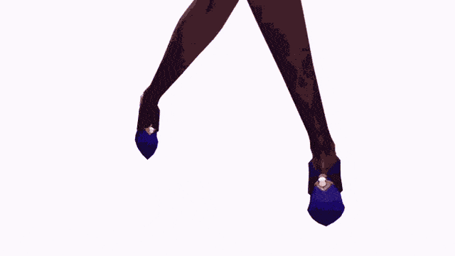

# Introduction

This year, after a lot of hard work, I qualified during the France CyberSecurity Challenge, or FCSC, which is an annual CTF organized by the [ANSSI](https://www.ssi.gouv.fr/). Therefore, in October, I'm going to Norway one week to compete as part of the French team at the European CyberSecurity Challenge, or ECSC, that also takes place each year. Each country sends its team to compete against the other countries, and the French team is selected at FCSC.

I am very proud of that, but for now let's just go back in time, and let me tell you the full story... \
My goal with this article is to demystify the process, and, I hope, inspire future people looking into cybersecurity who would be interested in participating in the French team. Finally, the goal is also to highlight how that is actually very doable, and that you should never give up before trying.

# TL;DR

- Anybody [motivated](https://youtu.be/ChPNBYNw1rQ?si=yu6rwOZ6ogIRbJsX) can do it
- Do previous editions challenges and read the write ups on [Hackropole](https://hackropole.fr)
- Learn new useful tools to extend your kit
- Do massive R&D about a lot of subjects
- Learn the mindset of searching and learning very quickly
- Be strategic with the challenges and categories you choose to do
- Do your best
- But never forget to take care of you and take breaks

# Context

Let me quickly explain where I'm coming from. I'm a cybersecurity student in an engineer's school, [ESIEE Paris](https://www.esiee.fr/), and at the same time a pentester in apprenticeship at [Synacktiv](https://www.synacktiv.com/). I already graduated from a computer science DUT, which gave me a lot of experience in development along with my personal development projects.
Back in the days, I always found cybersecurity very cool and knew I wanted to do that, but I always saw it as a very magic and weird thing as well. I had a kind of black box vision, and because of that, I didn't really know where to really learn it and most tutorials online about "hacking" were either very wrongly explained or very incomplete. The thing is that talking about cybersecurity is just as imprecise as talking about computer science... And the things you need to learn and practice aren't the same at all depending on the subdomain of cybersecurity you want to work on.

I started cybersecurity seriously around december 2021. I spent a lot of time on the Root-Me platform, grinding as much as I could to improve. My goal was to get an apprenticeship in cybersecurity for my upcoming engineer's degree, and I knew I had to prove my value to get a job I'm interested in, that is a technical, non bullshit cybersecurity job. \
It's here that I started interacting with the French cybersecurity and CTF community. In the process, I eventually created my CTF team with a few friends, and some members of the community started joining us as well all along since then.

I learned about the FCSC at this moment. An official CTF organized by the ANSSI to select the French team! This sounded amazing to me, such an experience must be truly unique. \
Because it is known for the quality of its challenges, I already participated last year, in 2022. But at the same time, I was still going through my computer science DUT which was in apprenticeship, and because I was at work at this period, I only worked on the challenges the evening on my free time. I managed to do some of the challenges, and especially liked the hardware ones (you can find on my blog write ups for a few FCSC 2022 hardware challenges!) but I gave up quickly on the harder challenges, because I didn't have time and wasn't in a tryhard mood, I just wanted to have fun with cool challenges after work. I ended up far away in the ranking, obviously: my goal wasn't to qualify, this time, but to discover.

A key thing to note is that during the FCSC, the members are split in two categories: the junior category, which includes people between 14 and 20 years old included, and the senior category, which is people between 21 and 25 years old included. I'm born in 2003... So, 2023 is the last year where I belong to the junior category! \
For this reason, around mid 2022, after the FCSC 2022, because I knew that I probably wasn't ready and experienced enough to qualify yet, I chose to set that as my goal for next year, 2023. I chose to work hard to get there and live that unique experience. \
I had one year to prepare myself!

# The year of preparation

I thought during a moment about how I should train myself to be ready next year. A few ideas came to my mind.

## Reading and understanding FCSC 2022 write ups

This is probably the most obvious thing to do if you want to train for a specifid CTF. Find the write ups for past editions of the CTF, go through them, and understand them entirely. If you don't know what it's talking about, if it has a lot of unknown vocabulary for example, just make your own researches on the topic in parallel to understand everything.

I especially spent time looking at the hardware write ups for the most difficult challenges that I didn't solved, because I wanted to be able to solve that kind of thing if I see it again in the future or if some key concepts are useful to understand and can be reused for other challenges. \
That's how I had to learn a lot about U2F and LoRa transmissions, until I was 100% sure if these challenges were seen again, I would solve them easily. \
Again, the write ups themselves are often not enough: don't hesitate to watch a lot of videos on the topic, to read documentations, wikipedia pages... And come back to the write up you were reading with the new knowledge you acquired, making you understand much better the explainations!

**2024 edit** : a new website called [Hackropole](https://hackropole.fr) was released and contain all the challenges from previous editions of the CTF, with everything to set them up locally. Participants can also submit their write ups and they are added to the website after review. This is an amazing place to try out past challenges and learn things, so I highly encourage you to use it extensively!

## Learning to use new useful tools

The second step is to fill the gaps you have! If you know about a technique, but you're not comfortable using it or you're still struggling to understand it properly, take some time to practice it and extend your capabilities.

In my case, when I was reading a few reverse write ups from FCSC 2022, I saw someone use a tool called BINSEC. I already heard about it, but never actually used it. But from what I saw in the write up, it looked overpowered to automate the solve of a lot of basic challenges! \
I did a lot of experiments with it, writing different scripts for different cases of executables and understanding the documentation examples as much as possible.

This tool actually ended up useful to me this year! It allowed me to solve the "Chaussette XS" challenge and *almost* the non XS version of it at FCSC 2023, even if using it here was a very overcomplicated way to do it... At least, it worked!

## Research and development

In general, just continue to explore weird, uncommon technical topics! One thing I noticed while reading the hardest hardware challenges from past year, is that you just can't know a lot of things in advance! \
More specifically, you can't know absolutely every uncommon technology and its inner working in detail... But the key thing here, and I want you to remember that, is that you **must** be able to learn the technical things treated by the challenge on the fly during the CTF! For example, I managed to solve the hardest estimated hardware challenge this year, PaleoTV... And I had no idea how PAL encoded analogous signals worked before the CTF! But because I trained my capabilities to adapt and understand a new subject very quickly, I only needed a few hours to understand entirely the mechanisms of analogous signals and start developing a custom decoder with the idea in mind!

So how did I train this capability of learning new things very fast? Well, because I was used to doing research and development... And therefore used to learning new things and applying them! It's just as with the fact that doing challenges makes you better and gives you experience that will make future challenges easier to approach.

What kind of research and development did I do? \
I explored topics that deserved more in depth exploration, and did a presentation for Root-Me on these subjects to share the knowledge I got. These are still available for replay on Root-Me's YouTube channel (in French), I talked about some Ethereum vulnerabilities, the eBPF technology, and the Tegra X1 bootrom vulnerability Fusée Gelée, present in the first Nintendo Switch consoles.
In October 2022, Root-Me organized a CTF to celebrate the 10k members in the Discord server. I contributed by created some challenges. \
Also, my school is organizing each year a CTF called Hackday. The qualifications for the 2023 edition took place in March, so I contributed by creating a lot of challenges as well.

The thing is that I didn't want to create easy, repetitive and non original challenges. I wanted some new stuff, some original ideas, that forces you to learn things, do some research... \
With this goal in mind, I literally spent months exploring interesting topics to create the best possible challenges about them. I created a private Ethereum chain with a full back end and front end automating the deployment of the challenges contracts, mixed multiples Ethereum vulnerabilities that I never saw used in CTF... I wrote eBPF rootkits, I discovered how some vulnerabilities can be used in very creative ways (server side XSS, for instance), and that is just scratching the surface! For some crypto challenges, I was forced to deeply understand the way the mathematics behind work. For reverse challenges, I had to try out the tools to analyse weird architectures and make sure the interesting part is feasible. The list here is not exhaustive, as I have too many subjects I worked on to describe everything here...

Once again, doing a lot of research like that is the reason why I was at ease reading and understanding new concepts I needed for the ongoing challenges during FCSC 2023! I really can't emphasize enough how important this mindset is.

# Strategy

One very important part of a CTF, is the challenges you choose to work on. This is especially true for the FCSC, where you can qualify if you're in the general top 5, or in the top 3 of a category among web, reverse, pwn, crypto, forensics and hardware. \
All the eligible people then go through meetings and the ANSSI selects the players they will keep themselves. \
Because of that, you have to choose to focus either on solving as many challenges as possible, or on only one specific category. The category you choose is also a very critical part. It depends not only on your skills, but also on the other very good player's skills. If you know there are 4 players very specialized in pwn and you're really not that good in it, you should better choose another category.

In my case, I estimated to be pretty comfortable with any category, but not exceptionally good in a single one. Because I know some people participating in junior, I knew what categories I should absolutely avoid. \
Crypto is one of my worst categories: I know how most algorithms work, I understand most of the concepts as well, but I really struggle as soon as you put mathematic manipulations. And when the crypto challenges level is as high as with the FCSC, you can be *sure* there will be a lot of maths shenanigans. In addition to that, a very talented and specialized crypto guy was already tryharding them. \
At first, my goal was to get a maximum of points in general to get in the general top 5, but by still doing in priority challenges in the same category to try and get a top 3 as well. My primary targets were the web, reverse and hardware categories.

I started with the web, because web is usually not the hardest thing in my opinion and I knew the top 3 would probably be taken quickly by people completing the whole category ("locking" the top 3). \
Except that because I've been doing a big quantity of web for a while at my job and I'm tired of it, I really didn't have much fun on the web challenges, and the hardest ones were just frustrating to me. They didn't motivate me to spend time on them at all. Although I loved the challenge about the ejs vulnerability to RCE, I gave up on the next challenges and focused on the reverse category instead for the moment, because I know a lot of people doing reverse as well and didn't want them to lock the top 3 here as well.

The reverse category was *very* hard this year. The first challenge was pretty simple, but as soon as you touched the second, it was way harder. As I said, I used BINSEC to try and solve it, but the complexity of some steps was so much that the SMT solver couldn't solve the constraints. I spent a whole day only on working for this challenge, but failed to solve it... For a 10 days competition, I was really stressed because I had lost a lot of time to finally get stuck while the other players continue to solve challenges! \
Fortunately for me, considering the ridiculous amount of solves for the reverse challenges, the organizers decided to add another, simpler version of this challenge. This time, with BINSEC and my very complicated method, the solve was instantaneous, and I was very happy to not have wasted all of that. I stepped out of the reverse category, because if the next challenges were as difficult as this one, I would never be able to solve them and qualify. On the other hand, a true monster in reverse (which was also the number 1 in the general junior ranking) was going through the category, so it was a bad idea to continue working on it.

For a moment, I just did all the easier challenges of all the categories to get a maximum of points. The goal was to catch up with the other people in the general ranking to get to top 5. I did some misc challenges, some forensics, the first pwn and the two first hardware as well... \
Meanwhile, the web category started to be top 3 locked by a few people that completed it entirely. In senior, the reverse and pwn also got finished. \
But then, I saw something very important. At some point, the top 3 hardware in senior was already entirely locked! It means that the top 3 in hardware was 3 people that completed the whole category. It was the first category to be fully locked in senior. \
In junior, nobody locked its place in hardware yet, but it made me realize that hardware must be pretty feasible! I then made the decision to focus on hardware, as I wanted to work on it anyway because I love it. It motivated me.

I did the medium difficulty challenges in hardware very easily, but then faced the last two remaining. As you would expect, being the hardest, these weren't an easy task. \
I spent a full day on each of these two. From the initial research and understanding, to the ideas of what to do and how to approach each challenge... After a long day of work and a lot of sweat for each one, I managed to solve both! \
If you're curious about these two challenges, I have made write ups for them, available on my blog. They are named PaleoTV and Sous-marin. I was the first junior to complete the whole hardware category, locking a top 1 in a qualifiable category!! I was so happy... ! In the end, nobody else in junior completed the whole category.

For the remaining time, I continued to try to get a maximum of points from accessible challenges, to stay in the general top 5 where I was already. If I could keep a general raking among the top 5, in addition to the other categories top 3 that I had, my ranking would have been pretty solid to be selected after the mettings. I just couldn't let my general ranking drop. \
I began to struggle solving any more challenges, while the people behind me were very close to me in the ranking. But then, a few hours before the end, while I was stressing a lot, I saw some forensics challenges with a lot of solves I didn't really tried seriously. This was in fact a 7 part series, with all the next challenges after the first one being less points than the rest. But with every one of them combined, it represented an enormous amount of points. Once you understood the challenge and passed the first step, 5 out of the 7 parts were basically free. Thanks to this, I took a comfortable advance over the other players behing in the ranking, just before the end of the CTF. Even without these challenges, I wouldn't have been caught up, but it was very reassuring and safer.

As a result, the CTF ended, and... I got the general top 4, hardware top 1 by being the only junior who locked the category, and I was still reverse top 3 (even though I gave up the category quickly; because in junior, almost nobody was able to solve these challenges this year!)

The meetings happened, and when we got the results of the selection... I'm in for this year! Let's go!! \
Me :

# Conclusion

If you work on your mindset, your skills and strategy, I definitely think you can perform just the same as I did. Don't let anyone discourage you, because the real, true way to get better is through experience and failures, over time, step by step. Progress requires some patience and time. You need to keep going and not give up. Only then, after some time, you will look back at where you used to be and realize how much you've done without even seeing it. Never forget that winning people are often those who lost the most before...

On a more sad note, I also want to highlight a very important thing that I never see anybody talking about. You should only spend all this time learning and improving, if you **truly enjoy** doing it! It may seem obvious, but it's not always the case. This process, to get to a high level of technical capabilities, is very time consuming and can feel exhausting. You should absolutely listen to yourself, and take breaks when you need to. The mindset of always trying harder without any break to reach a goal at the cost of constant heavy pressure and bad mental health is **not** worth it and will have heavy consequences on you. If you start to feel this way, please do not ignore it like I used to...

That being said, if you enjoy your time working on these technical subjects and keep taking care of you as well, if you can live without the bad pressure that may be felt, if you can avoid the traps... then, I know it, you'll go very far in your journey, and I hope to see that with my own eyes one day. Do what you like, and take care of you.

\- Elf