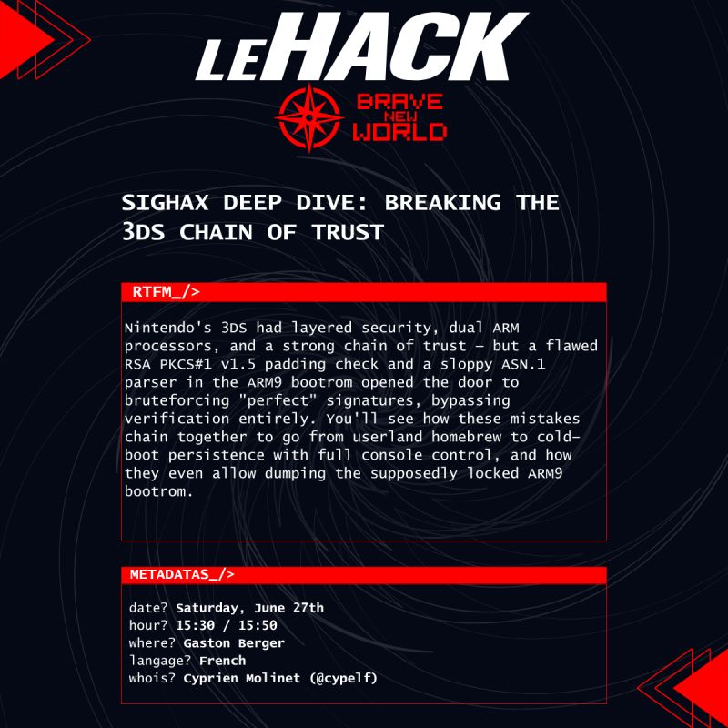

Le Hack is the biggest technical cybersecurity conference event organized in France, once per year, in Paris. \
For this 2026 edition, I will be presenting a talk on main stage, on the **27th of June** at **15:30**!

My presentation will be about the Sighax exploit. This is the critical vulnerability in the 3DS ARM9 bootrom, that has been used since its discovery, 10 years ago, to persist and launch custom firmware (CFW) on the console.

The talk will go over the 3DS hardware architecture and design with its two main ARM11 and ARM9 CPUs and their privilege separations, the FIRM file format detail, how the RSA signatures are implemented and verified using ASN.1 and DER encoding, what mistakes were made, how they got exploited, and then how both bootroms were able to be dumped...

Check the conference tracks for more info: https://lehack.org/fr/2026/tracks/conferences/#sighax-deep-dive-breaking-the-3ds-chain-of-trust

See you there!

