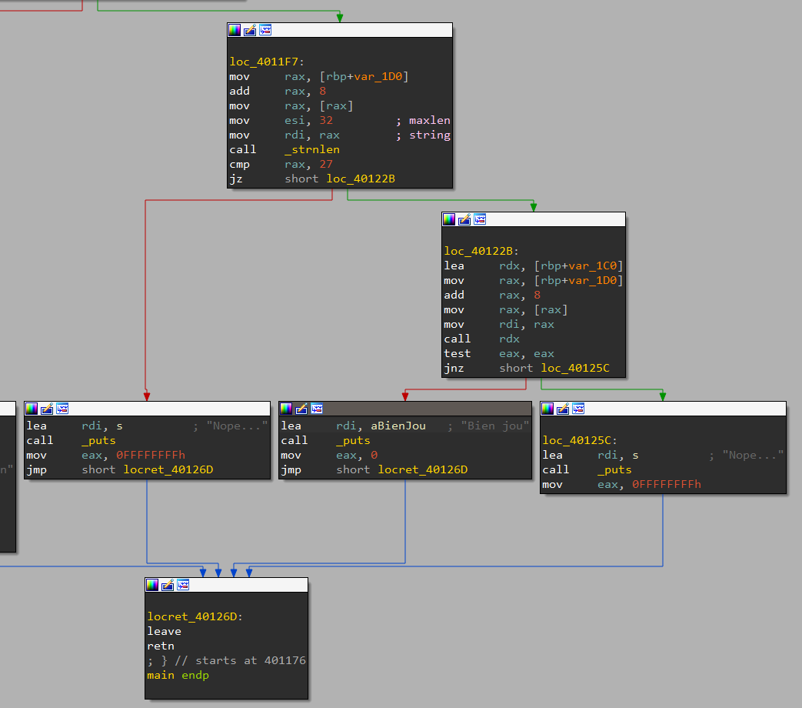
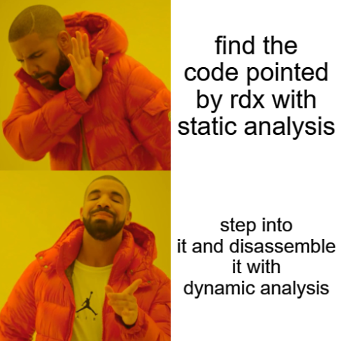
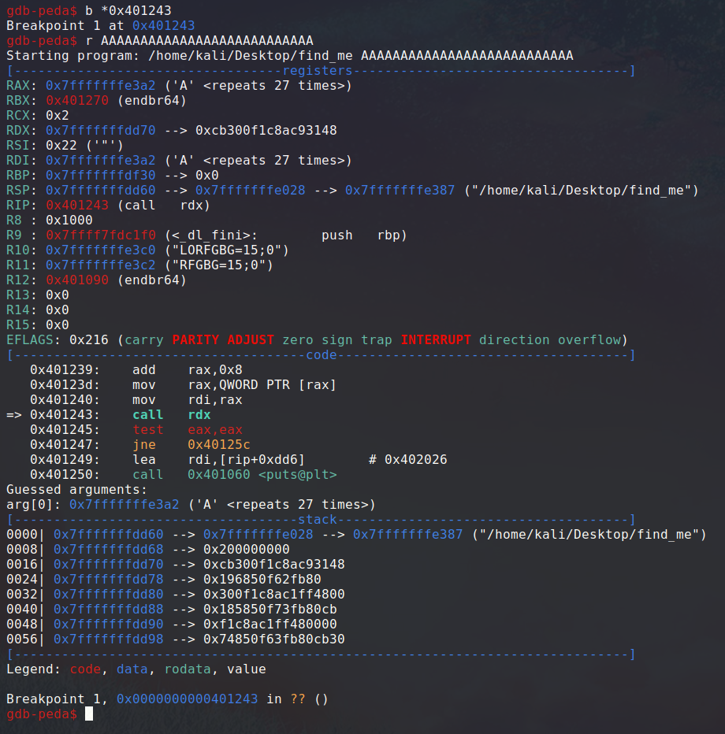
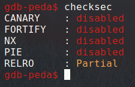
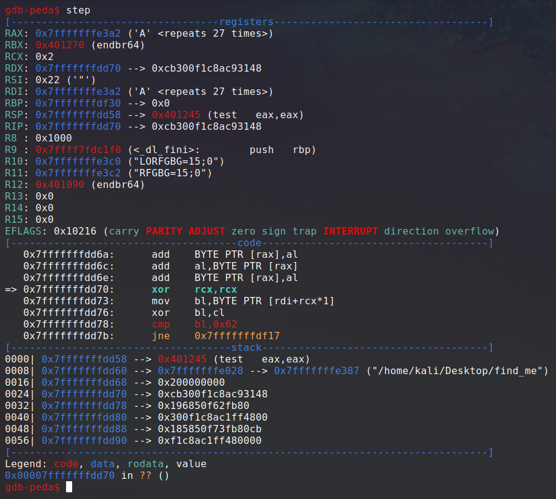
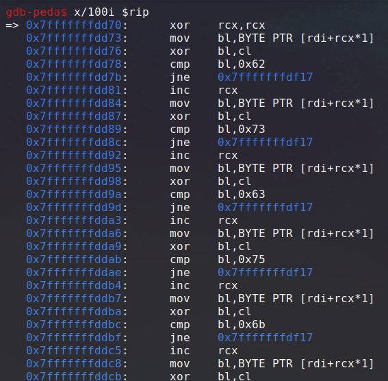
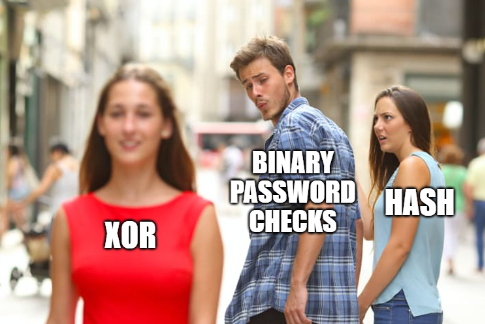
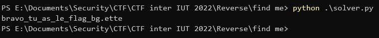

# find_me

> Can you find your way?
> 
> Flag format: `interiut{password}`

We start with a binary taking a password as an argument and telling us if it's the right one of not.

Let's open the file in IDA and dive into it.



The first thing we see is our input must be of length 27, otherwise we always get a failure no matter what it is.<br>
After that comparison, to reach the success, we must pass a test done with the return value of a call to `rdx`.



It seems like we can't see what code is actually pointed by `rdx` at that point easily with static analysis, so let's take out gdb and set a breakpoint on this call.



We can see a pointer to our command line argument being passed as an argument in `rax` to whatever function is pointed by `rdx`. By looking at `rdx`'s content, we can clearly see a stack address, so this function is stored during the execution on the stack.<br>
If we checksec the binary, it indeed doesn't have the NX bit.



Let's step in the function call to see what its code looks like.



Let's also check in more detail what the upcoming instructions will be in that function.



Okay, so there clearly is a pattern repeating here. As we scroll down, we can see this logic done 27 times in total.

This code initially set `rcx` to zero, then it uses it as an index to select a character in our command line argument.<br>
It then xor this character with `rcx`, which is the character index.<br>
Finally, it performs a comparison with a constant hex string, and return a failure if the comparison didn't pass. Otherwise, `ecx` is incremented and this logic happens again and again.

If all the comparisons are a success, the program return 0, indicating a success.



So, in summary, every character of our input is xored with its index, and the result is compared to a constant stored in the binary. We can now write a reverse script that takes the binary's constant values and xor them with their index to get the argument we should supply.

Here is my very simple script:

```py
charcodes = [0x62, 0x73, 0x63, 0x75, 0x6b, 0x5a, 0x72, 0x72, 0x57, 0x68, 0x79, 0x54, 0x60, 0x68, 0x51, 0x69, 0x7c, 0x70, 0x75, 0x4c, 0x76, 0x72, 0x38, 0x72, 0x6c, 0x6d, 0x7f]

for i in range(len(charcodes)):
    print(chr(charcodes[i] ^ i), end = "")
print() # new line
```

We execute it and get the binary's password:



Flag: `interiut{bravo_tu_as_le_flag_bg.ette}`