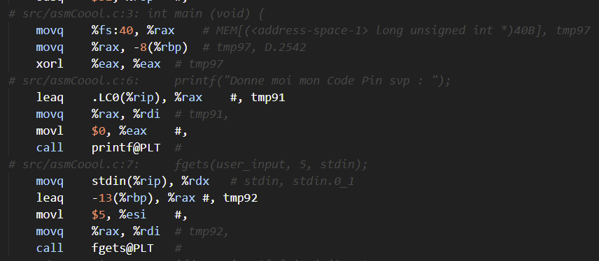
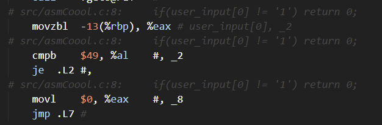
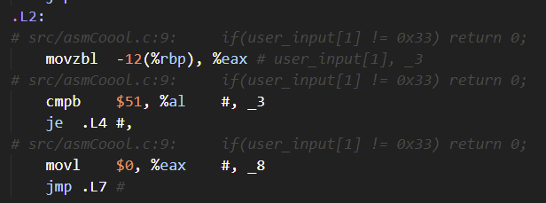
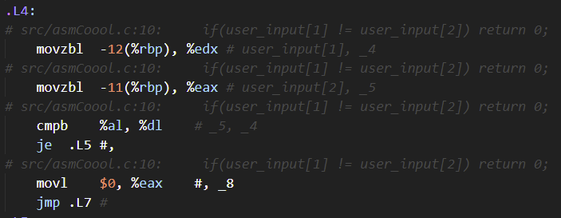
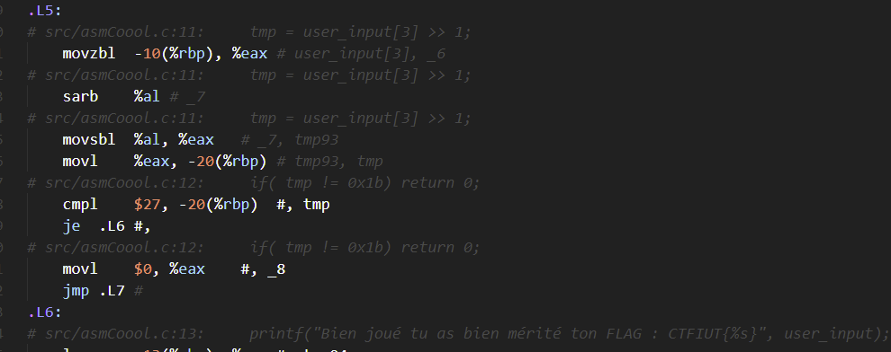

# Asmcoool

We are given a file containing assembly code to analyze. Actually, for this challenge, having x64 assembly knowledge was not even necessary: comments indicating the equivalent code in C are everywhere, and are more than enough to solve the challenge.

We can see that the program starts here, displays a small message asking for a PIN code, then performs a user input in the `user_input` variable.

Then we can see a comparison between the first character of the input and `1`, so the first character of our PIN code is `1`.

Then follows a comparison of the second character with `0x33`, which is the ASCII value of `3`.

Then, a comparison between the 2nd and 3rd character. They must therefore be equal. We deduce that the 3rd character of the PIN code is once again `3`.

Last line, we take the 4th character of our input, shifted once to the right, then we compare it to `0x1b`. So we just have to take `0x1b` and shift it to the left to know the last character of our PIN code. Since we shift it to the left, there are 2 possibilities: `110110` or `110111`, respectively `6` and `7`.

All we have to do is test both and that's it, we have the flag: `CTFIUT{1337}` (the flag is a reference to the [leet speak](https://en.wikipedia.org/wiki/Leet))