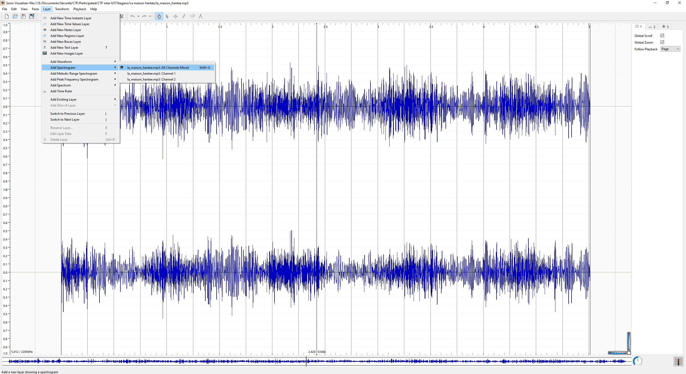
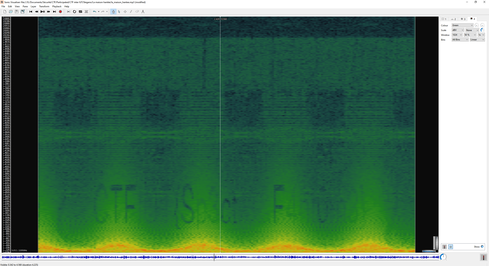

# La maison hantée

We are given the file `la_maison_hantee.mp3`.

When dealing with an audio file in steganography, there are not many possibilities. The flag may be said in the audio but the audio has been modified to make it inaudible without some editing, or the flag is hidden in the spectrogram of the sound as a readable text when drawn.
Here, we are dealing with the second case, a classic case that is regularly encountered.

We open the file in a software such as Sonic Vizualiser and display its spectrogram (`Layer` → `Add spectrogram` → `All Channels Mixed`) :

We can clearly see that the flag is located here:

However, there is a little peculiarity for this challenge: as you can see on the screenshot above, the flag is not well readable. Some characters are clear, but others are illegible. You can't reconstruct the complete flag with this.
To make the flag readable, we can display channels 1 and 2 separately (`Layer` → `Add spectrogram` → `Channel 1` or `Channel 2`).

For the channel 1:

For the channel 2:

Depending on the channel, the readable characters are not the same, as you can see.
With both, we can reconstruct the whole text and get the flag: `CTFIUT{Sp3ctr3&F4nt0m3}`