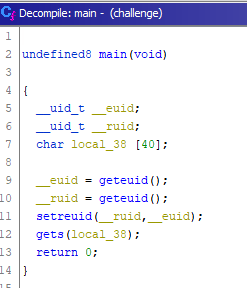
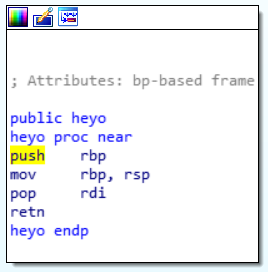
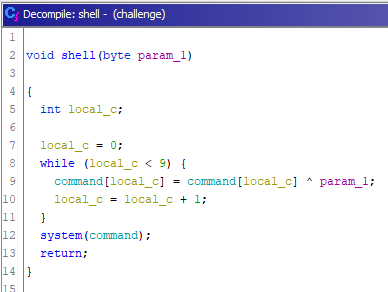
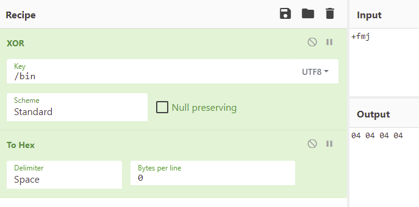
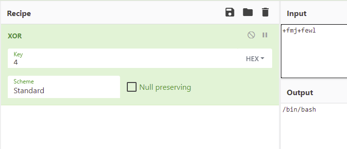

# Simple

This was the first pwn challenge of the CTF interIUT.
Please note that the infrastructure has been shut down, so I reproduced the server conditions on my local machine to make the screenshots.

This challenge gives us credentials to connect to a server via SSH, and our goal is to read the content of the `flag.txt` file. Obviously, we don't have the permissions to read the file directly with a `cat`, that's the point of the challenge. There is a `src` folder and a `Makefile`, but we don't have access to the `src` folder either, so we don't know the source code of the program. Note also that the stack is not executable and that the ASLR is activated, but not the PIE nor the stack canary.

In order to analyze it more easily, we download the program with a `scp chall@simple.interiut.ctf:/challenge/challenge ./challenge`.

Let's do a quick `file` on the executable :


It's a 64 bits ELF executable. Fortunately for us, it is not stripped. Now let's try to run it:


The program takes an input and stops just after this input is entered, without doing anything.
If we put a very large amount of characters (5000 here, a large number chosen arbitrarily), we can see that a buffer overflow happens:


After a few tests, we can see that the input starts to alter the `rip` save on the stack and thus makes the program crash when exactly **56** characters are entered.
Let's disassemble and decompile the program to see how it works. As I only have the freeware version of IDA, I can't use its decompiler, so I'll fall back on Ghidra for the decompilation, but stay with IDA for the disassembly.
The main function is very simple: it gives the program the rights of its owner (it's a [SUID](https://en.wikipedia.org/wiki/Setuid) binary), then it performs a user input with the `gets` function in a 40 characters buffer. This is the origin of our buffer overflow.



If you look at the other functions, you will find two that catch your attention: `heyo` and `shell`.
Here is the decompiled `heyo` function:


The decompiled version of this function doesn't really help us, so let's look at its assembler code instead:



All it really does is `pop rdi`. Let's just keep this function in the corner of our minds for now and let's take a look at the `shell` function.
Here is the decompiled `shell` function:



This function takes a byte as an argument, which it will xor 9 times to a `command` variable. This variable is not declared here, so we can assume this is a global variable. We can look at what value this variable is initialized with in the `.data` section:


This 9 variable contains these 9 characters: `+fmj+fewl`.
We can't simply redirect the execution of the program to this function, because it takes a parameter that it will xored with this before executing it as a command.
We must therefore first find out what to send as a parameter to this function in order to forge a command to be executed that interests us. From the shape of the stored string, we can easily guess that it is an xored version of `/bin/bash`.

We can thus find the key used by xoring one or several known characters and their xored version, stored in the executable.
Here I use [CyberChef](https://gchq.github.io/CyberChef/), a very powerful online tool that allows you to manipulate data in many ways.



Thus, we have recovered the key, which is 4. We can verify it:



We obtain the string `/bin/bash` which interests us. Now we just have to find out how to pass this key as an argument to the shell function.
If we were dealing with an x86 executable, it would have been enough to put the key on the stack to pass it as an argument: the arguments are placed on the stack. That would have been fine.
Except that we are dealing with an 64 bits executable, which means that the first arguments are placed in registers. The first argument must be placed in `rdi`.
This is where our `heyo` function from earlier comes in: everything it does is `pop rdi`!
So here is our solution: we put on the stack the address of the instruction `pop rdi` of heyo, then our key that will be put in `rdi` because of the `pop rdi`, and finally the address of the shell function so that the program continues there when the `heyo` function ends.

Unfortunately, Python was not installed on the remote computer. So instead of writing a script that output the exploit to redirect it to the program input, I wrote a script that write the exploit to a file, and then I uploaded the file back to the server to use it as the input of the program.
Here is my exploit code:

```py
from struct import pack

heyo_pop_rdi_address = 0x401156
shell_entry_point = 0x40115B
xor_value = 0x4

with open("exploit", "wb") as file:
    content = b"A" * 56
    
    # < = little endian, Q = quad word (64 bits value)
    content += pack("<Q", heyo_pop_rdi_address)
    content += pack("<Q", xor_value)
    content += pack("<Q", shell_entry_point)

    file.write(content)
```

All that's left to do is run the program with out exploit, without forgetting the classic `cat` to prevent the shell from closing as soon as it opens:


We get the flag: `CTFIUT{StUP1de_s7up1DE_5tUpiDe!!}`