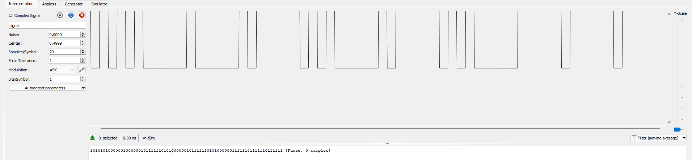
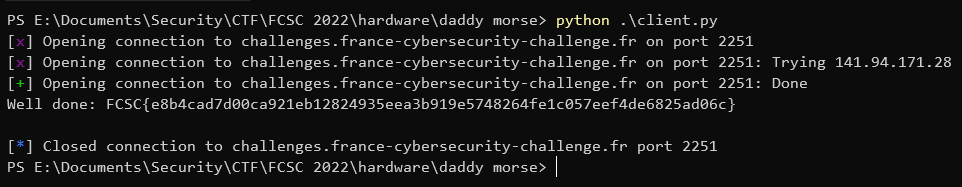
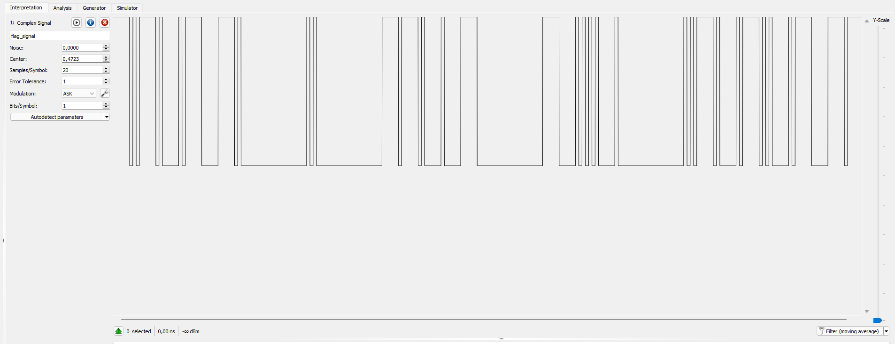

# Daddy Morse

We are told that there's a server acting as a morse telegraph, and we need to send him `CAN I GET THE FLAG` in order to get the flag.<br>
For this purpose, we are also given the transmission parameters :

> sample rate: 24 KH
> dot duration: 1 ms
> dash duration: 5 ms
> letters spacing: 5 ms
> words spacing: 20 ms

We finally have the source code of the server, a basic client sending an IQ file to the server and finally a `signal.iq` file containing an exemple with the signal for `HELLO` in it.

## Taking a look at the example signal

The first thing I did was to open this signal file with [Universal Radio Hacker](https://github.com/jopohl/urh) to see what it looks like.



After setting the sample rate in the signal details window (the `i` button), I could measure the time between two moments of the signal by selecting it and looking at the bottom of the window.

With that, we can see that the duration of the signals is coherent with the transmission parameters we were given. This also becomes obvious this signal is the string `HELLO`, since we can see that the signal represents `.... . .-.. .-.. ---`, which is `HELLO` in morse. The signal we need to build is clear now.

## Building our own signal

IQ files are [just a format](https://pysdr.org/content/iq_files.html) for storing the I and Q composantes of a signal. We can read it in Python using [numpy](https://numpy.org/) and convert it to a format we can work with, where each sample of the signal is represented by its I and Q coordinates in the complex plane.<br>
This becomes an array on complex numbers with one element of the array being one sample.

Now, all we have to do to create our signal is to go through each morse character and add the right number of samples at 1 + 1j, representing the HIGH level in the signal. We must also not forget to add the right number of samples for the spacing between everything.

Since we know all the parameters, we can script it to create our signal from scratch:

```py
from pwn import *
import numpy as np
import base64

samp_rate = 24000

dot_duration = 1 / 1000
dash_duration = 5 / 1000
pause_duration = 1 / 1000
letter_separation_duration = 5 / 1000
word_separation_duration = 20 / 1000

high = 1 + 1j
low = 0j

c = remote("challenges.france-cybersecurity-challenge.fr", 2251)

can_i_get_the_flag = [
    ["-.-.", ".-", "-."], # CAN
    [".."], # I
    ["--.", ".", "-"], # GET
    ["-", "....", "."], # THE
    ["..-.", ".-..", ".-", "--."] # FLAG
]

flag_signal = np.array([])

for i, word in enumerate(can_i_get_the_flag):
    for j, letter in enumerate(word):
        for k, char in enumerate(letter):

            if char == ".":
                flag_signal = np.append(flag_signal, [high] * int(dot_duration * samp_rate))
            elif char == "-":
                flag_signal = np.append(flag_signal, [high] * int(dash_duration * samp_rate))

            if k < len(letter) - 1:
                flag_signal = np.append(flag_signal, [low] * int(pause_duration * samp_rate))

        if j < len(word) - 1:
            flag_signal = np.append(flag_signal, [low] * int(letter_separation_duration * samp_rate))

    if i < len(can_i_get_the_flag) - 1:
        flag_signal = np.append(flag_signal, [low] * int(word_separation_duration * samp_rate))

flag_signal = flag_signal.astype(np.complex64)
flag_signal.tofile("flag_signal.iq") # for later verification

encoded_signal = base64.b64encode(flag_signal.tobytes())

c.recvuntil(b"> ")
c.sendline(encoded_signal)
print(c.recvline().decode("utf-8"))
```

We execute the script, and we get the flag:



Before we submit the flag and get our points, let's take a look at our flag signal real quick:



We can recognize the same morse message we stored in the `can_i_get_the_flag` variable, and the duration of the characters and the spacing seems correct.

Flag : `FCSC{e8b4cad7d00ca921eb12824935eea3b919e5748264fe1c057eef4de6825ad06c}`