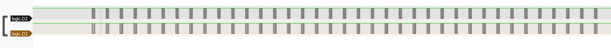
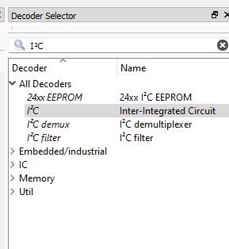
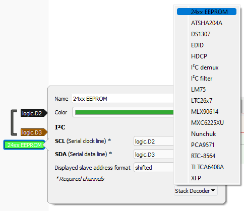
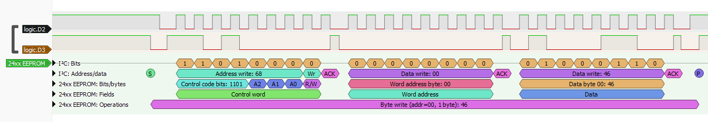

# I2CyouToo

A friend of us is storing his secrets in an EEPROM wired to an Arduino. We have sniffed the traffic between the Arduino and the EEPROM with a logical analyzer and we now need to recover the secret that was transmitted.

With the title of the challenge, you can guess pretty obviously that the communication is happening via [I²C](https://fr.wikipedia.org/wiki/I2C). Let's open this capture with Sigrok PulseView to analyze it.

We can see two channels going on in this capture, which confirms us this is I²C. I²C uses two channels to transmit data.
- SCL, or **s**erial **cl**ock line, is a channel transmitting a clock signal used as a reference to know when we can look for a new bit of information in the other channel.
- SDA, or **s**erial **da**ta line, is the channel conveying the real data you want to transmit.

Knowing this and looking at the signals again, we know D2 is SCL because of the repetition of the same signal at regular intervals, and so D3 is SDA.

To see what this is actually doing, let's add a new protocol decoder for I²C.

We need to configure it for it to know what channel is SCL and what channel is SDA. In addition to this, we can also tell PulseView what kind of transmission this is. Let's select the only EEPROM option available.

We can now see exactly what was going on in this communication.

With that, we can dissect the communication and know what each bit is for. What's interesting us most thought, is the bottom line:

> Byte write (add=00, 1 byte): 46

This tells us this is writing one byte, 0x46, to the address 0.

Looking forward to the next transmission block, we have

> Byte write (add=01, 1 byte): 43

So this is writing the byte 0x43 to the address 1.

We can clearly see what's going on now : this is the secret's bytes being transmitted. Just to be sure, we can convert the hex numbers 46 and 43 from ASCII, and we get `FC`. Looks like a flag!

We now extract each byte one after the other, giving us this :

> 464353437B4D592D50524543494F55532D504C454153452D535441592D534543524554217D

We convert it from hex, and we get the flag: `FCSC{MY-PRECIOUS-PLEASE-STAY-SECRET!}`