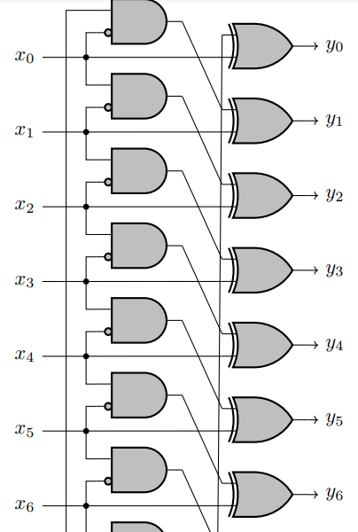
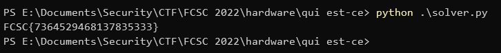

# Qui est-ce ?

Let y be `8549048879922979409`, with y<sub>i</sub> the bits of y where y<sub>62</sub> is the MSB and y<sub>0</sub> is the LSB. We need to find a number x that, when passed as input to the attached logical circuit, will lead to the bits of y as the output.

The logical circuit looks like this:



This pattern is continuing like this until x<sub>62</sub> and y<sub>62</sub>.

This is a typical [z3](https://github.com/Z3Prover/z3) challenge. z3 is a satisfiability modulo theories solver that can be used to solve this kind of logical circuits automatically.

We just have to declare the output we know, add all the constraints of the logical circuit and ask z3 to give us the input that satisfies all these conditions. It will do its magic and find it for us.

Don't forget to inverse the bits order when necessary when converting the bits from and to numbers if you want to work with the LSB at the left of the array and the MSB at the right to simplify manipulations and indices.

Here is my script:

```py
from z3 import *

y = 8549048879922979409

expected_y_bits = reversed(list(map(lambda bit: bit == "1", bin(y)[2:]))) # y0 should be the LSB and y62 the MSB, so we reverse the bits to have them sorted by index

s = Solver()

x_bits = [Bool(f"x{i}") for i in range(0, 63)]
t_bits = [Bool(f"t{i}") for i in range(0, 63)] # let's call the intermediary gates state t (t for tmp)

for i, bit in enumerate(expected_y_bits):
    previous_i = (i + 62) % 63 # this is the index of the previous element in a modulo 62 cycle

    s.add(Xor(t_bits[previous_i], x_bits[i]) == bit)
    s.add(And(x_bits[previous_i], Not(x_bits[i])) == t_bits[i])

if s.check() == sat:
    model = s.model()
    result = int("".join(reversed(["1" if is_true(model[x_bits[i]]) else "0" for i in range(0, 63)])), 2) # we reverse back the bits before converting to decimal to make x0 the LSB and x62 the MSB as it should be
    print(f"FCSC{{{result}}}")
```

Let's execute the script to get the flag.



Flag: `FCSC{7364529468137835333}`