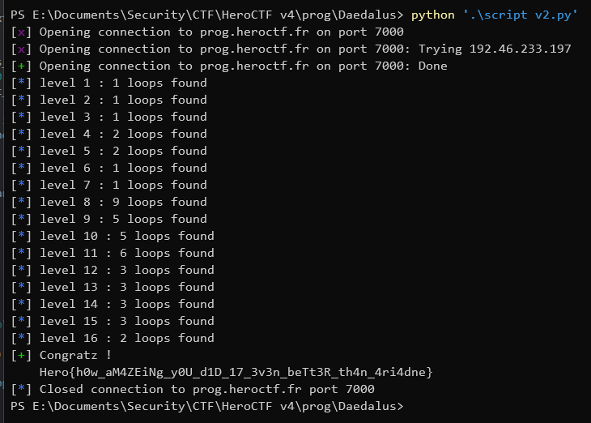

# Deadalus

> The description of the challenge is rather long, and is available in deadalus.md

Content of the attached file `deadalus.md`:

> Deadalus has lost the technical information of his famous maze and is left with a few old blueprints. He want's to add some improvements to it but got lost along the way. If you could just help him count the number of unique loops in different parts of the maze, it would be... amazing ?
> 
> The maze is magic, so there is no notion of walls and corridors, but there are gateways that allow you to travel in a direction (`L`: left, `R`: right, `U`: up, `D`: down). Some gateways are special, and allow you to go in two opposit directions (`-`: left/right, `|`: up/down).
> 
> If a gateway leads to another part of the maze (-> it leads outside of the grid), the loop is not complete, so don't count it. The same loop can't go twice through the same special getaway to go in both directions, it automatically leads to two different loops.
> 
> ```
> . R . D . .
> R . . . . D
> . | . L . .
> . . . . . .
> . R . U . .
> ```
> 
> In the previsous example, there are two unique loops. There are detailed on the following figure. The two first are the two unique loops, as for the third, it's not complete.
> 
> ```
> . ----- . .   . . . . . .   . . . . . .
> > . | . | . .   . . . . . .   -----------
> . ----- . .   . ----- . .   . . . . . |
> . . . . . .   . | . | . .   . . . . . |
> . . . . . .   . ----- . .   . . . . . |
> ```
> 
> 
> Finaly, you can use special gateways in a specific direction only. Here are two examples, the > first where you can use the gateway, the second were you can not.
> 
> 
> ```
> . . . . . .   . . . ^ . .  |  . . . . . .   . . . . . .
> . . . . . .   . . . | . .  |  . . . . . .   . . . . . .
> . R . | . .   . ->. | . .  |  . R . - . .   . ->. X . .
> . . . . . .   . . . | . .  |  . . . . . .   . . . . . .
> . . . . . .   . . . v . .  |  . . . . . .   . . . . . .
> ```
> 
> NB: to help you, the first 6 maze parts are always the same, and covering the basics. The next maze parts are random.

## Reminder

So, let me explain what the program is doing step by step, how and why. Don't worry if this is overwhelming at first: it can take some time to figure out everything going on here.<br>
Don't forget that I worked for hours and it was a long trial and error process to end up with this understanding of the problem and its resolution.<br>
With that said, let's get into it.

## Description of the program logic step by step

First things first, we receive the labyrinth from the server and convert it to a representation we can work with: a Python matrix, that I call board throughout the program.

Then, we go through each of the gateways contained in the board, and call our function `get_loops` each time. We'll dive deeper in this function in just a moment; it's supposed to give us a list of sets, where each set represents a loop from the gateway at these coordinates and contains tuples of the coordinates of the points in the loop.

For each loop in the list, we check if we didn't already find this same loop before from another gateway, and if it's a new one, we keep track of it and add it to our global list of loops.

When this ends, we have the number of loops in the labyrinth, and we can send that to the server to get to the next level.

Now, let's dive into the core of the script: the `get_loops` function. This function takes the board, the coordinates of a gateway, and should find every possible loops from this gateway.<br>
This function just calls the recursive function `get_loops_rec` with some more initial parameters:

- the loop_cell, which is the coordinates where we want to go back with a loop
- an empty dictionary that will be used to keep track of the coordinates we already visited in this exploration, we'll need this to detect loops and deadlocks (more on this later)

This recursive function will follow the direction that is given to it and go through the next cells, one after the other, until we can't go further, we detect a loop to our loop cell or we detect a deadlock.

The first thing in this recursive function is its stop condition. That is, when the coordinates we're at are the loop cell and we already visited the loop cell: this means we have a loop. We must check that we already visited this cell, because we're always going to begin the exploration starting from it, and we don't want to return we found a loop if we never left the cell before. When this condition is reached, as we should return a list of the loops we found, we just return a list with one set containing our loop cell. The recursive calls that leads to here will take care of appending their coordinates to this one to complete the whole loop cells coordinates.

Just after that, we have our anti deadlock condition. This is also necessary, because we can have a loop further in the path that does not goes back to our loop cell and just loops between cells we don't care. Without this check, this would cause an infinite loop and block the program. When we know there's no loop, we return a list of loops that's empty.

After that, if we're still here, we're not at our loop cell and we're not in a deadlock either, so we can continue our exploration. We set the current coordinates as visited and we start to prepare the next cell we're going into.

If the coordinates we're at are a gateway, we change the direction in which we're going to the gateway's one.

If we're at a special gateway, this means we'll have to explore the two sides. But before that, we check that we're perpendicular to the special gateway, because the rules doesn't allow us to go through a special gateway, in which case we an't go further and so there is no loop here.

Once we know what direction or directions we'll have to explore, for each of them, we'll call `get_loops_rec` on the next cell in that direction after checking if it's still in the board bounds (if it's not, we can't go further once again).

Recall that this recursive call will give us all the loops starting from the cell we currently are at. If the call returns something, there's a loop in that direction starting from here, so we append the coordinates of the current cell to each of these loops, and when this is done, we return this list that will be completed by the previous recursive call up to the beginning when we started the recursive calls on the loop cell.

And voilà, with this script you can determine the number of loops in the labyrinths and get the flag!

## My script


```py
from pwn import *

r = remote("prog.heroctf.fr", 7000)
gateways = ["L", "R", "U", "D"]
special_gateways = ["|", "-"]

def get_loops_rec(board, i, j, direction, loop_cell, visited):
    if (i, j) == loop_cell and loop_cell in visited: # loop to the goal found
        loops = set()
        loops.add((i, j))
        return [loops]

    if (i, j) in visited and direction in visited[(i, j)]: # we reached a loop that does not go back to the start
        return []

    if (i, j) in visited:
        visited[(i, j)].append(direction)
    else:
        visited[(i, j)] = [direction]    

    next_directions = []
    
    if board[i][j] in gateways:
        next_directions.append(board[i][j])
    elif board[i][j] in special_gateways:
        if board[i][j] == "|":
            if direction == "U" or direction == "D": # we can't use the special gateways if we are parallel to it
                return []

            next_directions.append("U")
            next_directions.append("D")
        elif board[i][j] == "-":
            if direction == "L" or direction == "R": # same here
                return []

            next_directions.append("L")
            next_directions.append("R")
    else:
        next_directions.append(direction)

    loops = []

    for direction in next_directions:
        next_i, next_j = i, j

        if direction == "R":
            next_j += 1
        elif direction == "L":
            next_j -= 1
        elif direction == "U":
            next_i -= 1
        elif direction == "D":
            next_i += 1

        if next_i < 0 or next_i >= len(board) or next_j < 0 or next_j >= len(board[0]):
            return []

        next_res = get_loops_rec(board, next_i, next_j, direction, loop_cell, visited) # explore the next directions recursively
        if len(next_res) > 0:
            for loop in next_res:
                loop.add((i, j))
            if next_res not in loops:
                loops.extend(next_res)
    return loops

def get_loops(board, i, j):
    return get_loops_rec(board, i, j, board[i][j], (i, j), dict())

def main():
    current_board = 1

    while True:
        r.recvline()

        board = []

        for row in r.recvuntil(b">>").decode().split("\n")[:-1]:
            if len(row) > 0:
                board.append([])
                for c in row:
                    board[-1].append(c)

        loops = []

        for i in range(len(board)):
            for j in range(len(board[0])):
                if board[i][j] in gateways:
                    extracted = get_loops(board, i, j)
                    for loop in extracted:
                        if loop not in loops:
                            loops.append(loop)

        log.info(f"level {current_board} : {len(loops)} loops found")

        r.sendline(str(len(loops)).encode())

        r.recvline()
        current_board += 1

        if current_board > 16: # we always crash after the 16th level, so this is probably the last one
            log.success(r.clean(timeout=1).decode())
            break

main()
```

Output of the script:



Flag: `Hero{h0w_aM4ZEiNg_y0U_d1D_17_3v3n_beTt3R_th4n_4ri4dne}`