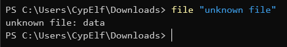
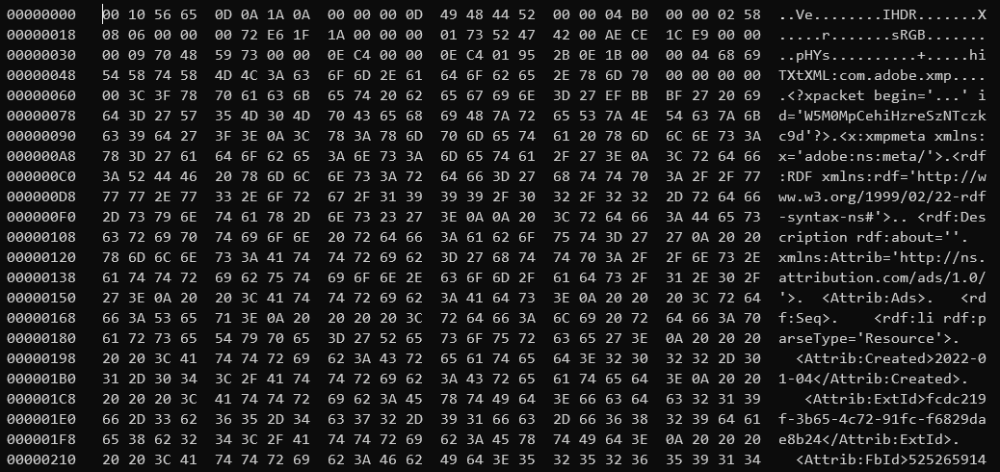
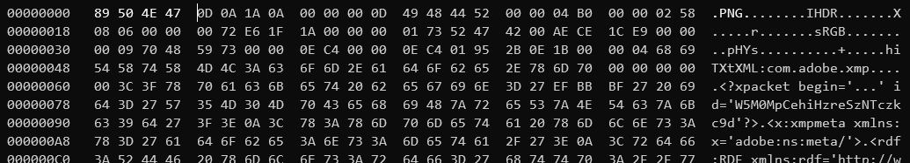
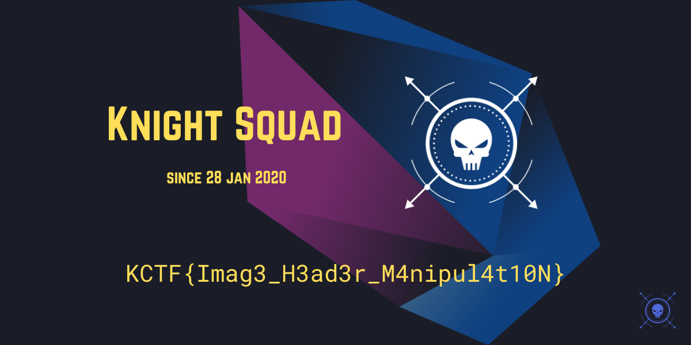

# Unknown File

We are given an `unknown file` file with no extension. As usual, let's `file` it to get more informations.

It seems it didn't recognize anything. Let's open the file with `hexedit` to see what it contains exactly.

We can see interesting words such as "IHDR", "sRGB" or "pHYs". We also recognize [XMP](https://en.wikipedia.org/wiki/Extensible_Metadata_Platform) metadata.

We are clearly in front of a PNG file. The issue is, the magic bytes seems corrupted. The [magic bytes](https://en.wikipedia.org/wiki/List_of_file_signatures) of PNG files is supposed to be `89 50 4E 47 0D 0A 1A 0A`, but as you can see in the file, while the last 4 are correct, the first 4 are wrong. Let's fix them and save that patched version as `flag.png`.

We open the image, and there we go:

Flag: `KCTF{Imag3_H3ad3r_M4nipul4t10N}`