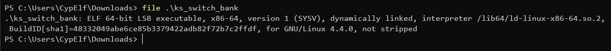
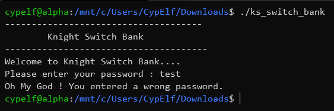
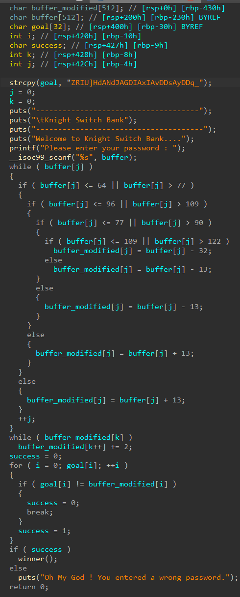
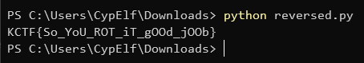

# Knight Switch Bank

We start with an x64 ELF executable.



Let's first test it to see what it looks like.



Okay, now let's load it into IDA pro and decompile it to start reversing it. I renamed the variables to make it more understandable.



The program loops on our input characters, and check each time the character code. Based on it, it will add or remove a number to the char code and store it in another buffer I called `buffer_modified`. We can notice it's always minus or plus 13 (except in one situation with the minus 32): you can think of it as some sort of weird ROT13.<br/>
It then adds 2 to every one of these and checks if it's equal to the string I called `goal` at the beginning, which contains `ZRIU]HdANdJAGDIAxIAvDDsAyDDq_`.

At the end of the day, our goal is to reverse the process that modifies our buffer and apply it to `goal` to get the right password.

First of all, we'll remove 2 from all the char codes to reverse the last step before the comparison.

```python
goal = "ZRIU]HdANdJAGDIAxIAvDDsAyDDq_"

goal_minus_2 = ""

for char in goal:
    goal_minus_2 += chr(ord(char) - 2)
```

Then, we'll loop through each of `goal`'s characters and figure out which was the original one.

In this loop, let's start by reversing the first condition. If the char code is between 65 and 77, the condition will fail and the modified character will be our original character plus 13. So, if the character we have minus 13 is between 65 and 77, we know the original character was this one minus 13.

```python
password = ""

for char in goal_minus_2:
    code = ord(char)
    if not (code - 13 <= 64 or code - 13 > 77):
        password += chr(code - 13)
    else:
        # WIP
```

If the condition failed, this means we entered in the binary's first if statement. At this point, it will another char code check. The remaining code follows the exact same logic.

We end up with this code:

```python
goal = "ZRIU]HdANdJAGDIAxIAvDDsAyDDq_"
goal_minus_2 = ""
password = ""

for char in goal:
    goal_minus_2 += chr(ord(char) - 2)

for char in goal_minus_2:
    code = ord(char)
    if not (code - 13 <= 64 or code - 13 > 77):
        password += chr(code - 13)

    elif not (code - 13 <= 96 or code - 13 > 109):
        password += chr(code - 13)
    
    elif not (code + 13 <= 77 or code + 13 > 90):
        password += chr(code + 13)

    elif not (code + 13 <= 109 or code + 13 > 122):
        password += chr(code + 13)

    else:
        password += chr(code + 32)

print(password)
```



And the flag is: `KCTF{So_YoU_ROT_iT_gOOd_jOOb}`