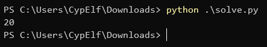
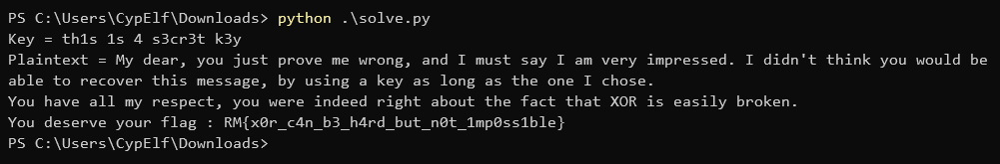

# Easy XOR

## Context

This is a write up for a challenge I created for the Root-Me CTF we organized to celebrate the 10k members on the Discord server. \
Please keep in mind I wasn't a participant but the creator of the challenge, hence the level of details and explainations I am able to provide. \
That was an amazing experience to help organizing this CTF, and I hope people learned a few things and enjoyed my challenges!

## Description

> While talking with a friend of yours who's a crypto adept, you say spontaneously that challenges using XOR to encode things are typically very easy. He smiles at you, and says : "Are you sure about that?". He then sends you this XOR encoded message, and challenge you to recover it.

## Resolution

We start with a file named `message.enc` with base64 content.

```
ORERF0VQAQwUWRxGQxhGB1RLQwsbHlRTTVRTV0ZPHVRPUlIaREt6WRkdQgcAQhJZFGlTUg5SRRFSEhMQGRhDFlNCFkQaADoTBxtXGgcfEw0cAV8YAEgcVRRXHEYPFhMWRUtSGxgNEQdPEQFFV08FVhFSRxxJGBMUERtCEkdUXwBWWVNGEBtdEwAKExIRERESUxEfT1pHU1IQUkccRUtcFxFIeFNDWRxTUQ55agwHExxBHVZZFQRdU01IU1JRUwNWAAYfVFkERlkDDUMWAFgdRFFFFxMRG1QcVEtSGxsdRVNUWRYAUkEQR0MGWxVUS2s2JkhYAABUElNdTAoTAQBcH0UFHXMtB0RTRFQARUZWFhMaHUYGAA1fGBNIC1NyfAhYBFIsUFccbBYTNFtNBgxuEVVFLE4EVCwCDgIDB1NaURURFQ==
```

From the description of the challenge, this is a XOR encoded message we need to recover. But we know neither some cleartext in this message nor any information about the key, such as its length. \
That's not a problem, let's jump right into it! If you're curious how we're going to proceed, just continue to read and you'll have all the answers.

The first thing we're going to do is to guess the most probable key length by using the [hamming distance](https://en.wikipedia.org/wiki/Hamming_distance). \
The idea is the following: for some key length `n` we want to try, we're going to split our encoded message into blocks of size `n`, compute the average hamming distance between two blocks at a time and then take the average of these distances. Because this average hamming distance probably minimizes this value, we can just test all the `n` values we want and the right one will probably be the minimum among them. \
If you want to know from where this property come from, you can read [this great answer on stackexchange that explains it very well](https://crypto.stackexchange.com/a/8118).

Here is my implementation of that in Python:

```python
message = "ORERF0VQAQwUWRxGQxhGB1RLQwsbHlRTTVRTV0ZPHVRPUlIaREt6WRkdQgcAQhJZFGlTUg5SRRFSEhMQGRhDFlNCFkQaADoTBxtXGgcfEw0cAV8YAEgcVRRXHEYPFhMWRUtSGxgNEQdPEQFFV08FVhFSRxxJGBMUERtCEkdUXwBWWVNGEBtdEwAKExIRERESUxEfT1pHU1IQUkccRUtcFxFIeFNDWRxTUQ55agwHExxBHVZZFQRdU01IU1JRUwNWAAYfVFkERlkDDUMWAFgdRFFFFxMRG1QcVEtSGxsdRVNUWRYAUkEQR0MGWxVUS2s2JkhYAABUElNdTAoTAQBcH0UFHXMtB0RTRFQARUZWFhMaHUYGAA1fGBNIC1NyfAhYBFIsUFccbBYTNFtNBgxuEVVFLE4EVCwCDgIDB1NaURURFQ=="

def hamming(s1, s2):
    s1_bin = "".join([format(byte, "08b") for byte in s1])
    s2_bin = "".join([format(byte, "08b") for byte in s2])

    d = 0
    for bit1, bit2 in zip(s1_bin, s2_bin):
        if bit1 != bit2:
            d += 1
    return d

def key_score(ciphertext, key_size):
    ciphertext_blocks = [ciphertext[i:i+key_size] for i in range(0, len(ciphertext), key_size)]
    ciphertext_blocks_pairs = list(combinations(ciphertext_blocks, 2))
    avg = sum(hamming(block1, block2) for block1, block2 in ciphertext_blocks_pairs) / len(ciphertext_blocks_pairs)
    return avg / key_size

def guess_key_size(ciphertext):
    key_sizes = range(2, 40) # this range should be enough 
    key_scores = [(key_size, key_score(ciphertext, key_size)) for key_size in key_sizes]
    return sorted(key_scores, key = lambda x: x[1])[0][0]

ciphertext = b64decode(message)
print(guess_key_size(ciphertext))
```



The key size seems to be 20.

Now that we know that, the next step is to try to recover the key and message. \
What we're going to do is to group every byte in each block of size 20 by their index `i`. The resulting groups will therefore be all the bytes in the encoded message that have been XORed with the same byte of the key. \
Next, we'll loop through the 256 possible values for the key's byte that XORed this group and perform a [frequency analysis](https://en.wikipedia.org/wiki/Frequency_analysis) on the decoded message. The message is probably written in plain English, so we can write a small function that will note the message by mesuring the letters frequencies and checking how many characters are actually printable characters. \
This scoring function can be customized as needed and does not have to be perfect. In case it doesn't return the right key, and it might very well do so, you can change your function to return something like the 10 best results it got instead of just the better one. You're pretty much guaranteed to find the right one in that if your scoring function is a minimum accurate.

Here is my implementation of all this logic in a complete script:

```python
from base64 import b64decode
from itertools import islice, cycle
from string import ascii_letters
from pwn import xor

message = "ORERF0VQAQwUWRxGQxhGB1RLQwsbHlRTTVRTV0ZPHVRPUlIaREt6WRkdQgcAQhJZFGlTUg5SRRFSEhMQGRhDFlNCFkQaADoTBxtXGgcfEw0cAV8YAEgcVRRXHEYPFhMWRUtSGxgNEQdPEQFFV08FVhFSRxxJGBMUERtCEkdUXwBWWVNGEBtdEwAKExIRERESUxEfT1pHU1IQUkccRUtcFxFIeFNDWRxTUQ55agwHExxBHVZZFQRdU01IU1JRUwNWAAYfVFkERlkDDUMWAFgdRFFFFxMRG1QcVEtSGxsdRVNUWRYAUkEQR0MGWxVUS2s2JkhYAABUElNdTAoTAQBcH0UFHXMtB0RTRFQARUZWFhMaHUYGAA1fGBNIC1NyfAhYBFIsUFccbBYTNFtNBgxuEVVFLE4EVCwCDgIDB1NaURURFQ=="

# frequencies of the letters in English
# source: https://en.wikipedia.org/wiki/Letter_frequency
frequencies = {
    'a': 0.082,
    'b': 0.015,
    'c': 0.028,
    'd': 0.043,
    'e': 0.13,
    'f': 0.022,
    'g': 0.02,
    'h': 0.061,
    'i': 0.07,
    'j': 0.0015,
    'k': 0.0077,
    'l': 0.04,
    'm': 0.024,
    'n': 0.067,
    'o': 0.075,
    'p': 0.019,
    'q': 0.00095,
    'r': 0.06,
    's': 0.063,
    't': 0.091,
    'u': 0.028,
    'v': 0.0098,
    'w': 0.024,
    'x': 0.0015,
    'y': 0.02,
    'z': 0.00074
}

def transpose(ciphertext, keysize):
    blocks = [ciphertext[i:i+keysize] for i in range(0, len(ciphertext), keysize)]
    transposed = [bytes([block[i] for block in blocks if i < len(block)]) for i in range(keysize)] # transpose the blocks into other blocks of each nth bit of the blocks. this means each block will be all the character xored by once single byte of the key, so we can do statistics on the block to guess the right key byte that was the most probably used
    return transposed

def repeating_key_xor(key, plaintext):
    return xor(bytes(islice(cycle(key), len(plaintext))), plaintext)

def score_text(text):
    score = 0
    for letter, freq in frequencies.items():
        freq_actual = text.count(ord(letter)) / len(text)
        score += abs(freq - freq_actual)
    
    for letter in text:
        if letter not in (" " + ascii_letters).encode():
            score += 1 # big malus for everything that is not a letter or a space, because the text is probably containing almost only these characters

    return score

def crack_xor_cipher(ciphertext):
    guesses = []

    for possible_key in range(256):
        key = bytes([possible_key]) * len(ciphertext)
        plaintext = xor(ciphertext, key)
        score = score_text(plaintext)
        guesses.append((score, bytes([possible_key])))
    
    return min(guesses, key = lambda x: x[0])[1]

def crack_repeating_key_xor(ciphertext, key_size):
    transposed = transpose(ciphertext, key_size)
    key = b""
    for block in transposed:
        key += crack_xor_cipher(block)
    return key

ciphertext = b64decode(message)

key_size = 20
key = crack_repeating_key_xor(ciphertext, key_size)
plaintext = repeating_key_xor(key, ciphertext)

print(f"Key = {key.decode()}")
print(f"Plaintext = {plaintext.decode()}")
```

And that's it!



Flag: `RM{x0r_c4n_b3_h4rd_but_n0t_1mp0ss1ble}`