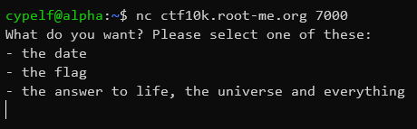
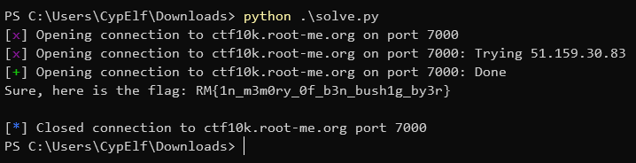

# Trucha bug

## Context

This is a write up for a challenge I created for the Root-Me CTF we organized to celebrate the 10k members on the Discord server. \
Please keep in mind I wasn't a participant but the creator of the challenge, hence the level of details and explainations I am able to provide. \
That was an amazing experience to help organizing this CTF, and I hope people learned a few things and enjoyed my challenges!

## Description

> To keep my secrets, I protected my application with my RSA implementation to require a signature when someone tries to access it. Nobody will ever be able to get my precious flag... Right?

## Resolution

We start the challenge with a file `main.c` as well as a host / port couple we can connect to. \
Here is the content of `main.c`:

```c
#include <stdio.h>
#include <stdbool.h>
#include <string.h>
#include <tomcrypt.h>
#include <gmp.h>

#define SHA256_SIZE 32

char* PKEY_N = "28316605750203454049002363560313563954296751450828848448517208195421674434602842807549596897970975529201316850622185623315583333237800231329023940484748688010961986901515147691858248996029931794630763468134269876901486229211372065501121751105623386156595213445891671288794107312313963247118259644196378662929869385025707884211817553083248681280118820740363347221337328761267079917222413767989397087611382611167569151505277047991858303445030096445782329982462564958470982918402018945533966426750370205997840705200810347367312283800916365954203381180315167389062039395265242886707651891538103937713233762440148808375849";
unsigned long PKEY_E = 65537;

bool check_signature(unsigned char* content, int content_len, mpz_t signature) {
    hash_state md;
    sha256_init(&md);

    unsigned char computed_hash[SHA256_SIZE];
    sha256_process(&md, content, content_len);
    sha256_done(&md, computed_hash);

    char computed_hash_str[SHA256_SIZE * 2 + 1]; // don't forget the + 1 for the null byte

    for (int i = 0; i < SHA256_SIZE; i++) {
        sprintf(&computed_hash_str[i * 2], "%02x", computed_hash[i]);
    }

    mpz_t computed_hash_mpz;
    mpz_init(computed_hash_mpz);
    mpz_set_str(computed_hash_mpz, computed_hash_str, 16);

    mpz_t n;
    mpz_init(n);
    mpz_set_str(n, PKEY_N, 10);

    // the + 5 and + 4 in the following piece of code are because mpz_out_raw exports not just the raw bytes of the number, but a specific sequence consisting of :
    // - 4 bytes of size information, containing the size in bytes of the number
    // - the bytes of the number itself
    // - 1 ending null byte
    unsigned char in_mem_buf[SHA256_SIZE + 5];
    unsigned char decrypted_hash[SHA256_SIZE];

    mpz_t dec_sig;
    mpz_init(dec_sig);
    mpz_powm_ui(dec_sig, signature, PKEY_E, n);

    FILE* in_mem_buf_f = fmemopen(in_mem_buf, SHA256_SIZE + 5, "w");
    mpz_out_raw(in_mem_buf_f, dec_sig);
    fclose(in_mem_buf_f);

    memcpy(decrypted_hash, in_mem_buf + 4, SHA256_SIZE);

    mpz_clear(computed_hash_mpz);
    mpz_clear(n);
    mpz_clear(dec_sig);

    return strncmp(computed_hash, decrypted_hash, SHA256_SIZE) == 0;
}

void remove_trailing_line_feed(char* str) {
    str[strcspn(str, "\n")] = 0;
}

int main(void) {
    printf("What do you want? Please select one of these:\n");
    printf("- the date\n");
    printf("- the flag\n");
    printf("- the answer to life, the universe and everything\n");
    fflush(stdout);

    int input_size = 100;
    char input[input_size];

    fgets(input, input_size, stdin);
    remove_trailing_line_feed(input);

    if (strstr(input, "flag") != NULL) {
        printf("Okay, but before that I need you to prove me I can trust you... Please send me now the raw RSA signature of what you just sent, as a base 10 number.\n");
        fflush(stdout);

        char signature_str[1000];
        fgets(signature_str, 1000, stdin);
        remove_trailing_line_feed(signature_str);

        mpz_t signature;
        mpz_init(signature);
        int failure = mpz_set_str(signature, signature_str, 10);
        if (failure) {
            printf("That's not a base 10 number.\n");
            fflush(stdout);
            return 1;
        }

        if (check_signature(input, strlen(input), signature)) {
            FILE* f = fopen("flag.txt", "r");
            int flag_size = 100;
            char flag[flag_size];
            fgets(flag, flag_size, f);

            printf("Sure, here is the flag: %s\n", flag);
            fflush(stdout);
        }
        else {
            printf("Who are you!? This is a secret! Stop it!\n");
            fflush(stdout);
        }

        mpz_clear(signature);
    }
    else if (strstr(input, "date") != NULL) {
        FILE* fp = popen("date", "r");
        int date_size = 100;
        char date[date_size];
        fgets(date, date_size, fp);
        pclose(fp);

        printf("The date is %s\n", date);
        fflush(stdout);
    }
    else if (strstr(input, "answer") != NULL) {
        printf("The answer is 23 (if you expected 42, you were wrong)\n");
        fflush(stdout);
    }
    else {
        printf("Sorry but I didn't understand\n");
        fflush(stdout);
    }

    return 0;
}
```

Okay, this piece of code is pretty long. If we connect with netcat to the given host and port, we can see this program running.



If we want to retrieve the flag, the program asks for the RSA signature of our payload and verify it using a hardcoded public key before letting us access the flag.

Before going further, let's look at the title of the challenge for a second. What is a "trucha" bug? \
If we try to search that on Google, we find out what's called the trucha bug [is in fact a signing bug](https://wiibrew.org/wiki/Signing_bug) found in the early days of the Wii in IOS36. It allowed to fake signatures to install software that wasn't approved by Nintendo on the console. \
By reading the technical details about it, we can see the critical part of this bug is the use of `strncmp` to compare two hashes that were not stored as ASCII hex characters but rather as the raw bytes of the hashes, thus allowing null byte injection to end the hash comparison earlier than expected.

Let's look again at the code we have here, and we can see that we have exactly the same issue: the `strncmp` function is used to compare the raw hashes.

Now, our goal is to forge a hash for our message and another one for our signature that will both start with a null byte, so the `strncmp` will stop at these first bytes.

For the message, because the string comparison is done with `strstr` instead of `strncmp`, we can basically add garbage to "flag" to bruteforce a hash of the string that starts with a null byte.

For the signature, because of the way RSA works, we can just provide the number 0, because the signature will be exponentiated by e and the result put modulo n, and applying this to the number 0 results in the number 0 itself.

And that's it, if the message hash starts with a null byte and the "decrypted" signature gives a result of 0, then the `strncmp` between them will stop and succeed at the first character comparison, and the signature will be considered valid.

Here's my script:

```python
from pwn import *
from hashlib import sha256
from string import printable
from itertools import product

challenge_host = "ctf10k.root-me.org"
challenge_port = 7000

r = remote(challenge_host, challenge_port)

msg = b"flag"

done = False
for i in range(1, 8):
    for chars in product(printable, repeat = i):
        chars = "".join(chars)
        forged_msg = msg + b" " + chars.encode()
        hash = sha256(forged_msg).digest()

        if hash[0] == 0:
            msg = forged_msg
            done = True
            break
    if done:
        break

n = 28316605750203454049002363560313563954296751450828848448517208195421674434602842807549596897970975529201316850622185623315583333237800231329023940484748688010961986901515147691858248996029931794630763468134269876901486229211372065501121751105623386156595213445891671288794107312313963247118259644196378662929869385025707884211817553083248681280118820740363347221337328761267079917222413767989397087611382611167569151505277047991858303445030096445782329982462564958470982918402018945533966426750370205997840705200810347367312283800916365954203381180315167389062039395265242886707651891538103937713233762440148808375849

e = 65537

signature = 0

r.recvlines(4)
r.sendline(msg)
r.recvline()
r.sendline(str(signature).encode())
print(r.recvline().decode())
```



This flag is a tribute to [Ben "bushing" Byer](https://fail0verflow.com/blog/2016/ben/), a hacker who worked on the Wii security among other consoles and passed away in 2016. He was an amazing person and inspired a lot of people like me. I would like to express here by respect for him and thank him for all he has done.

Flag: `RM{1n_m3m0ry_0f_b3n_bush1g_by3r}`