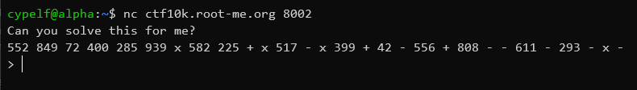
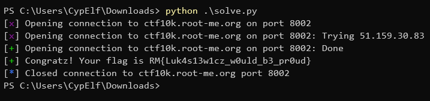

# RPN

## Context

This is a write up for a challenge I created for the Root-Me CTF we organized to celebrate the 10k members on the Discord server. \
Please keep in mind I wasn't a participant but the creator of the challenge, hence the level of details and explainations I am able to provide. \
That was an amazing experience to help organizing this CTF, and I hope people learned a few things and enjoyed my challenges!

## Description

> Who needs parentheses when you can use Jan's RPN to get an unambiguous formula?

## Resolution

We start the challenge with a host and a port. Let's see what it consists of by connecting to it with netcat.



Okay, so it doesn't seem too complicated. We have a big mathematical expression and we need to compute its value. But the given expression is a bit weird: there are no parentheses to determine the priorities, and we can see some operators next to each other in the expression.

We need to know what we're working with! If we search the meaning of RPN and who is this Jan mentionned in the challenge's description, we can figure out this is [Reverse Polish Notation](https://en.wikipedia.org/wiki/Reverse_Polish_notation) and this Jan is in fact the creator of this notation, [Jan Łukasiewicz](https://en.wikipedia.org/wiki/Jan_%C5%81ukasiewicz).

The reverse polish notation, also called postfix notation, as the name implies, is a way to express mathematical expressions by putting the operands first and the operator *after* them instead of between them as we're used to with the infix notation in our daily life. \
This notation makes parentheses useless in the expression, because there's no ambiguity possible with it.

Now that we know that, we can write a script to solve this challenge pretty easily. The reverse polish notation logic is very easy to implement in a program using a stack. \
Here's my solve script:

```python
from pwn import *

host = "ctf10k.root-me.org"
port = 8002

r = remote(host, port)

operators = ["+", "-", "*"]

# 100 is figured out after trying undefinitely and seeing it crashed at the 100th try
for i in range(100):
    r.recvline()
    formula = r.recvline().decode().strip().replace("x", "*").split(" ")
    r.recvuntil(b"> ")

    stack = []

    for elem in formula:
        if elem in operators:
            op1 = stack.pop()
            op2 = stack.pop()
            stack.append(str(eval(op2 + elem + op1)))
        else:
            stack.append(elem)

    solution = stack.pop()

    r.sendline(solution.encode())
    r.recvline()

log.success(r.clean(0.3).decode())
```



Flag: `RM{Luk4s13w1cz_w0uld_b3_pr0ud}`