# Gate keeper

## Context

This is a write up for a challenge I created for the Root-Me CTF we organized to celebrate the 10k members on the Discord server. \
Please keep in mind I wasn't a participant but the creator of the challenge, hence the level of details and explainations I am able to provide. \
That was an amazing experience to help organizing this CTF, and I hope people learned a few things and enjoyed my challenges!

## Description

> Your teammate has successfully pwned the server of his challenge, but when he tries to cat the flag, he's told he won't get the flag. Besides that, he has also found this weird file on the file system. Help him understand what's going on, so he can finally finish his challenge.

## Resolution

Let's see what kind of file we got to get started.

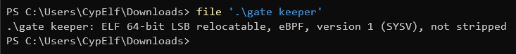

What we have here is an [eBPF](https://en.wikipedia.org/wiki/Berkeley_Packet_Filter) program.
<!-- TODO : uncomment when the talk is released on the YouTube channel -->
<!-- If you're French and want to know a bit about what it is and how it works, I've made a presentation about eBPF for the Root-Me association you can find on their YouTube channel. -->

Because of the description of the challenge and the fact that this is an eBPF program, it seems that this program may be an eBPF rootkit preventing from reading the flag. Let's dive into it.

We can't just load it right away inside IDA or Ghidra, because these tools don't support this ISA out of the box. Fortunately, we can add it to both of them using a [processor for IDA](https://github.com/zandi/eBPF_processor) and a [plugin for Ghidra](https://github.com/Nalen98/eBPF-for-Ghidra).

Let's open it in IDA (we could have used Ghidra and the process would have been roughly the same all along).

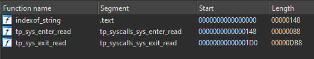

There are only 3 functions in this program. We can guess from the name of the first one that it's just a function to get the index of a substring inside a string.

The other two are what is interesting us. We can see from their segments and names that these are tracepoints set on the read syscall, one being set before when the syscall will be executed (the `enter` one) and the other one being set after its execution (the `exit` one).

Let's first look at the tracepoint that will be run first, the `enter` one.

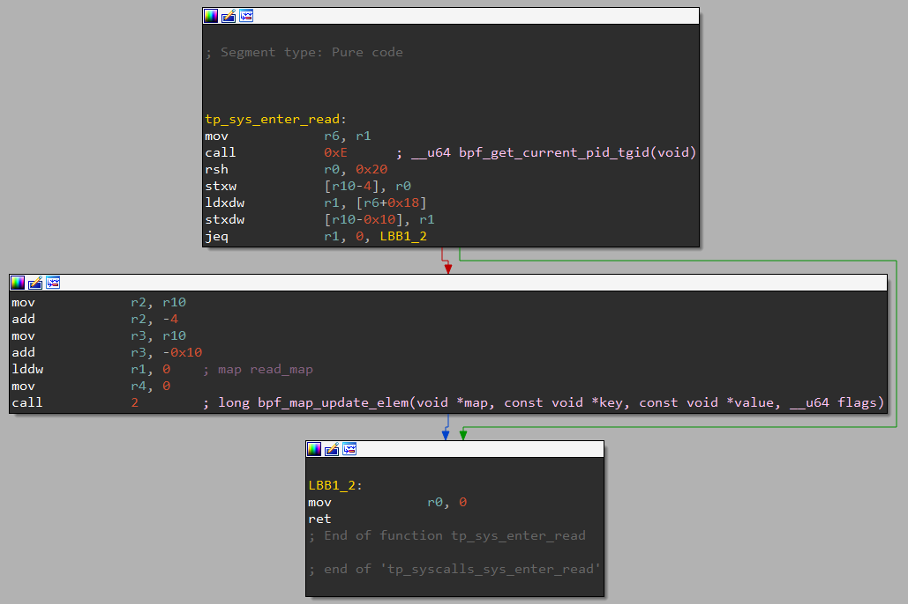

We can see that the content of this function is pretty trivial to reverse.

You can consult the structure being passed as an argument to the tracepoint by reading the file `/sys/kernel/debug/tracing/events/syscalls/sys_enter_read/format`.

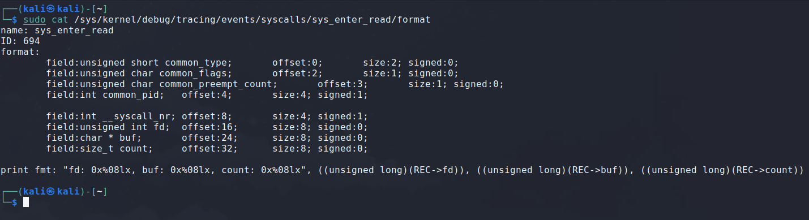

We know from the [eBPF calling convention](https://docs.kernel.org/bpf/instruction-set.html) that r1 ro r5 are used for the arguments when a function is called. It means the address of this structure will be stored in r1. Let's keep that in mind.

The code begins by calling the `bpf_get_current_pid_tgid` helper, then it shifts the result to the right by 32 bits, which is the tgid part of the value.

Next, we load in r1 what's at offset 24 in the struct. As you can see above in the format of the structure, this is where the buffer address supplied by the user is stored. This is where the read syscall is going to put the data the user asked for.

Then, it compares this to 0 and exit directly if the comparison is a success. This seems to be a check to execute the next part of the code only if the buffer address the user supplied is not null.

In the next part of the code executed if the buffer is not null, we can see it loads the tgid address we just got in r2, a pointer to the user buffer address (so, the address where is stored this user buffer address) inside r3, and the number 0 inside r1. Then, it calls `bpf_map_update_elem`. This means 0 is the id of the map which is going to be updated, the key is the tgid and the value is the user buffer address.

And that's all for this function. \
To recap, it will get the calling process tgid, and store inside a map the association between the tgid and the user buffer address. Very suspicious, isn't it?

Let's now take a look at the `exit` tracepoint. This is where the fun really begins.

The control flow graph can be a bit... scary, but don't be discouraged or impressed, it's not as awful as it seems, as you'll see in a second.

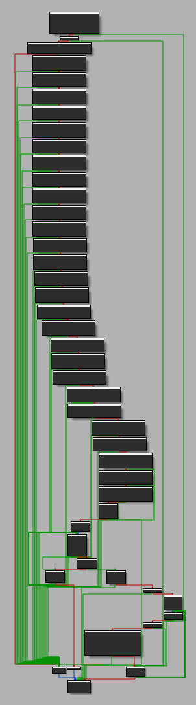

Let's first read where the function begins.

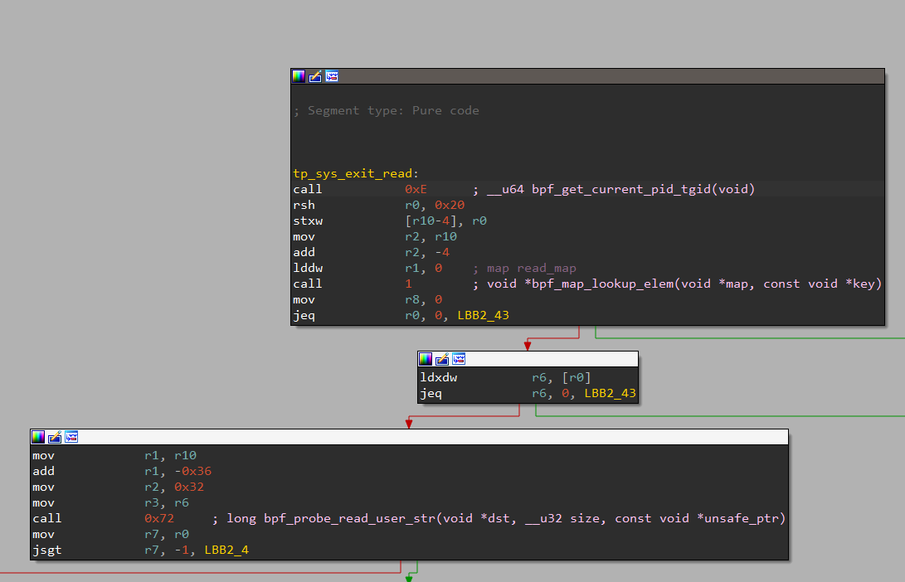

The first thing it does is the exact same thing as in the `enter` tracepoint, it calls `bpf_get_current_pid_tgid` and then shifts it by 32 bits to get the tgid. \
It then put a pointer to it inside r2, and a 0 in r1, before calling `bpf_map_lookup_elem`.

This should be pretty straightforward after seeing the code of the `enter` tracepoint: this part basically just fetches the value associated to this tgid in the same map that was used in the `enter` tracepoint.

Remember what value was associated to the tgid in the `enter` tracepoint? Yes, that's a pointer the user buffer address. \
Why this code is doing all of this is pretty clear now. Let's just look at the format of the `exit` tracepoint for read.

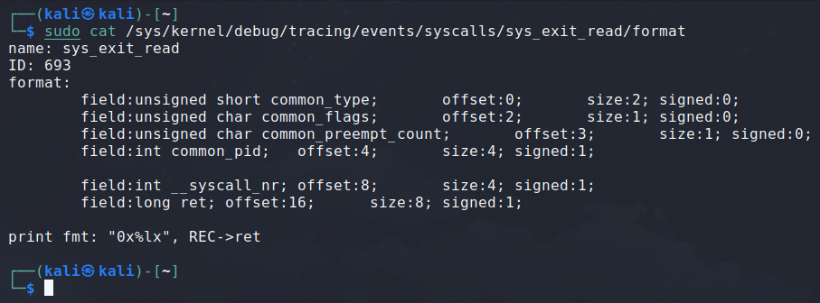

You can see that the user buffer address isn't anymore in the structure. This information isn't given to the `exit` tracepoint. Hence, this is a mecanism to pass it from the `enter` tracepoint that has access to it to the `exit` tracepoint.

Moving on to the next part, it dereferences the pointer to the user buffer address, checks wether the user buffer address isn't null and continue only if it doesn't. \
Even though it doesn't seem necessary to test it here because it has already been tested in the `enter` tracepoint, it may be a security left here to be 100% sure the address is ok even if something was messed up in the `enter` tracepoint.

If all went successfully, the program will now place r10 (the stack pointer) inside r1, and substract 0x36 to it. This is typically using some space on the stack for a buffer. It then puts 0x32 into r2 and the user buffer address in r3, and finally calls the `bpf_probe_read_user_str` helper. \
This helper will therefore read a string from the user space buffer and put it in the buffer that was just reserved. The parameter 0x32 passed in r2 is the size of our buffer. All matches perfectly.

After that, the program just makes sure that the value returned by `bpf_probe_read_user_str` is greater or equal to 0, because a negative return value from this helper would mean it failed. And we move on the the second part.

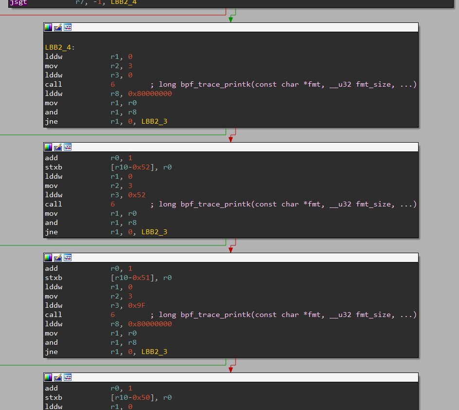

This part is really the key to solve the challenge. \
As you can see, the same block of code is repeated over and over with a slight different value in one of the instructions. Let's analyse what it's doing.

It's putting 0 inside of r1, 3 inside of r2 and 0 inside of r3, and then it calls `bpf_trace_printk`. \
You might be confused by this. The first argument should be a pointer to a string, so why is it set to 0? And why are the other paremeters set to 3 and 0?

We need some more explaination here. Before the kernel version 5.2, eBPF programs just couldn't use statically defined strings stored directly in the binary, and therefore we had to place the string in a buffer on the stack and then pass its address for every call to `bpf_trace_printk`. \
That was not very convenient. But we had [a new feature since kernel 5.2](https://github.com/torvalds/linux/commit/d8eca5bbb2be9), that allows us to declare gobal and static variables. The way we access them though is a bit strange, but it works somehow like a map: we can access statics and globals using a kind of identifier. 0 here mus be referring to the `.rodata` section, because `bpf_trace_printk` takes a constant string as parameter. Let's see what's in there.

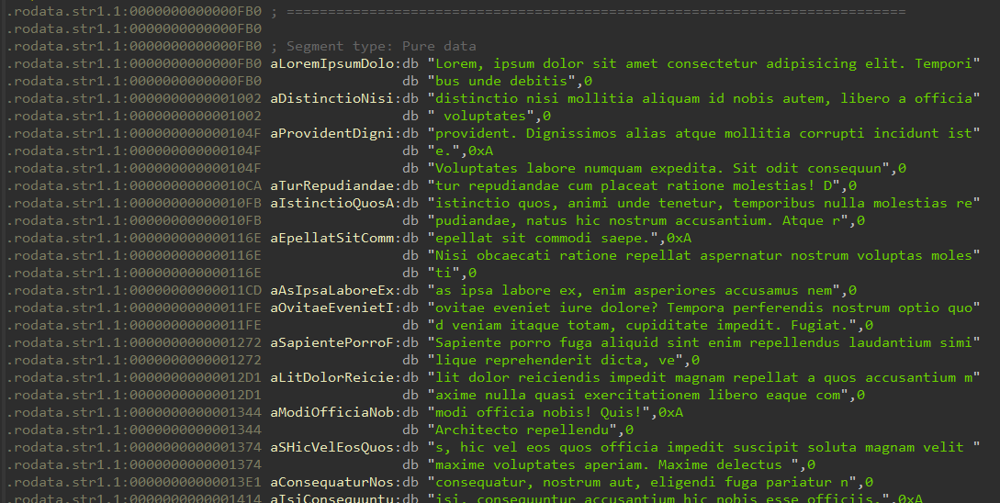

Okay, so we can see a lot of lorem ipsum garbage being stored here. It seems to be one very big lorem split in a lot of separate chunks. So, the first `bpf_trace_printk` we have is going to print the first element in it, so the string `Lorem, ipsum dolor sit amet consectetur adipisicing elit. Temporibus unde debitis`. 

Back to our `exit` tracepoint. To be honest, I don't really know why 3 is being passed as the second parameter, because this parameter should be the size of the string passed as the first argument, and is always 3 all along this part. It's not relevant at all to continue investigating how the program works and what it does, but I find it interesting and don't have an answer to justify it at the moment. \
Let's ignore the third parameter for now, we'll talk about it in just a moment.

Let's move on. The next thing the program does is apply a logical AND between the return value of this `bpf_trace_printk` and the constant `0x80000000`. It will only continue executing the next instructions of the program if the result of this is 0.

To get a better idea of what this is, we can convert `0x80000000` to binary, and it gives us `0b10000000000000000000000000000000`. That is, 31 bits to 0 and the MSB to 1. \
This looks a lot like a fancy way the compiler chose to use to perform a check wether this number is negative or not. If it is, the program stop here. \
So what it basically does it check if the `bpf_trace_printk` was a success or not, because the return value of this helper will once again be a negative number in case of error.

Moving on to the next block. Let me put the picture of this block here again for readability.

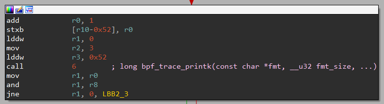

This block increment the return value of the previous call to `bpf_trace_printk`, and then stores it in a buffer on the stack. \
It will next do another call to `bpf_trace_printk`, with the same parameters in r1 and r2, but this time with a different r3, whose value is set to `0x52`. \
It's very unlikely that the program prints many times the same string, especially when the `.rodata` section is full of strings. Because this is the only parameter that has changed from the previous call to `bpf_trace_printk`, it should be what decides what string to use. If we investigates a bit more, we can see that this number matches exactly the length of the previous string (+1 for the ending null byte)! Therefore, we can assume it's an offset inside the `.rodata` section where it will grab the string to print.

To be honest, I'm myself a bit confused about why it works like this, because the documentation says the parameters after the first two are used as data meant to be injected inside the format string just as a classical printf, so I have no idea why in this case where we do not have a single format tag in our format string it uses the third argument to pass this offset. But anyway, the fact is it does seem to work like that in our case, and that's all that matter.

Then the program, again, applies the mask to check if the result if negative, and continue if it isn't.

And this goes on, and on, and on for a while. To summarize, this whole block is taking the return value of all these calls to `bpf_trace_printk` that prints some lorem ipsum garbage, increment them all and store them all inside a buffer one after the other. \
Quite suspicous.

Let's go to the end of this passage.

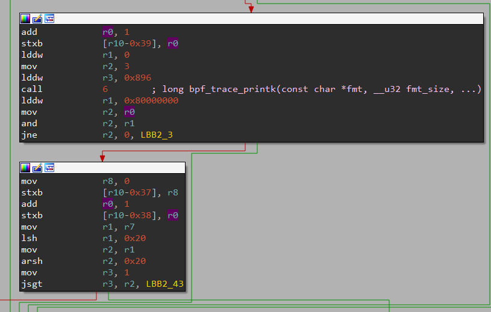

It just puts the last `bpf_trace_printk`'s returned value +1 in the end of the buffer and a null byte after that. Wait, a null byte at the end? Could this be a string?

At this point, we can stop reversing the program and try something. If we scroll down a bit, later in the function we can see a block calling `bpf_probe_write_user`.

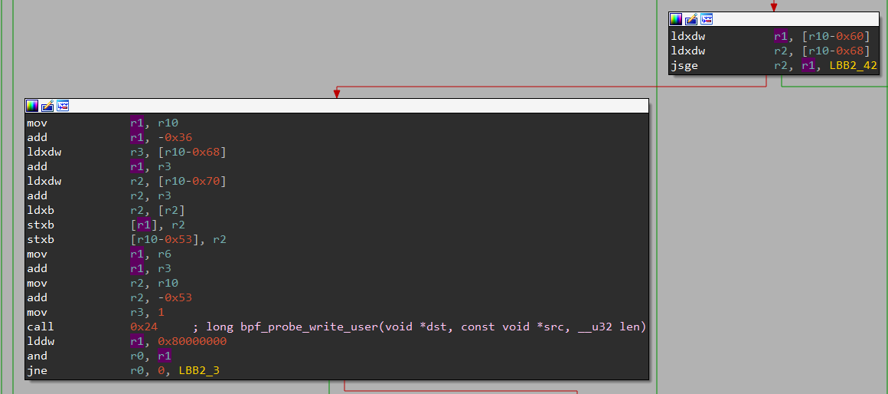

We can now guess that this string that was just constructed using successive calls to `bpf_trace_printk` will be useful for this later. Particularly, given the challenge's description and our assumption that this may be a rootkit hiding the flag from the user, we can be pretty confident that this constructed string is in fact the flag. After all, it doesn't depend on anything else than these hardcoded strings, so the result will always be the same.

Let's just gather the length of all the strings stored in the `.rodata`, add one to them all and then display the result as a string.

```python
lengths = [81, 76, 122, 48, 114, 94, 48, 115, 94, 114, 47, 108, 50, 94, 106, 48, 109, 99, 94, 47, 101, 94, 81, 47, 79, 62, 124]
print("".join([chr(code + 1) for code in lengths]))
```

And that's a win!

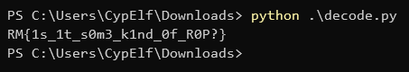

If you don't get the intuition about what's going from all that we reversed up to this point, feel free to continue to reverse engineer the program! You'll end up finding that the program tests if the user buffer contains this flag, and replaces it with `YOU WON'T GET THIS FLAG !!!` instead if found.

Flag: `RM{1s_1t_s0m3_k1nd_0f_R0P?}`