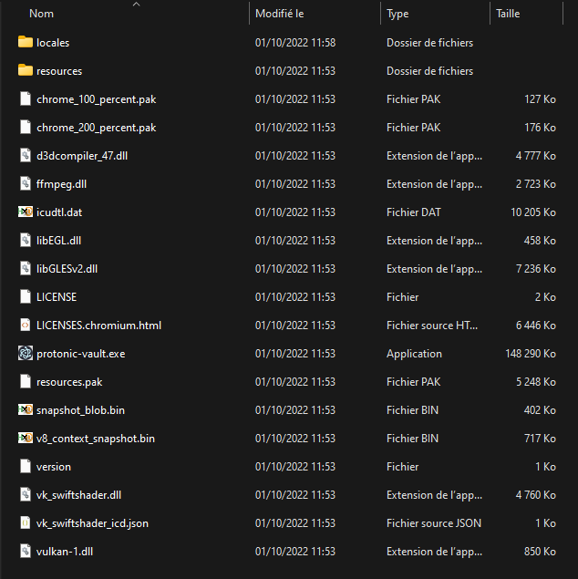
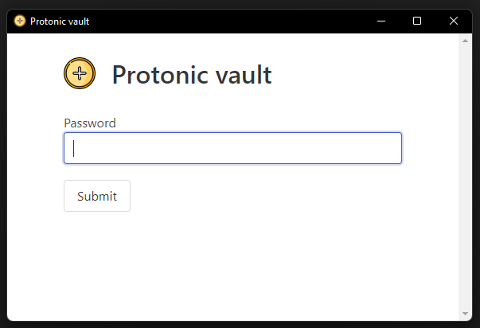
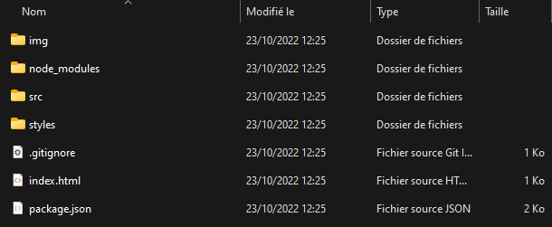
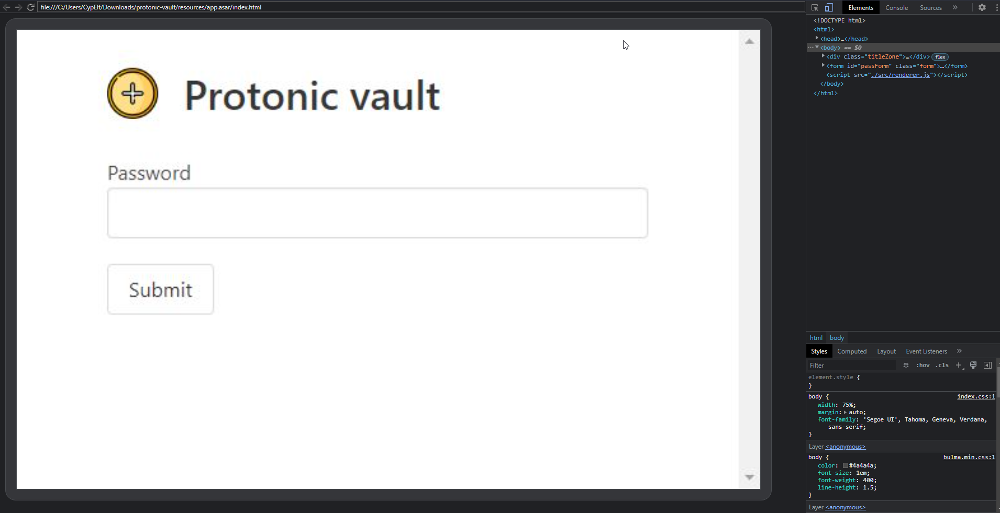
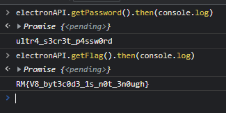
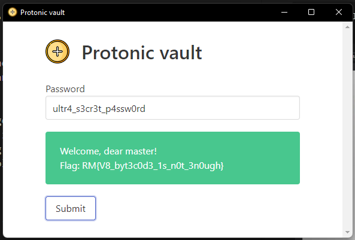

# Protonic vault

## Context

This is a write up for a challenge I created for the Root-Me CTF we organized to celebrate the 10k members on the Discord server. \
Please keep in mind I wasn't a participant but the creator of the challenge, hence the level of details and explainations I am able to provide. \
That was an amazing experience to help organizing this CTF, and I hope people learned a few things and enjoyed my challenges!

## Description

> Can you find your way inside the vault?

## Resolution

Let's uncompress the `protonic-vault.zip` file given for this challenge. We can see there are actually a lot of files in it.



We immediately recognize an Electron application. Let's run it.



It's an application asking for a password.

Hopefully for us, Electron application are fairly easy to reverse engineer.

Let's grab the `app.asar` file in the `resources` folder and extract it to recover the website source files.

```sh
$ npx asar extract app.asar app
```

We can see all the source files in the `app` folder.



Let's go to the `src` folder to read the JavaScript source code that handles the password verification. There are 4 files in it : `main.js`, `preload.js`, `renderer.js` and `window.jsc`.

The front end code we're interested in is located in the file `renderer.js`. \
Here is its content:

```js
async function setupHandler() {
    let truePassword = await window.electronAPI.getPassword()

    document.getElementById("passForm").addEventListener("submit", async e => {
        e.preventDefault()

        const passwordInput = document.getElementById("password")
        const password = passwordInput.value
        const resultDiv = document.getElementById("result")

        resultDiv.hidden = false

        if (password === truePassword) {
            resultDiv.innerHTML = `Welcome, dear master!<br/>Flag: ${await window.electronAPI.getFlag()}`
            resultDiv.className = "notification is-success"
        }
        else {
            resultDiv.textContent = "You're wrong!!"
            resultDiv.className = "notification is-danger"
        }
    })
}

setupHandler()
```

Interestingly, the password used for the check is not stored directly in the code but rather gathered from somewhere else with `window.electronAPI.getPassword()`. \
We can see in the `preload.js` what this function really is: this is just a wrapper that will send a message to the Electron back end through an IPC bridge.

The code that will handle this should be in `window.js`, but... What we have is not a `.js` but rather a `.jsc`, and its content doesn't seem to be printable characters. \
The content of `main.js` gives us an indication about what it is:

```js
const bytenode = require("bytenode")
const v8 = require("v8")

v8.setFlagsFromString("--no-lazy")

require("./window.jsc")
```

We just have to search on Google about `.jsc` files and bytenode to get the picture: bytenode is a bytecode compiler for Node.js, that compiles a JavaScript source file to V8 bytecode.

It means that if we want to see what the password is in this file, we have to reverse this V8 bytecode... Or not?

Feel free to make your own researches on the topic, but there are currently no tool and no way to reverse engineer V8 bytecode properly.

Does it mean I'm a liar and the challenge is in fact impossible? Well, no, because we can work around this issue pretty easily.

We don't have to know what's inside this V8 bytecode, because the front end has a nice function that ask the back end to give it the password, so we can simply inspect from the front what this function returns and we'll get the password.

From here, there are a few different ways to solve this challenge. \
One of them is that even though the devtools have been disabled in this Electron application so we can't just open them with a shortcut, we can use something such as [electron-inject](https://github.com/tintinweb/electron-inject.git) to get devtools in the application anyway.

```
$ pip install electron_inject
$ python -m electron_inject --enable-devtools-hotkeys --browser - /path/to/the/challenge/exe/file
```



It opens a nice interface in our browser with devtools directly linked to the application at the right. \
All we have to do now is just call the function that gives us the password and / or the flag.



We can also check that the password does work in the application.



Flag : `RM{V8_byt3c0d3_1s_n0t_3n0ugh}`