# CVE finder engine

## Context

This is a write up for a challenge I created for the Root-Me CTF we organized to celebrate the 10k members on the Discord server. \
Please keep in mind I wasn't a participant but the creator of the challenge, hence the level of details and explainations I am able to provide. \
That was an amazing experience to help organizing this CTF, and I hope people learned a few things and enjoyed my challenges!

## Description

> The admin of this CVE browser website refused to add your latest discovered CVE and laughted at you saying "it's a basic CVE anybody could have found, it doesn't deserve its place in the database". Get his credentials so you can add it yourself.

## Resolution

Let's give straight into the website.

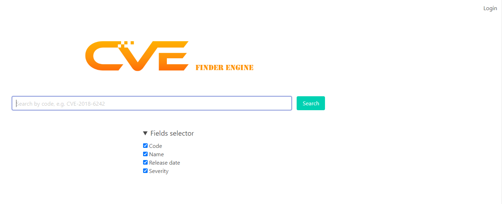

We're welcomed by a kind of search engine for CVE. If we expand the "Fields selector" button under the search bar, there are some checkboxes. We can also see a login button at the top right.

Submitting the form with no query return a list of CVEs.

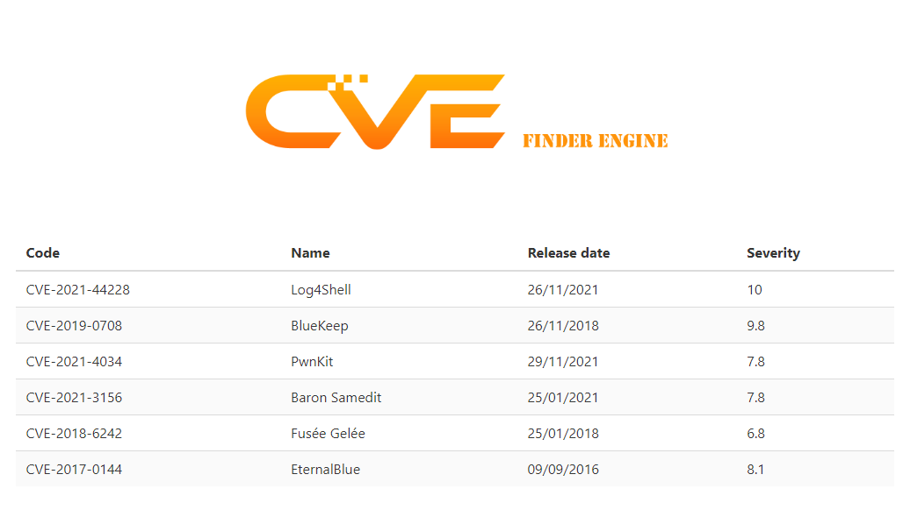

The login page is as usual.

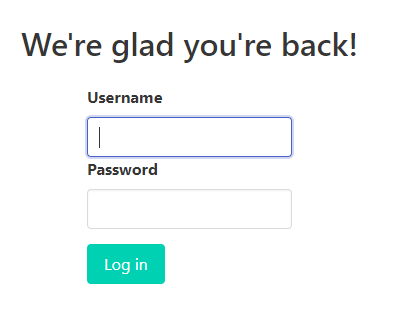

Back to the search page, if we look at the HTML, we can see a `script` tag containing some code.

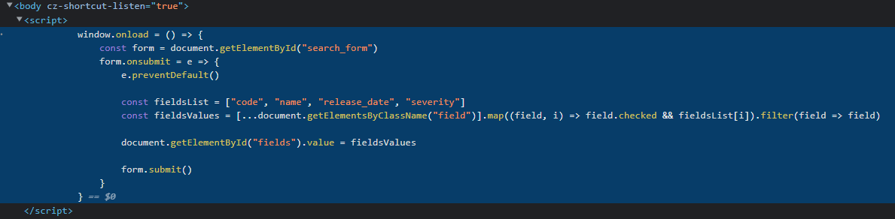

What it seems to do is, when the form is submitted, take the selected fields under the fields selector, add them to an array and update a hidden input tag with this array as the value, before submitting the form.

This is very suspicious. If we take a look at the request being sent, we can indeed see the checked fields being sent as values separated by commas.

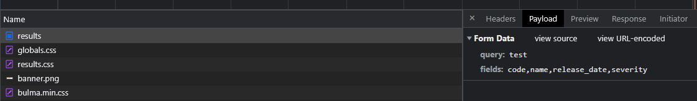

It looks a lot like the fields that could be used for a SQL query into a database where these CVEs are stored. It means we probably have a SQL injection. Let's try to detect a potential DBMS by injecting `@@version-- -`.

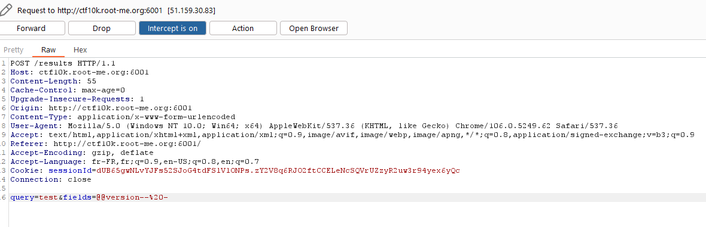

The result is interesting. It says an error occured with our CQL query.

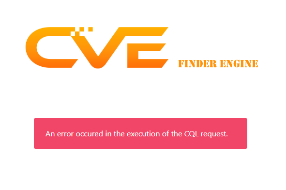

Wait, our *CQL* query? Is that a typo? Well no, CQL does exist, it stands for [Cassandra Query Language](https://cassandra.apache.org/doc/latest/cassandra/cql/) and it's a SQL like language for the NoSQL database Cassandra. \
It has some differences compared to SQL, but the general syntax is almost the same. The important thing is that it's not a relational database, so the concept of join just doesn't exist here. We also can't use subqueries. \
But we have the control directly on the first part of the query, where the fields are placed, so we can make the query fetch any data in any table we want!

The first step is to get the different keyspaces. We can inject `* FROM system_schema.keyspaces-- -` for that.

Hum, there's no error this time, but we didn't get any data in the table. This is probably caused by the back end expecting the columns returned by the database to be named `code`, `name`, `release_date` and `severity`. We can use an alias to make it think what we returned is named like that. Let's try with `keyspace_name AS name FROM system_schema.keyspaces;-- -`.

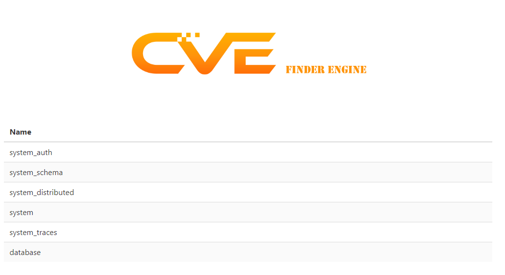

This time we've successfully accesed the list of the keyspaces in the database. The only one that's not system related is `database`, so it should be the keyspace where the application stores its data. Let's enumerate the tables in this keyspace. \
We can do this by injecting `table_name AS name FROM system_schema.tables WHERE keyspace_name = 'database';-- -`.

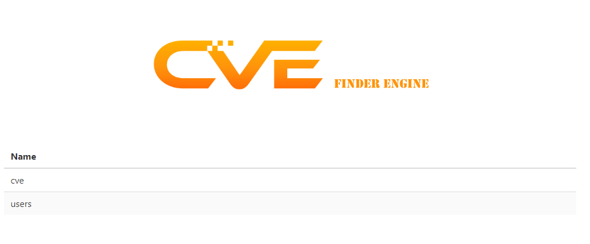

Let's go, there are two tables, `cve` and `users`. \
Remember, our goal is to compromise the website admin. Let's now enumerate the columns in the `users` table! \
We can use the following payload for this: `column_name AS name FROM system_schema.columns WHERE table_name = 'users' ALLOW FILTERING;-- -`.

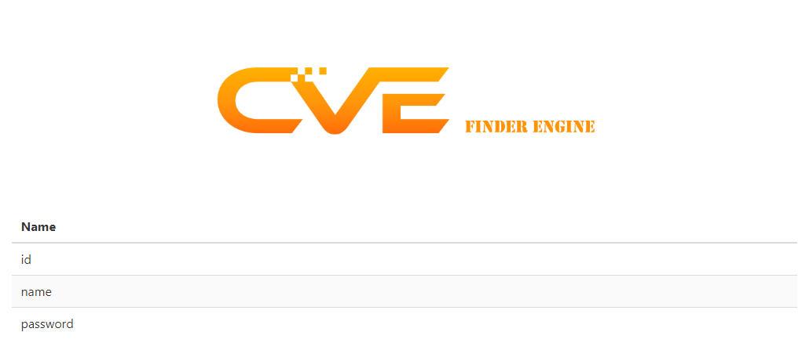

We're almost done! The only thing left to do is to dump these columns with `id AS code, name, password AS severity FROM users;-- -`.

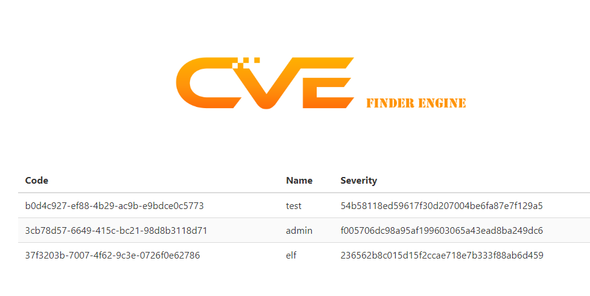

And that's it! We have the users and their password! Unfortunately, this isn't quite the end, because the password is hashed. From their length being 20 bytes, it seems to be SHA-1. Let's try to bruteforce these!

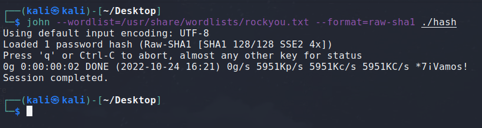

Unfortunately for us once more, none of the hashes seem to be in the `rockyou.txt` wordlist. \
We can try adding rules or with different wordlists, but it doesn't seem successful either.

But let's not forget the most basic bruteforce: the incremental ASCII bruteforce! We're so used to breaking hashes because they're common passwords, that we often forget that incremental bruteforce is still a thing and can break any password if its length isn't big enough.

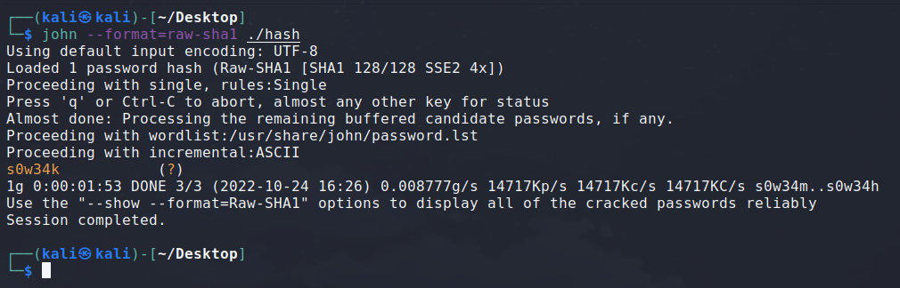

That's it, we could successfully break the hash of the admin account! \
Let's log in the website with the credentials `admin` and `s0w34k`.

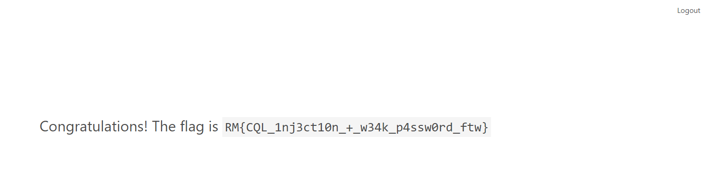

Flag: `RM{CQL_1nj3ct10n_+_w34k_p4ssw0rd_ftw}`